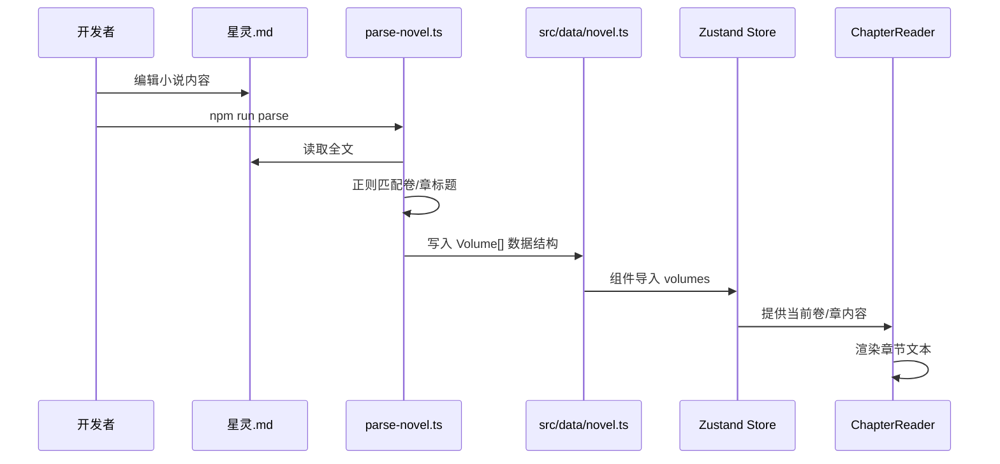

**星灵**（Star Spirit）是一个以科幻奇幻小说《星灵.md》为内容载体的沉浸式 Web 阅读应用。项目以十六卷、二百章的史诗级叙事为内核，通过星空主题视觉、多页面导航架构和阅读进度持久化，为读者提供从"打开即读"到"深度探索世界观"的完整体验。

本页面面向初次接触本项目的开发者，从整体定位、技术选型、架构分层和模块职责四个维度建立全局认知。完成阅读后，你将能够理解代码仓库的运作方式，并顺利进入 [快速开始](2-kuai-su-kai-shi) 环节。

## 项目定位

星灵本质上是一个 **内容驱动型单页应用（SPA）**，其核心价值在于将一部 Markdown 格式的原创小说转化为结构化、可交互的阅读体验。应用并非传统意义上的小说阅读器——它在基础阅读功能之上，提供了角色图鉴、世界观浏览、时间线三大辅助页面，使读者能够在故事世界中进行多维探索。

| 维度 | 说明 |
|---|---|
| **内容来源** | 根目录 [`星灵.md`](星灵.md) 为唯一数据源，包含十六卷小说正文 |
| **数据转化** | 通过 `npm run parse` 脚本将 Markdown 自动解析为 TypeScript 数据结构 |
| **阅读功能** | 卷选择 → 章节阅读 → 进度保存 → 断点续读 |
| **探索功能** | 人物图鉴、世界观百科、编年时间线 |
| **视觉主题** | 深色星空背景 + Framer Motion 动画 + Tailwind CSS 定制色板 |

Sources: [星灵.md](星灵.md#L1-L6), [xingling-web/package.json](xingling-web/package.json#L6-L8), [xingling-web/scripts/parse-novel.ts](xingling-web/scripts/parse-novel.ts#L1-L5)

## 技术架构全景

以下架构图展示了星灵应用从数据源到用户界面的完整流转路径：

```mermaid
flowchart TD
    A["星灵.md<br/>Markdown 小说源文件"] -->|npm run parse| B["parse-novel.ts<br/>解析脚本"]
    B -->|生成| C["src/data/novel.ts<br/>章节数据结构"]
    
    D["src/data/characters.ts<br/>角色数据"] --> E["应用数据层"]
    F["src/data/world.ts<br/>世界观数据"] --> E
    C --> E
    
    E --> G["src/store/index.ts<br/>Zustand 状态管理"]
    G -->|阅读进度 / 字体设置| H["localStorage<br/>持久化存储"]
    
    G --> I["src/App.tsx<br/>路由入口"]
    I --> J["react-router-dom<br/>六条路由"]
    
    J --> K["Home<br/>首页导航"]
    J --> L["VolumeSelector<br/>卷选择器"]
    J --> M["ChapterReader<br/>章节阅读器"]
    J --> N["CharacterBook<br/>人物图鉴"]
    J --> O["WorldView<br/>世界观浏览"]
    J --> P["Timeline<br/>时间线"]
    
    Q["StarField.tsx<br/>Canvas 星空背景"] -.->|固定层| K
    Q -.->|固定层| L
    Q -.->|固定层| M
    
    style A fill:#1a1f4e,stroke:#8b5cf6
    style C fill:#1a1f4e,stroke:#8b5cf6
    style G fill:#252b6e,stroke:#60a5fa
    style I fill:#252b6e,stroke:#60a5fa
    style Q fill:#0f1535,stroke:#34d399
```

架构分为三个层次：
1. **数据层** — `src/data/` 下的三个 TypeScript 文件，分别承载章节、角色、世界观数据
2. **状态层** — Zustand 管理阅读进度与用户设置，通过 localStorage 实现持久化
3. **表现层** — 六个页面组件通过 React Router 组织，共享全局星空背景和主题样式

Sources: [xingling-web/src/App.tsx](xingling-web/src/App.tsx#L1-L27), [xingling-web/src/store/index.ts](xingling-web/src/store/index.ts#L1-L68), [xingling-web/src/data/novel.ts](xingling-web/src/data/novel.ts#L1-L15)

## 技术栈一览

星灵选择了现代前端开发中成熟且轻量的工具组合，每个技术选型都服务于"沉浸式阅读体验"这一核心目标。

| 技术 | 版本 | 职责 | 为什么选它 |
|---|---|---|---|
| **React** | 19.x | UI 组件框架 | 组件化开发，生态丰富 |
| **TypeScript** | 6.0.x | 类型安全 | 数据结构明确，减少运行时错误 |
| **Vite** | 8.0.x | 构建工具 | 极速 HMR，开发体验优秀 |
| **Tailwind CSS** | 4.2.x | 样式系统 | 定制主题色板，原子化样式 |
| **React Router** | 7.x | 客户端路由 | 六页 SPA 导航 |
| **Zustand** | 5.x | 状态管理 | 轻量 API，无需 Provider 包裹 |
| **Framer Motion** | 12.x | 动画系统 | 声明式动画，页面过渡效果 |
| **Lucide React** | 1.x | 图标库 | 统一风格的矢量图标 |
| **Canvas 2D** | 原生 | 星空背景 | 200 颗星星的粒子动画 |

Sources: [xingling-web/package.json](xingling-web/package.json#L10-L28)

## 模块职责速查

理解每个模块的职责是高效开发的第一步。下表以"最小认知单元"的方式列出仓库核心文件：

| 文件/目录 | 职责 | 关键概念 |
|---|---|---|
| `星灵.md` | 小说原始数据源 | 十六卷 Markdown，`#` 表示卷标题，`##` 表示章标题 |
| `scripts/parse-novel.ts` | 数据转换脚本 | 正则解析 → 生成 `novel.ts`，每卷绑定主题色 |
| `src/data/novel.ts` | 章节数据（自动生成） | `Volume[]` 结构，包含 `title`、`chapters`、`theme` |
| `src/data/characters.ts` | 角色百科数据 | `Character[]` + `races`，含种族、权能、出场卷号 |
| `src/data/world.ts` | 世界观数据 | `locations`、`artifacts`、`timeline` 三类数据 |
| `src/store/index.ts` | 全局状态管理 | `useStore`（阅读进度）+ `useSettings`（字体大小） |
| `src/App.tsx` | 路由与布局入口 | `<BrowserRouter>` + 六条 `<Route>` + `<StarField />` |
| `src/components/effects/StarField.tsx` | Canvas 星空背景 | 200 颗粒子，渐变背景，闪烁 + 下落动画 |
| `src/components/pages/*.tsx` | 六个页面组件 | Home / VolumeSelector / ChapterReader / CharacterBook / WorldView / Timeline |
| `src/index.css` | 全局样式 | Tailwind 主题色板 + 自定义动画 keyframes |
| `vite.config.ts` | 构建配置 | React 插件 + Tailwind 插件，开发端口 5178 |

Sources: [xingling-web/src/App.tsx](xingling-web/src/App.tsx#L1-L27), [xingling-web/src/components/effects/StarField.tsx](xingling-web/src/components/effects/StarField.tsx#L1-L98), [xingling-web/src/index.css](xingling-web/src/index.css#L1-L77)

## 数据流转：从 Markdown 到页面

理解星灵最独特的设计——**Markdown 自动解析管线**，是掌握整个项目的关键。开发者只需维护一份 `星灵.md` 文件，其余数据文件均可自动生成。

这条管线的核心设计原则是 **Single Source of Truth**（单一数据源）：

- **编辑小说**：只需修改 `星灵.md`，使用标准 Markdown 标题语法
- **生成数据**：运行 `npm run parse`，脚本通过正则匹配 `# 第X卷` 和 `## 第X章` 自动提取结构
- **主题绑定**：每卷在 `volumeThemes` 字典中映射一个视觉主题（如 snow、storm、medicine）
- **行号追踪**：每个章节保留 `lineStart` 字段，便于调试和溯源

Sources: [xingling-web/scripts/parse-novel.ts](xingling-web/scripts/parse-novel.ts#L36-L110), [xingling-web/scripts/parse-novel.ts](xingling-web/scripts/parse-novel.ts#L10-L20)

## 阅读进度持久化

星灵使用 Zustand + localStorage 实现轻量级持久化，无需后端服务。状态管理分为两个独立 store：

| Store | 管理内容 | localStorage Key | 触发时机 |
|---|---|---|---|
| `useStore` | 当前卷/章、已读章节列表 | `xingling-progress`、`xingling-completed` | 翻页时自动保存 |
| `useSettings` | 正文字体大小 | `xingling-fontsize` | 用户调整时保存 |

应用初始化时（`main.tsx`），`loadProgress()` 会从 localStorage 恢复上次的阅读位置，实现"断点续读"体验。

Sources: [xingling-web/src/store/index.ts](xingling-web/src/store/index.ts#L1-L68), [xingling-web/src/main.tsx](xingling-web/src/main.tsx#L7-L8)

## 视觉系统

星灵的视觉设计围绕"宇宙星空"主题展开，通过 Tailwind CSS 自定义色板和 Canvas 动画协同实现。

**色彩体系**定义了三个主色调：
- **Nebula（星云紫）** `#8b5cf6` — 用于主标题渐变、交互高亮
- **Star（星辰蓝）** `#60a5fa` — 用于角色相关元素
- **Aurora（极光绿）** `#34d399` — 用于世界观/时间线元素

背景采用三级深色渐变：`cosmic-900` → `cosmic-700` → `cosmic-500`，从 `#0a0e27` 到 `#3b3f8e`，营造深邃宇宙感。字体统一使用宋体族（Noto Serif SC / STSong），契合文学阅读场景。

Sources: [xingling-web/src/index.css](xingling-web/src/index.css#L3-L12), [xingling-web/src/components/pages/Home.tsx](xingling-web/src/components/pages/Home.tsx#L12-L18)

## 下一步

现在你已经建立了星灵项目的全局认知。建议按以下路径深入：

1. **[快速开始](2-kuai-su-kai-shi)** — 安装依赖、启动开发服务器、运行解析脚本
2. **[技术栈总览](3-ji-zhu-zhan-zong-lan)** — 深入了解每个技术选型的细节
3. **[项目结构说明](4-xiang-mu-jie-gou-shuo-ming)** — 完整目录树与文件职责详解
4. **[应用架构设计](5-ying-yong-jia-gou-she-ji)** — 从设计模式角度理解组件组织方式

如果你已有 React 基础，可以直接跳转到 [路由与页面导航](6-lu-you-yu-ye-mian-dao-hang) 了解页面结构；如果更关注数据层，建议先阅读 [小说数据模型](9-xiao-shuo-shu-ju-mo-xing) 和 [Markdown 解析脚本](11-markdown-jie-xi-jiao-ben)。