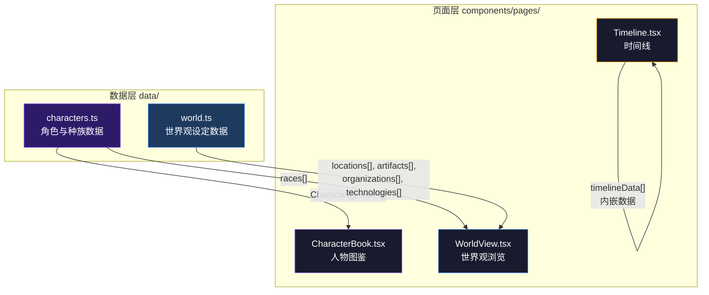
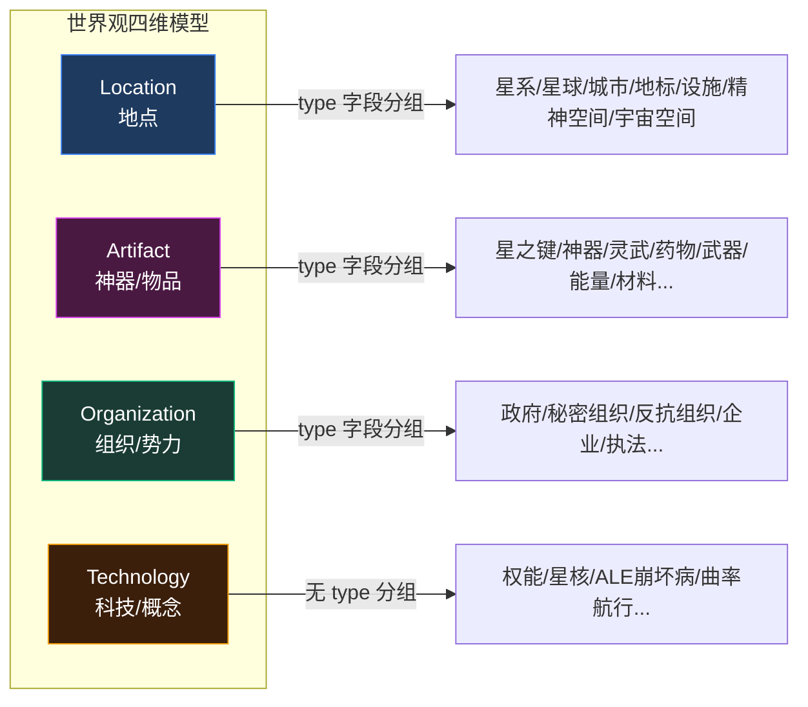
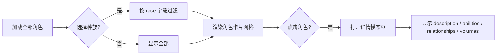

本文档解析星灵阅读应用中**角色图鉴**、**世界观百科**与**时间线**三大功能模块背后的数据层设计。与[小说数据模型](9-xiao-shuo-shu-ju-mo-xing)关注章节内容不同，本层承载的是小说的**设定元数据**——角色档案、地理风貌、神器遗物、组织势力、科技体系以及历史事件编年。这些数据以纯 TypeScript 常量的形式内嵌于应用代码中，通过类型约束保障数据完整性，并由三个独立页面组件消费渲染。

## 数据架构总览

角色与世界观数据由三个独立数据源构成，各自服务于不同的展示维度：



**核心设计决策**：角色数据与世界观数据分别存放于独立文件，而时间线数据则内嵌于页面组件中。这种拆分体现了两种不同的数据生命周期——角色与世界观设定相对稳定、跨页面复用频率高；时间线则是面向单一页面的叙事序列，无需跨组件共享。

Sources: [characters.ts](xingling-web/src/data/characters.ts#L1-L457), [world.ts](xingling-web/src/data/world.ts#L1-L108), [Timeline.tsx](xingling-web/src/components/pages/Timeline.tsx#L1-L358)

## 角色数据模型

### Character 接口定义

每个角色由 `Character` 接口描述，包含身份标识、种族归属、叙事定位和关系网络四个维度：

```typescript
export interface Character {
  name: string;           // 角色中文名
  alias?: string;         // 英文名/别名/称号
  race: string;           // 所属种族
  role: string;           // 叙事角色定位
  description: string;    // 详细描述
  abilities?: string;     // 权能/能力
  volumes: number[];      // 登场卷号列表
  relationships?: string[]; // 人物关系描述
}
```

除 `volumes` 为必填项外，其余字段中仅 `name`、`race`、`role`、`description` 为必填，`alias`、`abilities`、`relationships` 均为可选。这种设计允许对次要角色进行轻量级记录——例如麦克斯特政府官员"潘德拉贡"仅包含基本信息，而主角"安培尔"则拥有完整的关系网络和权能描述。

Sources: [characters.ts](xingling-web/src/data/characters.ts#L1-L8)

### 种族分类体系

`races` 常量数组定义了星灵世界中的五大种族，每个种族附带描述性文本。角色通过 `race` 字符串字段与种族关联，实现基于种族的筛选和分组展示：

| 种族 | 特征描述 | 代表角色 |
|------|----------|----------|
| 安吉拉 | 拥有羽翼的天使种族，多数具有特殊权能 | 安培尔、艾莉丝、费德里科 |
| 卡普拉 | 拥有心形尖尾巴的种族，因历史事件遭受歧视 | K、玛蒂尔达 |
| 泰坦 | 体型巨大的种族，力量强大 | 苏尔特尔 |
| 精灵 | 神秘的精灵种族，拥有尖耳朵 | 佩托拉 |
| 人类 | 人类时代的原住民 | 彼得 |

**数据关联模式**：角色数据中的 `race` 字段是自由字符串，与 `races` 数组通过字符串匹配关联。这种松耦合设计简化了数据录入，但也意味着缺少编译期的种族名称校验——输入不存在的种族名称不会触发类型错误。

Sources: [characters.ts](xingling-web/src/data/characters.ts#L439-L457), [CharacterBook.tsx](xingling-web/src/components/pages/CharacterBook.tsx#L14-L16)

### 角色组织与规模

当前角色数据按叙事分组注释进行组织，涵盖**主角团**、**安兹华德公司成员**、**第一卷角色**、**麦克斯特政府**、**火凤凰组织**、**历史人物**、**宇宙/虚数空间存在**及其他角色，共计 **50 余个角色条目**。每个角色的 `volumes` 数组记录其登场的卷号，用于在人物图鉴中显示卷号标签，辅助读者按卷索引人物。

Sources: [characters.ts](xingling-web/src/data/characters.ts#L10-L438)

## 世界观数据模型

`world.ts` 文件定义了四个独立接口，分别对应世界观的四个维度。每个维度的数据数组均导出为命名常量，供 `WorldView` 页面按需消费。

### 四维世界观架构



### 各维度接口对比

| 接口 | 必填字段 | 可选字段 | 数据量 | 分组策略 |
|------|----------|----------|--------|----------|
| `Location` | `name`, `description` | `volume?`, `type?` | ~20 个 | 按 `type` 分组（星系、星球、城市、地标等） |
| `Artifact` | `name`, `description` | `type?` | ~17 个 | 按 `type` 硬编码分组（星之键、神器、灵武等 13 类） |
| `Organization` | `name`, `description`, `type` | 无 | ~9 个 | 按 `type` 硬编码分组（政府、秘密组织、反抗组织等 7 类） |
| `Technology` | `name`, `description` | 无 | ~8 个 | 无分组，平铺展示 |

**设计差异分析**：`Organization` 是唯一将 `type` 设为必填的接口，表明组织分类在世界观体系中的核心地位——每个组织必须有明确的类型归属。而 `Technology` 不设 `type` 字段，因其条目数量较少且概念类型差异较大，不宜强行分类。

Sources: [world.ts](xingling-web/src/data/world.ts#L1-L21)

### 关键数据示例

**地点维度**覆盖了从宏观星系（拉提麦尔星系）到微观设施（ALE抑制器）的空间层级，部分条目通过 `volume` 字段关联首次登场的卷号，如"诺克城"标注 `volume: 1`。

**神器维度**以"星之键"为核心叙事线索，从总述到个体（星之键·晨曦、星之键·天火），延伸至灵武（雷影）、科技物品（星铳、纳米丝）、能量体系（奇点能量）和材料（震刚），构建出完整的物品百科。

Sources: [world.ts](xingling-web/src/data/world.ts#L23-L108)

## 时间线数据模型

时间线数据采用**内嵌模式**，直接定义在 `Timeline.tsx` 组件文件中，不与其他页面共享。这反映了时间线作为独立叙事视图的定位——它是世界观数据的**时序化重组**，而非独立的数据实体。

### TimelineEvent 接口

```typescript
interface TimelineEvent {
  year: string;        // 时代标签（如"远古时代"、"星灵纪元2275"）
  title: string;       // 事件标题
  description: string; // 事件描述
  volume: number;      // 对应卷号
  icon: string;        // 图标标识（flame, sparkles, heart 等）
  category: 'war' | 'discovery' | 'personal' | 'political' | 'tragedy' | 'hope';
}
```

`category` 字段使用联合类型严格限定六种事件类别，每个类别绑定独立的颜色方案和图标：

| 类别 | 颜色 | 图标 | 叙事含义 |
|------|------|------|----------|
| `war` | 红色 | Flame | 战争与冲突 |
| `discovery` | 紫蓝色 | Sparkles | 发现与探索 |
| `personal` | 金色 | Heart | 个人情感与关系 |
| `political` | 琥珀色 | Flag | 政治决策与权力变动 |
| `tragedy` | 灰色 | Skull | 悲剧与牺牲 |
| `hope` | 极光色 | Zap | 希望与转机 |

Sources: [Timeline.tsx](xingling-web/src/components/pages/Timeline.tsx#L5-L13)

### 时代分组策略

时间线数据按 `year` 字段分组为五个叙事时代，呈现从宇宙起源到主线剧情的完整编年：

1. **远古时代** — 宇宙起源、星灵文明诞生、天命审判庭建立
2. **第一次圣皇战争（约1000年前）** — 战争爆发、圣星冠消失、艾萨克被封印
3. **战后时代** — 麦克斯特王国建立、雷恩西斯家族悲剧
4. **星灵纪元2275·第一卷** — 诺克城任务、地心之旅、矿脉爆炸
5. **星灵纪元2285·第二卷** — 寻找天火、普雷斯顿事件、黑蜂计划

Sources: [Timeline.tsx](xingling-web/src/components/pages/Timeline.tsx#L284-L292)

## 数据消费模式

### 人物图鉴：种族过滤 + 模态详情

`CharacterBook` 组件实现了**两层数据消费**：首先通过 `selectedRace` 状态过滤角色列表，用户可按种族浏览；点击角色卡片后弹出模态框展示完整档案，包括权能、人物关系和登场卷号。



**渲染优化**：角色卡片使用 Framer Motion 的 `whileInView` 动画，按索引延迟入场（`delay: idx * 0.03`），创建瀑布流式加载效果。卷号标签限制显示前 5 个，超出部分以 `+N` 缩写，避免 UI 溢出。

Sources: [CharacterBook.tsx](xingling-web/src/components/pages/CharacterBook.tsx#L11-L194)

### 世界观浏览：Tab 分类导航

`WorldView` 组件通过 `activeTab` 状态切换五个浏览维度（地点、神器、组织、种族、科技），每个维度内按 `type` 字段进一步分组。地点和神器维度使用动态 `type` 提取，组织和科技维度则使用硬编码的类别顺序，确保展示顺序符合叙事重要性。

**跨数据源引用**：种族 Tab 直接复用 `characters.ts` 中的 `races` 数组，体现了数据层的可复用性设计。

Sources: [WorldView.tsx](xingling-web/src/components/pages/WorldView.tsx#L8-L216)

### 时间线：时代分组 + 分类着色

`Timeline` 组件将扁平的 `timelineData` 数组按 `year` 字段重组为五个时代区块，每个事件条目根据 `category` 应用对应的颜色主题和图标。垂直渐变时间线（`from-nebula-500 via-star-500 to-aurora-500`）在视觉上串联起从远古到当下的叙事流。

Sources: [Timeline.tsx](xingling-web/src/components/pages/Timeline.tsx#L294-L358)

## 数据扩展指南

当需要添加新的角色或世界观条目时，遵循以下模式：

**添加角色**：在 `characters.ts` 的角色数组末尾追加对象，确保 `name`、`race`、`role`、`description`、`volumes` 字段必填。若角色属于新种族，需同时在 `races` 数组中补充种族定义。

**添加地点/神器/组织**：在 `world.ts` 对应的数组中追加条目。对于 `Location` 和 `Artifact`，建议设置 `type` 字段以便在 WorldView 中正确分组。新增 `type` 值时，需在 `WorldView.tsx` 的硬编码类别列表中同步添加。

**添加时间线事件**：在 `Timeline.tsx` 的 `timelineData` 数组中追加事件，选择合适的 `category` 以匹配颜色主题，并确保 `icon` 值存在于 `iconMap` 映射中。

## 架构总结

角色与世界观数据层采用**纯 TypeScript 常量 + 静态类型接口**的轻量方案，避免了外部数据加载的复杂度。数据与展示层通过清晰的导入边界解耦，页面组件仅负责数据过滤、分组和渲染逻辑。这种设计适合设定数据相对稳定、无需运行时更新的阅读类应用。若未来需要支持数据远程更新或用户贡献内容，可考虑将静态常量迁移至 JSON 文件或轻量数据库，同时保持现有接口定义不变。