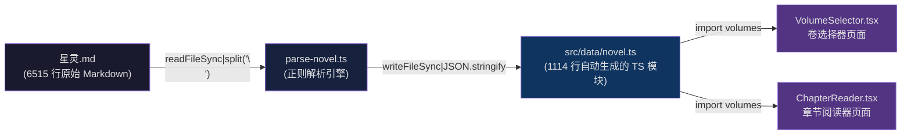
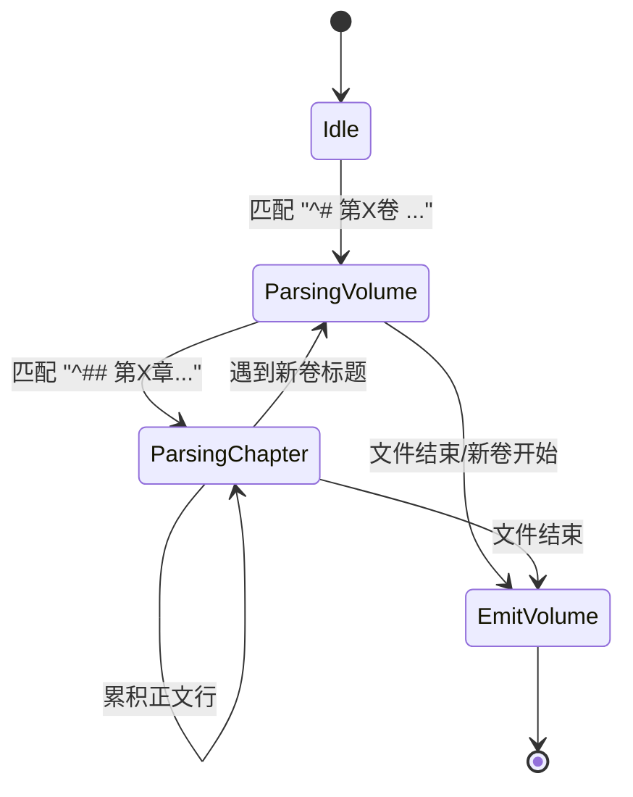
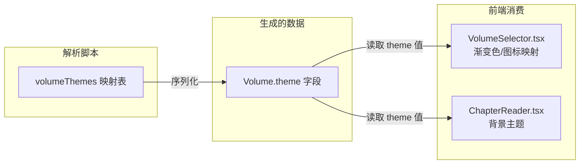
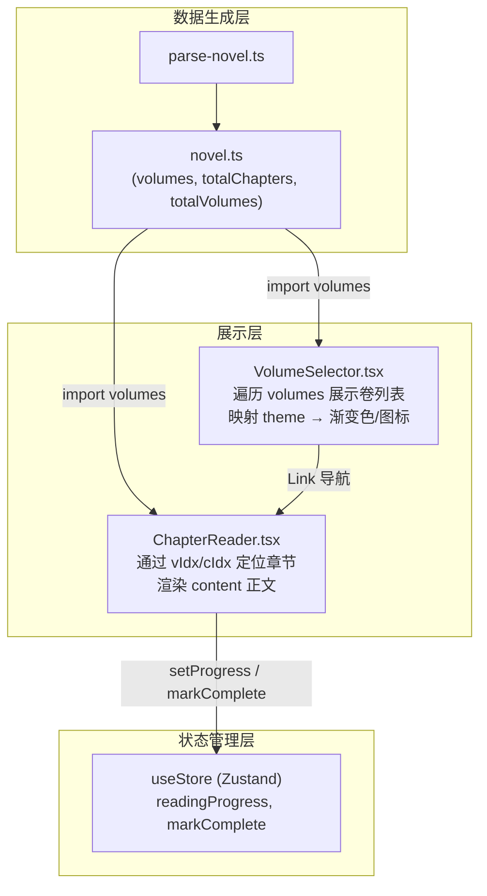

本项目采用**构建时解析**策略，将源文件 `星灵.md`（一部 6500+ 行的 Markdown 小说原文）转换为 TypeScript 模块 `src/data/novel.ts`，供前端运行时直接消费。整个解析流程由一个 129 行的独立脚本 `parse-novel.ts` 完成，通过 `npm run parse`（即 `tsx scripts/parse-novel.ts`）触发，生成包含全部卷、章节结构及正文内容的静态数据。

Sources: [parse-novel.ts](xingling-web/scripts/parse-novel.ts#L1-L129), [package.json](xingling-web/package.json#L7-L7)

## 数据流水线架构

解析脚本是源文件与前端应用之间的**唯一数据桥梁**。原始 Markdown 文件不直接参与运行时逻辑——所有文本内容在构建阶段即被固化为 TypeScript 常量，从而获得类型安全和零运行时解析开销的优势。



该架构的核心决策在于**以空间换时间**：生成的 `novel.ts` 文件达 1114 行，将全部小说内容内联到前端 bundle 中。对于本项目规模（16 卷、约数十万字），这一策略在加载性能和工程简洁性之间取得了合理平衡。

Sources: [parse-novel.ts](xingling-web/scripts/parse-novel.ts#L1-L5), [parse-novel.ts](xingling-web/scripts/parse-novel.ts#L106-L128)

## 解析引擎设计

脚本采用**逐行状态机**模式，通过维护 `currentVolume` 和 `currentChapter` 两个指针变量，在单次遍历中完成全部层级结构的构建。



### 正则表达式规范

脚本定义了两条核心正则规则，分别对应卷标题和章节标题的 Markdown 语法：

| 层级 | 正则模式 | 匹配示例 | 提取字段 |
|------|----------|----------|----------|
| 卷 (Volume) | `^#\s+第([\d一二三四五六七八九十百千]+)卷\s+(.+)` | `# 第一卷 自行始终` | 卷序号、卷名称 |
| 章 (Chapter) | `^##\s+第([一二三四五六七八九十百千\d]+)[章:：]\s*(.+)` | `## 第一章：为何而来` | 章序号、章名称 |

卷标题正则中，序号捕获组同时支持阿拉伯数字和中文数字，确保格式的鲁棒性。章节标题正则中的 `[章:：]` 字符类允许标题使用 `第X章` 或 `第X：` 两种分隔形式。

Sources: [parse-novel.ts](xingling-web/scripts/parse-novel.ts#L43-L44), [parse-novel.ts](xingling-web/scripts/parse-novel.ts#L54-L55)

## 主题映射系统

脚本内置了卷序号到视觉主题的映射表 `volumeThemes`，将 16 个卷分别关联到不同的场景关键词。这些关键词随后被序列化到生成的 TypeScript 数据中，驱动前端的视觉呈现。



完整映射关系如下：

| 卷序号 | 卷名 | 主题键 | 视觉意象 |
|--------|------|--------|----------|
| 1 | 自行始终 | `snow` | 冰雪 |
| 2 | 风暴突袭 | `storm` | 风暴 |
| 3 | 靶向药物 | `medicine` | 医疗 |
| 4 | 爱与冰雪 | `ice` | 冰雪 |
| 5 | 家在何方 | `home` | 温暖 |
| 6 | 森林奇缘 | `forest` | 自然 |
| 7 | 命运之门(上) | `fate` | 神秘 |
| 8 | 命运之门(下) | `fate2` | 启示 |
| 9 | 暗流涌动 | `ocean` | 深海 |
| 10 | 往日之影 | `shadow` | 暗影 |
| 11 | 来势汹汹 | `surge` | 力量 |
| 12 | 分崩离析(上) | `break1` | 火焰 |
| 13 | 分崩离析(下) | `break2` | 真相 |
| 14 | 久别重逢 | `reunion` | 温暖 |
| 15 | 长夜孤星(上) | `night1` | 暗夜 |
| 16 | 长夜孤星(下) | `night2` | 终章 |

Sources: [parse-novel.ts](xingling-web/scripts/parse-novel.ts#L14-L31)

## 输出数据结构

脚本生成的 TypeScript 模块导出三个核心常量和一个计算值，形成前端消费的统一接口：

```
// Auto-generated from 星灵.md - DO NOT EDIT
export interface Chapter { title: string; content: string; lineStart: number; }
export interface Volume { title: string; chapters: Chapter[]; theme: string; }
export const volumes: Volume[] = [...]
export const totalChapters = ...
export const totalVolumes = ...
```

各字段含义如下：

| 字段 | 类型 | 说明 |
|------|------|------|
| `volumes` | `Volume[]` | 全部卷的数组，按原始顺序排列 |
| `Volume.title` | `string` | 卷标题，如 "第一卷 自行始终" |
| `Volume.theme` | `string` | 视觉主题键，用于前端样式映射 |
| `Volume.chapters` | `Chapter[]` | 该卷下所有章节的数组 |
| `Chapter.title` | `string` | 章节标题 |
| `Chapter.content` | `string` | 章节正文（原始 Markdown 文本，含 `\n` 换行） |
| `Chapter.lineStart` | `number` | 该章节在源文件中的起始行号，用于调试溯源 |
| `totalChapters` | `number` | 所有章节总数的运行时计算值 |
| `totalVolumes` | `number` | 总卷数 |

`lineStart` 字段是一个重要的调试工具——当发现某章节内容异常时，可直接定位到 `星灵.md` 中的对应行进行排查。

Sources: [parse-novel.ts](xingling-web/scripts/parse-novel.ts#L106-L118), [novel.ts](xingling-web/src/data/novel.ts#L1-L14)

## 使用方法

### 执行解析

```bash
cd xingling-web
npm run parse
```

该命令通过 `tsx` 运行 TypeScript 脚本，无需额外编译步骤。成功执行后输出类似：

```
Parsed 16 volumes, XX chapters
Output: /home/tony/xingling/xingling-web/src/data/novel.ts
```

### 何时需要重新解析

| 场景 | 是否需要重新解析 |
|------|------------------|
| 修改 `星灵.md` 内容 | ✅ 必须 |
| 添加/删除章节 | ✅ 必须 |
| 修改 `volumeThemes` 映射 | ✅ 必须 |
| 修改前端组件样式 | ❌ 不需要 |
| 仅修改非小说数据（角色、世界观） | ❌ 不需要 |

建议在修改源文件后、执行 `npm run build` 之前运行解析脚本，确保生成的数据与源文件保持同步。

Sources: [package.json](xingling-web/package.json#L7-L7), [parse-novel.ts](xingling-web/scripts/parse-novel.ts#L126-L128)

## 已知问题与改进方向

### 章节标题双冒号

当前章节标题正则在匹配 `## 第一章：为何而来` 时，捕获组 2 包含冒号后的内容，而标题拼接时又硬编码了 `章：` 前缀，导致生成的标题出现双冒号 `第一章：：为何而来`。

**根因分析**：正则 `[章:：]` 匹配了 `章` 和 `：` 两个字符，但捕获组仅从 `：` 之后开始。拼接模板 `第${n}章：${name}` 再次添加了 `章：`，造成重复。

**修复方案**：将正则修改为 `^##\s+第([一二三四五六七八九十百千\d]+)[章:：]\s*(.+)` 的冒号后匹配，或调整模板逻辑去除硬编码的冒号。

Sources: [parse-novel.ts](xingling-web/scripts/parse-novel.ts#L54-L60), [novel.ts](xingling-web/src/data/novel.ts#L17-L17)

### 正文内容保留 Markdown 标记

当前解析器将章节正文作为**纯文本块**存储，不做任何 Markdown 语法处理。前端的 `ChapterReader` 组件直接渲染这些文本，意味着加粗、斜体、链接等 Markdown 语法不会在页面上呈现为富文本格式。如需富文本渲染，可在前端引入 `react-markdown` 等库，在渲染阶段处理 `Chapter.content`。

Sources: [parse-novel.ts](xingling-web/scripts/parse-novel.ts#L64-L70), [ChapterReader.tsx](xingling-web/src/components/pages/ChapterReader.tsx#L1-L30)

## 与相关模块的协作关系

解析脚本生成的数据被两个核心页面组件消费，形成完整的数据流：



解析脚本本身不涉及任何运行时依赖——它仅使用 Node.js 内置的 `fs`、`path`、`url` 模块，确保了解析过程的独立性和可重复性。