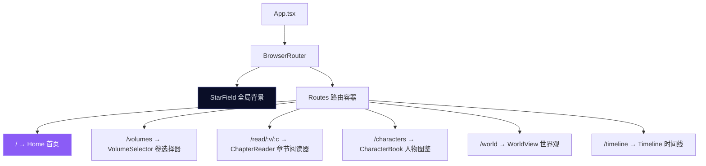
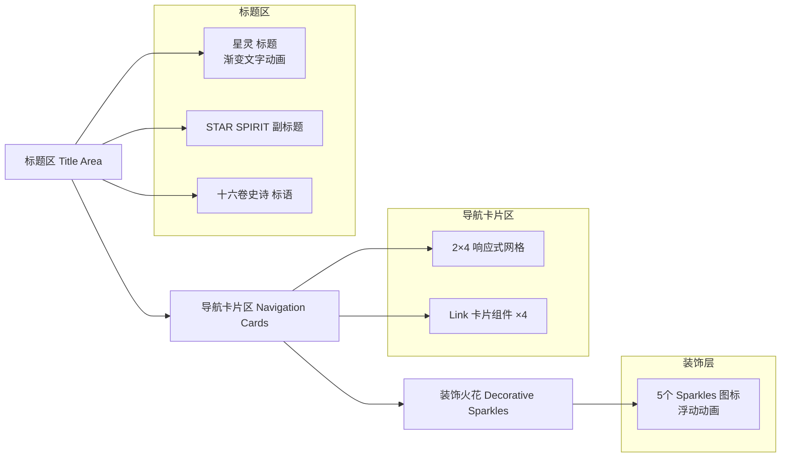
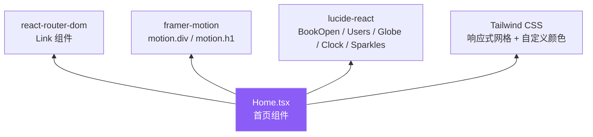

首页是"星灵"阅读应用的入口页面，承担着内容导航与视觉定调的双重职责。它以星空主题为背景，通过四个功能卡片引导用户进入核心模块：开始阅读、人物图鉴、世界观浏览和时间线。页面采用 `react-router-dom` 实现客户端路由，配合 `framer-motion` 提供入场动效，所有交互均通过 `Link` 组件完成无刷新跳转。

Sources: [App.tsx](xingling-web/src/App.tsx#L1-L27), [Home.tsx](xingling-web/src/components/pages/Home.tsx#L1-L110)

## 路由架构

首页由全局路由系统定义。应用入口 `App.tsx` 通过 `BrowserRouter` 包裹全部页面，`<StarField />` 作为全局背景层渲染在所有路由之上（`-z-10` 定位），确保切换页面时星空背景保持不变。

首页对应根路径 `/`，是用户进入应用后的首个页面。其余五个路由分别对应导航卡片中的四个功能入口以及章节阅读路径。

Sources: [App.tsx](xingling-web/src/App.tsx#L9-L17)

## 路由与导航卡片映射

首页的四个导航卡片与路由路径一一对应，每个卡片通过 `<Link>` 组件声明目标路由：

| 卡片标题 | 图标 | 目标路由 | 主题色 | 功能说明 |
|---------|------|---------|--------|---------|
| 开始阅读 | `BookOpen` | `/volumes` | nebula (紫) | 进入卷选择器，浏览十六卷内容 |
| 人物图鉴 | `Users` | `/characters` | star (蓝) | 查看角色百科与关系图谱 |
| 世界观 | `Globe` | `/world` | aurora (绿) | 探索世界设定与地理信息 |
| 时间线 | `Clock` | `/timeline` | aurora (绿) | 浏览故事编年史 |

每张卡片使用 Tailwind 语义化颜色类实现视觉区分：卡片默认采用 `bg-cosmic-700/50` 半透明背景，悬停时边框变为主题色并触发 `shadow-lg` 光晕效果，图标同步执行 `scale-110` 缩放动画。

Sources: [Home.tsx](xingling-web/src/components/pages/Home.tsx#L47-L110), [index.css](xingling-web/src/index.css#L4-L12)

## 页面布局结构

首页采用垂直居中的 Flex 布局，自上而下分为三个视觉层级：

**标题区**：包含三行文字内容。主标题"星灵"使用 `text-6xl md:text-8xl` 字号，通过 `bg-gradient-to-r` 实现三色渐变（nebula → star → aurora），并配置 `backgroundPosition` 无限循环动画产生流光效果。副标题"STAR SPIRIT"与标语"十六卷史诗 · 二百章旅程"分别以 0.8s 和 1.2s 延迟渐入。

**导航卡片区**：使用 `grid grid-cols-2 md:grid-cols-4` 响应式网格，移动端为 2 列，桌面端为 4 列。每个卡片为 `Link` 组件，内部包含图标、主标题和副标题三元素。

**装饰层**：通过 `fixed inset-0 pointer-events-none` 定位 5 个 `Sparkles` 图标，以不同延迟和周期执行呼吸动画，增强页面的沉浸感。

Sources: [Home.tsx](xingling-web/src/components/pages/Home.tsx#L6-L110)

## Framer Motion 动效系统

首页的动效全部由 Framer Motion 驱动，按时间轴可分为两个阶段：

| 动画元素 | 初始状态 | 目标状态 | 延迟 | 持续时间 | 缓动函数 |
|---------|---------|---------|------|---------|---------|
| 标题容器 | `opacity: 0, y: -40` | `opacity: 1, y: 0` | 0s | 1.2s | `easeOut` |
| 主标题流光 | `backgroundPosition: 0%` | 循环 `0% → 100% → 0%` | - | 8s | 线性 |
| 副标题 | `opacity: 0` | `opacity: 1` | 0.8s | 1s | 默认 |
| 标语 | `opacity: 0` | `opacity: 1` | 1.2s | - | 默认 |
| 导航卡片容器 | `opacity: 0, y: 30` | `opacity: 1, y: 0` | 0.5s | 0.8s | 默认 |
| 卡片图标(悬停) | `scale: 1` | `scale: 1.1` | - | 300ms | 默认 |
| 装饰火花 | `opacity: 0.2~0.8` | 循环呼吸 | `i × 0.5s` | `3+i s` | 默认 |

入场动画遵循"从上到下、从标题到内容"的认知顺序。标题容器首先从上方滑入，随后副标题和标语依次淡入，导航卡片在标题动画进行到一半时开始上浮，形成层次分明的视觉节奏。

Sources: [Home.tsx](xingling-web/src/components/pages/Home.tsx#L8-L45)

## 主题色彩系统

首页的视觉风格建立在 Tailwind CSS v4 自定义主题之上。`index.css` 通过 `@theme` 指令定义了三组语义化颜色：

| 色彩组 | 色值范围 | 语义用途 | 应用位置 |
|--------|---------|---------|---------|
| cosmic (宇宙深色系) | `#0a0e27` ~ `#3b3f8e` | 背景、卡片底色、边框 | 全局背景、卡片背景 |
| nebula (星云紫色系) | `#8b5cf6` ~ `#c4b5fd` | 主操作强调色 | "开始阅读"卡片、标题渐变起点 |
| star (星辰蓝色系) | `#60a5fa` ~ `#bfdbfe` | 次要强调色 | "人物图鉴"卡片、标题渐变中点 |
| aurora (极光绿色系) | `#34d399` ~ `#6ee7b7` | 辅助强调色 | "世界观"/"时间线"卡片、标题渐变终点 |

全局背景色为 `#0a0e27`（cosmic-900），与 StarField 组件中 Canvas 绘制的渐变色保持一致。正文采用 `Noto Serif SC` 等衬线字体族，契合小说阅读的文学气质。

Sources: [index.css](xingling-web/src/index.css#L3-L12), [index.css](xingling-web/src/index.css#L26-L28), [StarField.tsx](xingling-web/src/components/effects/StarField.tsx#L38-L42)

## 全局背景层

`<StarField />` 组件以 Canvas 2D 渲染 200 颗动态星星，作为 `App.tsx` 中的全局背景层。每颗星星拥有独立的位置、大小、下降速度和闪烁频率。Canvas 使用 `fixed inset-0 w-full h-full -z-10` 定位在页面最底层，并通过 `pointer-events: none` 确保不拦截用户交互。

星空背景在路由切换时保持渲染，无需重新初始化，这是因为它渲染在 `<Routes>` 外部而非页面组件内部。这种设计保证了页面切换的视觉连续性。

Sources: [App.tsx](xingling-web/src/App.tsx#L10), [StarField.tsx](xingling-web/src/components/effects/StarField.tsx#L10-L98)

## 组件依赖关系

首页组件为纯展示型组件（Presentational Component），不依赖全局状态管理。其技术依赖如下：

- **react-router-dom**: `<Link>` 组件声明式导航，避免整页刷新
- **framer-motion**: `motion.*` 组件声明式动画，通过 `initial` / `animate` / `transition` 属性控制
- **lucide-react**: 五个 SVG 图标组件，支持 `className` 传递样式
- **Tailwind CSS**: 响应式布局（`md:` 断点）、渐变（`bg-gradient-to-r`）、悬停效果（`hover:` 变体）

Sources: [Home.tsx](xingling-web/src/components/pages/Home.tsx#L1-L3)

## 下一步阅读

根据项目目录结构，建议按以下顺序继续探索：

1. **[卷选择器](13-juan-xuan-ze-qi)** — 了解从首页"开始阅读"卡片进入的卷选择页面如何展示十六卷内容
2. **[章节阅读器](14-zhang-jie-yue-du-qi)** — 了解核心阅读体验的实现
3. **[星空背景动画](18-xing-kong-bei-jing-dong-hua)** — 深入了解 StarField 组件的 Canvas 渲染机制
4. **[Framer Motion 动画系统](19-framer-motion-dong-hua-xi-tong)** — 系统学习首页所用动画库的原理与进阶用法
5. **[主题与样式系统](20-zhu-ti-yu-yang-shi-xi-tong)** — 了解完整的 Tailwind 主题配置与全局样式