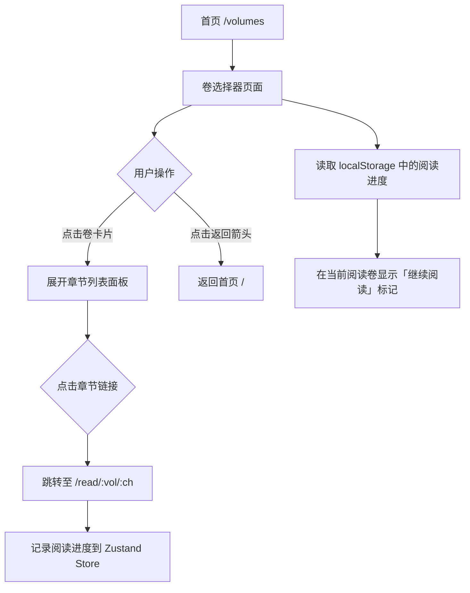
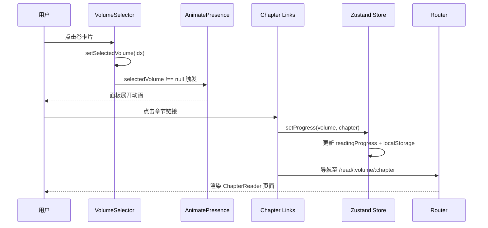
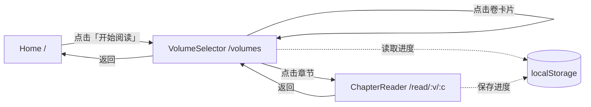

卷选择器（VolumeSelector）是星灵阅读应用中的核心导航页面，负责以可视化网格形式展示全部 16 卷小说内容。用户通过该页面选择目标卷后，可展开查看章节列表并直接跳转至任意章节进行阅读。该页面在路由 `/volumes` 处挂载，同时集成了阅读进度记忆功能，帮助读者快速回到上次阅读位置。

Sources: [VolumeSelector.tsx](xingling-web/src/components/pages/VolumeSelector.tsx#L1-L126), [App.tsx](xingling-web/src/App.tsx#L15-L16)

## 页面架构概览

卷选择器的设计理念遵循"先选卷、后选章"的两层导航模型。整个页面由三个核心区域组成：顶部导航栏、卷网格展示区、章节列表面板。这种分层结构降低了用户的认知负担，确保读者在浏览大量内容时不会迷失方向。

Sources: [VolumeSelector.tsx](xingling-web/src/components/pages/VolumeSelector.tsx#L17-L126), [App.tsx](xingling-web/src/App.tsx#L10-L26)

## 核心组件结构

卷选择器是一个纯函数组件，内部维护一个 `selectedVolume` 状态来控制章节列表面板的展开与收起。组件依赖以下三个外部数据源：

| 依赖来源 | 数据类型 | 用途 |
|---------|---------|------|
| `../../data/novel` 中的 `volumes` | `Volume[]` 数组 | 提供全部卷和章节的标题、内容数据 |
| `../../store` 中的 `useStore` | Zustand Store | 读取和写入 `readingProgress` 阅读进度 |
| `react-router-dom` 的 `Link` | React Router 组件 | 实现页面间导航跳转 |

组件内部还定义了一个 `volumeThemes` 对象，为每卷分配独特的渐变色、强调色和表情图标。这种主题映射确保视觉上的区分度，帮助用户快速定位目标卷。

Sources: [VolumeSelector.tsx](xingling-web/src/components/pages/VolumeSelector.tsx#L7-L22), [VolumeSelector.tsx](xingling-web/src/components/pages/VolumeSelector.tsx#L24-L26)

## 卷网格展示

卷网格采用响应式布局，在不同屏幕尺寸下自动调整列数：手机单列、平板双列、桌面三列、超宽屏四列。每卷卡片包含三个信息元素：主题表情图标、卷标题、章节数量。

卡片的视觉状态分为三种：

| 状态 | 背景色 | 边框色 | 触发条件 |
|------|--------|--------|---------|
| 默认态 | `bg-cosmic-700/30` | `border-cosmic-600/30` | 未被选中 |
| 悬停态 | `bg-cosmic-700/50` | `border-cosmic-500/50` | 鼠标移入 |
| 选中态 | `bg-cosmic-600/80` | `border-nebula-500/50` | 用户点击 |

每张卡片还附带入场动画：`initial={{ opacity: 0, y: 20 }}` 到 `animate={{ opacity: 1, y: 0 }}`，通过 `delay: idx * 0.05` 实现逐张延迟出现的阶梯效果，营造出内容依次加载的节奏感。

当某卷与 `readingProgress.volume` 匹配时，卡片右上角会显示"继续阅读"徽章，这是通过条件渲染实现的。

Sources: [VolumeSelector.tsx](xingling-web/src/components/pages/VolumeSelector.tsx#L36-L63)

## 章节列表面板

点击任意卷卡片后，章节列表面板通过 `AnimatePresence` 组件以展开动画呈现。面板包含顶部信息区和章节链接网格两部分。

章节链接区域采用双列网格布局，每个链接项包含：
- **BookOpen 图标**：阅读标识，悬停时颜色变亮
- **章节标题**：使用 `truncate` 类确保超长标题被截断
- **ChevronRight 图标**：引导符号，悬停时变色提示可点击

点击章节链接时，会同时执行两件事：调用 `useStore.getState().setProgress()` 记录阅读进度到本地存储，并通过 `<Link>` 组件导航至阅读器页面。这种设计确保即使用户刷新页面或下次访问，应用也能通过 `loadProgress()` 恢复上次阅读位置。

Sources: [VolumeSelector.tsx](xingling-web/src/components/pages/VolumeSelector.tsx#L66-L125), [store/index.ts](xingling-web/src/store/index.ts#L15-L21)

## 主题颜色映射

组件内置的 `volumeThemes` 对象为 16 卷分别定义了视觉主题。这些主题不仅是装饰，更通过颜色和图标暗示每卷的叙事基调：

| 卷号 | 渐变方向 | 强调色 | 图标 | 对应卷名 |
|------|---------|--------|------|---------|
| 0 | `blue → cyan` | cyan-400 | ❄️ | 第一卷 自行始终 |
| 1 | `purple → pink` | pink-400 | 🌪️ | 第二卷 风暴突袭 |
| 2 | `green → emerald` | emerald-400 | 💊 | 第三卷 靶向药物 |
| 3 | `sky → blue` | sky-300 | 💙 | 第四卷 |
| 4 | `amber → orange` | orange-400 | 🏠 | 第五卷 |
| 5 | `green → lime` | lime-400 | 🌲 | 第六卷 |
| 6 | `violet → purple` | purple-400 | 🚪 | 第七卷 |
| 7 | `indigo → violet` | violet-400 | 🔮 | 第八卷 |
| 8 | `teal → cyan` | cyan-400 | 🌊 | 第九卷 |
| 9 | `gray → slate` | slate-400 | 👤 | 第十卷 |
| 10 | `red → orange` | red-400 | ⚡ | 第十一卷 |
| 11 | `orange → yellow` | yellow-400 | 🔥 | 第十二卷 |
| 12 | `rose → pink` | rose-400 | 💔 | 第十三卷 |
| 13 | `yellow → amber` | amber-300 | 🤝 | 第十四卷 |
| 14 | `blue → indigo` | indigo-400 | 🌙 | 第十五卷 |
| 15 | `slate → gray` | gray-400 | ⭐ | 第十六卷 |

若传入的卷索引超出 0-15 范围，组件会回退到索引 0 的默认主题，确保视觉一致性。

Sources: [VolumeSelector.tsx](xingling-web/src/components/pages/VolumeSelector.tsx#L7-L22)

## 阅读进度集成

卷选择器通过 `useStore` hook 与 Zustand 状态管理集成。`readingProgress` 字段存储了 `{ volume, chapter }` 格式的坐标对象，来源于 `localStorage` 中的 `xingling-progress` 键。

在卷选择器中，阅读进度数据被用于两个场景：一是页面顶部显示"上次阅读至 第X卷 第X章"的提示文本，二是在对应卷卡片上标记"继续阅读"徽章。这种双重提示策略确保用户无论扫视网格还是查看顶部摘要，都能快速定位阅读断点。

当用户点击章节链接时，`setProgress` 方法会同时更新内存状态和本地存储，确保下次访问 `/volumes` 或 `/read/:vol/:ch` 时进度信息可用。

Sources: [VolumeSelector.tsx](xingling-web/src/components/pages/VolumeSelector.tsx#L26), [VolumeSelector.tsx](xingling-web/src/components/pages/VolumeSelector.tsx#L33-L36), [store/index.ts](xingling-web/src/store/index.ts#L13-L16)

## 动画系统说明

卷选择器中的动画全部由 Framer Motion 驱动，遵循"渐进式呈现"原则：

- **卡片入场**：每张卷卡片从下方 20px 处淡入，延迟 50ms 递增，形成波浪式加载效果
- **面板展开**：章节列表使用 `height: 0 → height: 'auto'` 配合透明度渐变，实现平滑的展开/收起切换
- **AnimatePresence**：包裹章节列表面板，确保 `exit` 动画在组件卸载时完整播放，避免突兀消失

这些动画不仅提升视觉体验，更重要的是通过运动节奏引导用户注意力，使界面变化具有可预测性。

Sources: [VolumeSelector.tsx](xingling-web/src/components/pages/VolumeSelector.tsx#L40-L43), [VolumeSelector.tsx](xingling-web/src/components/pages/VolumeSelector.tsx#L67-L71), [VolumeSelector.tsx](xingling-web/src/components/pages/VolumeSelector.tsx#L66)

## 导航流程总结

卷选择器在整个应用路由体系中承上启下，连接首页入口与章节阅读器：

Sources: [App.tsx](xingling-web/src/App.tsx#L14-L17), [Home.tsx](xingling-web/src/components/pages/Home.tsx#L38-L45)

## 下一步

了解卷选择器后，建议按照以下顺序继续深入：

- 阅读 [首页与导航](12-shou-ye-yu-dao-hang) 了解卷选择器如何从首页入口到达
- 阅读 [章节阅读器](14-zhang-jie-yue-du-qi) 了解点击章节后进入的页面实现
- 阅读 [Zustand 状态管理](7-zustand-zhuang-tai-guan-li) 深入了解阅读进度持久化的底层机制
- 阅读 [Framer Motion 动画系统](19-framer-motion-dong-hua-xi-tong) 学习组件中动画效果的实现原理