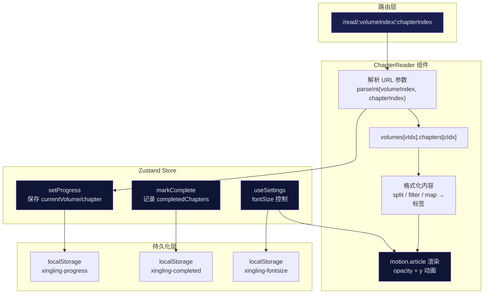
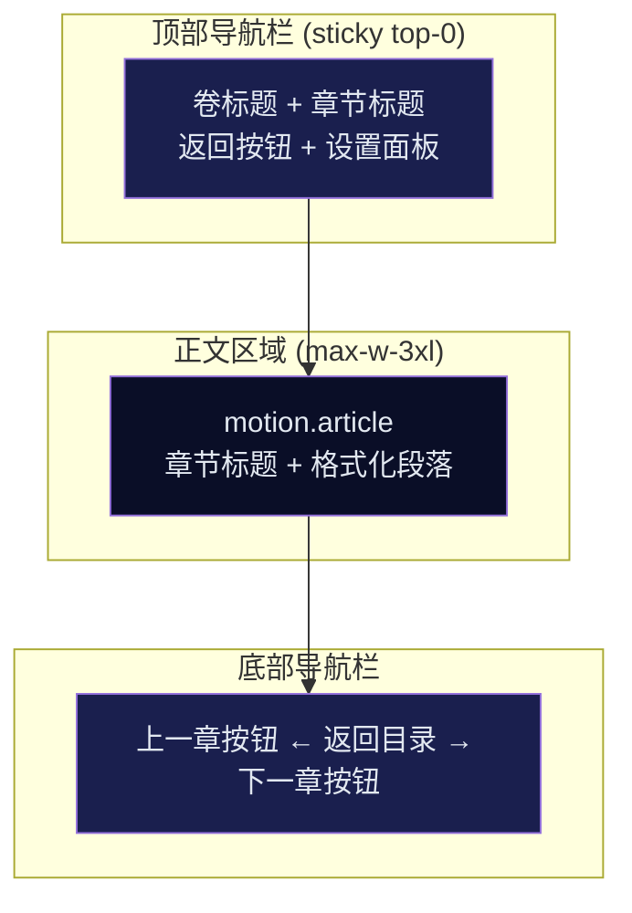

章节阅读器是"星灵"小说应用的核心阅读界面，负责以沉浸式排版呈现小说正文内容。它通过 URL 参数路由定位具体章节，结合 Zustand 状态管理实现阅读进度自动保存、章节完成标记以及可调节的字号设置，同时借助 Framer Motion 提供平滑的内容入场动效。该组件是整个阅读链路中用户停留时间最长的页面，其设计目标是在视觉沉浸感与阅读功能性之间取得平衡。

## 组件架构总览

章节阅读器遵循"数据定位 → 状态更新 → 内容渲染 → 交互导航"的单向数据流。组件从 react-router 的 URL 参数中解析 `volumeIndex` 和 `chapterIndex`，以此为索引从 `volumes` 数据数组中提取对应章节，随后驱动 Zustand store 更新全局阅读状态。

**核心数据流**：URL 参数驱动章节定位 → 数据提取后格式化为段落 → 状态更新触发 localStorage 持久化 → 动画过渡完成内容展示。

Sources: [ChapterReader.tsx](xingling-web/src/components/pages/ChapterReader.tsx#L1-L158), [store/index.ts](xingling-web/src/store/index.ts#L1-L68), [App.tsx](xingling-web/src/App.tsx#L16-L17)

## 内容渲染机制

章节阅读器对原始小说内容采用**轻量级 Markdown 解析策略**，而非引入完整的 Markdown 渲染库。`formattedContent` 通过 `useMemo` 计算属性处理：将章节 `content` 字符串按换行符分割，过滤空行与标题标记（`# ` 和 `## ` 开头的行），逐行包裹为 `
` 标签。每个段落应用 `text-justify leading-loose mb-4` 样式类，实现两端对齐、宽松行距与段间距。

| 处理步骤 | 输入 | 操作 | 输出 |
|---------|------|------|------|
| 分割 | `content` 字符串 | `split('\n')` | 行数组 |
| 过滤 | 包含空行的数组 | `filter(line => line.trim())` | 去除空白行 |
| 清洗 | 含 Markdown 标题的行 | `startsWith('# ')` 检测 | 跳过标题行 |
| 渲染 | 纯文本行 | 包裹 `
` 标签 | JSX 段落数组 |

这种设计决策基于项目数据源的特殊性：`novel.ts` 由 Markdown 解析脚本自动生成，章节内容中残留的标题行需要在前端过滤。同时，小说正文以段落为基本单位，不需要复杂的富文本渲染能力。

Sources: [ChapterReader.tsx](xingling-web/src/components/pages/ChapterReader.tsx#L34-L49)

## 阅读状态管理

章节阅读器与两个 Zustand store 协作：**`useStore`** 管理阅读进度与完成状态，**`useSettings`** 管理字号偏好。

### 进度持久化

当组件挂载且 URL 参数变化时（`[vIdx, cIdx]` 依赖触发），`setProgress` 将当前卷章索引写入 `localStorage` 的 `xingling-progress` 键。这一机制确保用户刷新页面或重新进入应用时能够从上次位置恢复阅读。

### 完成标记

组件卸载时（`useEffect` 的 cleanup 函数），`markComplete` 将当前章节记录到 `completedChapters` 数组中。该数组以 `"${volume}-${chapter}"` 格式作为唯一键，写入 `xingling-completed` 键。其他页面（如[卷选择器](13-juan-xuan-ze-qi)）可读取此数据以展示阅读进度标识。

### 字号设置

Settings store 独立维护 `fontSize` 状态（默认 18px，范围 14-28px），通过 `xingling-fontsize` 键持久化。初始化时从 localStorage 读取已保存值并恢复。

Sources: [ChapterReader.tsx](xingling-web/src/components/pages/ChapterReader.tsx#L22-L31), [store/index.ts](xingling-web/src/store/index.ts#L1-L68)

## 页面布局结构

章节阅读器采用**三段式布局**，每部分在视觉与功能上承担明确职责：

**顶部导航栏**使用 `sticky top-0 z-50` 固定在视口顶部，背景为 `bg-cosmic-900/90 backdrop-blur-md` 的半透明磨砂效果。左侧展示当前卷名（`text-accent`）和章节名（`text-secondary`）的层级信息，右侧为设置按钮，点击后展开包含字号滑块的浮层面板。

**正文区域**限制最大宽度为 `max-w-3xl`（约 48rem），居中对齐，上下内边距为 `py-12`。章节标题使用 `text-2xl md:text-3xl` 响应式字号，下方以 `border-b border-cosmic-600/30` 分隔线区分标题与正文。段落内容应用 `text-text-primary/90` 实现轻微的透明度衰减，降低长时间阅读的视觉疲劳。

**底部导航栏**提供三种导航路径：左侧"上一章"按钮（首章时隐藏）、中间"返回目录"链接、右侧"下一章"按钮（末章时隐藏）。按钮样式使用 `bg-cosmic-700/50` 半透明背景，悬停时切换至 `bg-cosmic-600/50`。

Sources: [ChapterReader.tsx](xingling-web/src/components/pages/ChapterReader.tsx#L60-L158), [index.css](xingling-web/src/index.css#L1-L77)

## 动画与交互细节

### 内容入场动画

章节内容使用 Framer Motion 的 `motion.article` 组件实现入场动画。初始状态为 `opacity: 0, y: 20`（下方 20px 且完全透明），在组件挂载 100ms 后通过 `setTimeout` 将 `textVisible` 置为 `true`，触发目标状态 `opacity: 1, y: 0`。过渡时长为 0.5 秒，产生从下方淡入的平滑效果。

延迟 100ms 的策略确保 DOM 结构完成初步渲染后再启动动画，避免动画帧丢失或视觉跳动。

### 设置面板交互

设置面板采用绝对定位浮层实现：`absolute right-0 top-full mt-2` 使其从设置按钮右下方弹出，配合 `shadow-xl` 提供层级深度感。面板宽度固定为 `w-64`，包含字号标签（`Type` 图标 + 当前值）与范围滑块。滑块使用 `accent-nebula-500` 主题色与项目整体色调一致。

Sources: [ChapterReader.tsx](xingling-web/src/components/pages/ChapterReader.tsx#L25-L27), [ChapterReader.tsx](xingling-web/src/components/pages/ChapterReader.tsx#L103-L109)

## 数据模型集成

章节阅读器读取的数据结构由 `novel.ts` 中的 `Volume` 和 `Chapter` 接口定义：

| 接口 | 字段 | 类型 | 说明 |
|------|------|------|------|
| `Chapter` | `title` | `string` | 章节标题 |
| `Chapter` | `content` | `string` | 章节正文（原始文本） |
| `Chapter` | `lineStart` | `number` | 在原始 Markdown 文件中的起始行号 |
| `Volume` | `title` | `string` | 卷标题 |
| `Volume` | `chapters` | `Chapter[]` | 该卷包含的所有章节 |
| `Volume` | `theme` | `string` | 卷主题标识（用于视觉样式差异化） |

`novel.ts` 共包含 16 卷小说数据，总计 1114 行 TypeScript 代码，由 [Markdown 解析脚本](11-markdown-jie-xi-jiao-ben) 从 `星灵.md` 自动生成。章节阅读器通过 `volumes[vIdx]?.chapters[cIdx]` 的安全访问模式处理可能的越界索引，返回"章节未找到"的兜底 UI。

Sources: [ChapterReader.tsx](xingling-web/src/components/pages/ChapterReader.tsx#L18-L20), [novel.ts](xingling-web/src/data/novel.ts#L1-L15)

## 扩展方向

当前章节阅读器的实现已满足基础阅读需求，以下方向可作为后续迭代参考：

- **Markdown 富文本渲染**：引入 `react-markdown` 等库，支持粗体、斜体、引用块、图片等 Markdown 语法，提升正文表现力
- **滚动位置恢复**：记录离开章节时的 `scrollTop` 值，再次进入时自动滚动至同一位置
- **章节内搜索**：在正文区域添加 Ctrl+F 搜索功能，高亮匹配文本
- **阅读进度可视化**：在顶部导航栏添加进度条，显示当前章节内的滚动百分比
- **夜间/日间主题切换**：扩展 Settings store，支持完整的主题色方案切换

如需了解章节导航的上游组件，可查阅 [卷选择器](13-juan-xuan-ze-qi)；如需了解数据生成方式，可查阅 [Markdown 解析脚本](11-markdown-jie-xi-jiao-ben)。