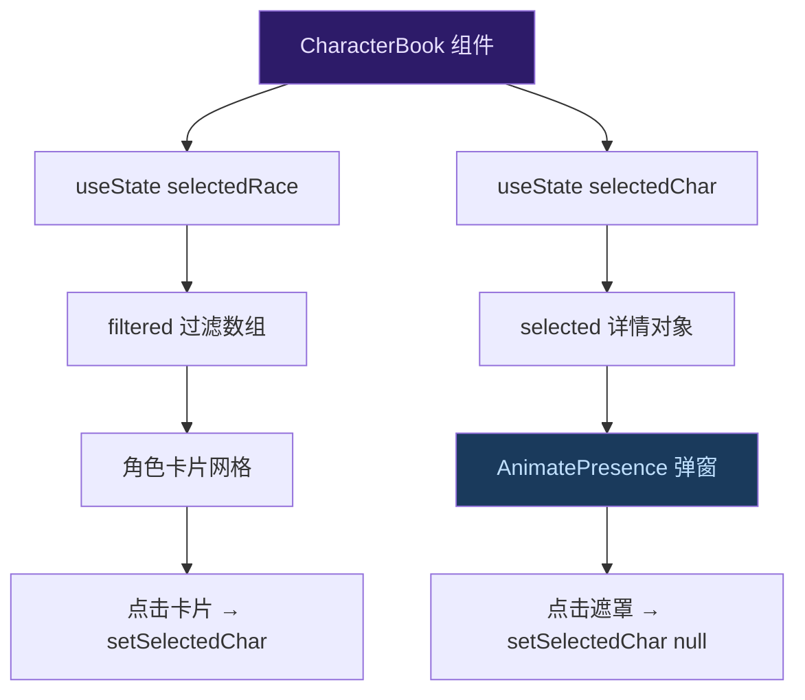
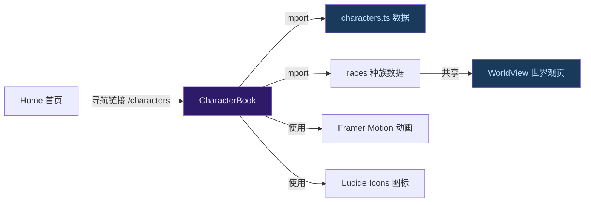

人物图鉴（CharacterBook）是星灵世界中角色信息的可视化浏览页面。它以**种族筛选 + 卡片网格 + 详情弹窗**的交互模式，帮助读者快速定位和探索小说中的数十位角色。页面路由为 `/characters`，数据完全静态存储于本地 TypeScript 模块中。

Sources: [CharacterBook.tsx](xingling-web/src/components/pages/CharacterBook.tsx#L1-L194), [characters.ts](xingling-web/src/data/characters.ts#L1-L457)

## 组件架构

人物图鉴采用**双层状态驱动**的设计——外层管理种族筛选，内层管理详情弹窗。两个状态均为 `null`-able 的 `useState`，组合出三种交互态：默认网格视图、筛选后网格视图、弹窗详情视图。



组件文件结构如下：

Sources: [CharacterBook.tsx](xingling-web/src/components/pages/CharacterBook.tsx#L6-L12), [App.tsx](xingling-web/src/App.tsx#L6-L18)

## 数据模型

所有角色数据定义在 `characters.ts` 中，通过 TypeScript 接口约束结构一致性。每个角色包含 **7 个字段**，其中 3 个为可选：

| 字段 | 类型 | 必填 | 说明 | 示例 |
|------|------|------|------|------|
| `name` | `string` | ✅ | 角色中文名 | `"安培尔"` |
| `alias` | `string` | ❌ | 外文名/别称 | `"Ampere"` |
| `race` | `string` | ✅ | 所属种族（关联 races 数组） | `"安吉拉"` |
| `role` | `string` | ✅ | 身份描述 | `"主角 / 安兹华德公司暗部特别行动队成员"` |
| `description` | `string` | ✅ | 角色背景描述 | `"拥有电磁系权能的金发安吉拉少女..."` |
| `abilities` | `string` | ❌ | 权能/技能列表 | `"电磁系权能、黑客技术、EMP脉冲"` |
| `volumes` | `number[]` | ✅ | 登场的卷号数组 | `[1, 2, 3, 4, 5]` |
| `relationships` | `string[]` | ❌ | 人物关系描述 | `["凯奥斯的救命恩人与同伴"]` |

种族数据独立于角色数组，以 `races` 数组导出，包含 5 个主要种族：安吉拉、卡普拉、泰坦、精灵、人类。部分角色标注为「未知」种族（如凯奥斯、托尼），这些不会出现在种族筛选按钮中。

Sources: [characters.ts](xingling-web/src/data/characters.ts#L1-L8), [characters.ts](xingling-web/src/data/characters.ts#L450-L456)

## 交互功能

### 种族筛选器

页面顶部的 pill 按钮组支持按种族过滤角色。**「全部」按钮**始终显示，各种族按钮动态计算角色数量——数量为 0 的种族不会渲染按钮。选中态通过 `bg-nebula-500` 高亮区分。

筛选逻辑简洁：`selectedRace` 为 `null` 时返回全量数组，否则调用 `Array.filter()` 匹配 `c.race === selectedRace`。

Sources: [CharacterBook.tsx](xingling-web/src/components/pages/CharacterBook.tsx#L29-L53)

### 角色卡片网格

卡片采用响应式 CSS Grid 布局：单列 → 双列 → 三列随视口自适应。每张卡片展示：

- **头像**：取 `name[0]` 首字作为圆形渐变背景的占位头像
- **身份标识**：种族 + 角色的副标题行
- **描述预览**：截断至 80 字符的简介
- **登场卷标**：最多显示前 5 个卷号标签，超出部分以 `+N` 示意

卡片入场动画使用 `whileInView` 配合递增 `delay`（`idx * 0.03`），实现瀑布流式的渐显效果。

Sources: [CharacterBook.tsx](xingling-web/src/components/pages/CharacterBook.tsx#L56-L82)

### 详情弹窗

点击卡片触发 `selectedChar` 状态更新，`AnimatePresence` 包裹的模态层接管渲染。弹窗包含四个信息区块：

1. **头部**：大号头像 + 姓名（含别称）+ 种族角色标签，右上角关闭按钮
2. **完整描述**：不加截断的全文本展示
3. **权能区块**（可选）：带 ⚡ 图标的独立卡片，仅当 `abilities` 存在时渲染
4. **人物关系**（可选）：带 ❤️ 图标的列表，仅当 `relationships` 非空时渲染
5. **登场卷**：完整卷号标签列表

弹窗支持点击外部遮罩关闭（`e.stopPropagation()` 防止内部点击冒泡），退出时使用 `scale: 0.9, y: 20` 的缩小动画。

Sources: [CharacterBook.tsx](xingling-web/src/components/pages/CharacterBook.tsx#L85-L188)

## 与系统的关联

人物图鉴并非孤立页面，它与项目其他模块存在明确的数据流向：



- **首页入口**：[Home](xingling-web/src/components/pages/Home.tsx#L60) 提供 `/characters` 导航链接
- **数据共享**：`races` 数组同时被 [世界观浏览](xingling-web/src/components/pages/WorldView.tsx#L5) 引用，确保种族描述一致性
- **动画系统**：复用项目统一的 Framer Motion 配置，卡片入场与弹窗切换遵循 [Framer Motion 动画系统](19-framer-motion-dong-hua-xi-tong) 的设计规范

Sources: [Home.tsx](xingling-web/src/components/pages/Home.tsx#L60), [WorldView.tsx](xingling-web/src/components/pages/WorldView.tsx#L5)

## 扩展指南

### 添加新角色

在 `characters.ts` 的 `characters` 数组末尾追加对象即可。建议按种族分组并添加注释分隔线（如 `// === 主角团 ===`），保持可读性。

```typescript
{
  name: '新角色名',
  alias: 'NewChar',
  race: '安吉拉',
  role: '角色定位描述',
  description: '详细背景描述...',
  abilities: '权能列表',
  volumes: [1, 2],
  relationships: ['与X的关系'],
}
```

### 添加新种族

在 `races` 数组中追加种族定义后，筛选器会自动出现对应按钮。需要确保至少有一个角色的 `race` 字段与该种族名匹配。

### 修改卡片布局

卡片的列数由 Tailwind 的 `grid-cols-1 sm:grid-cols-2 lg:grid-cols-3` 控制。调整断点或列数直接修改 [CharacterBook.tsx](xingling-web/src/components/pages/CharacterBook.tsx#L56) 的 className 即可。