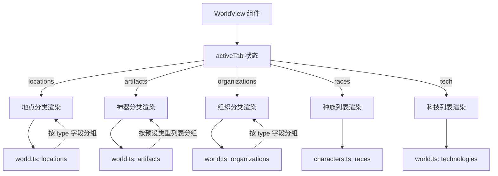
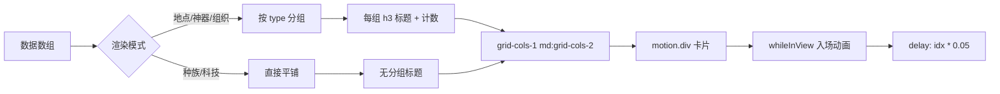

世界观浏览页面是星灵阅读应用中用于**系统性展示小说世界设定**的参考页面。它以分类标签页的形式，将小说中出现的地点、神器、组织、种族和科技设定进行结构化呈现，帮助读者在阅读过程中快速查阅世界观信息，构建对故事背景的整体认知。

该页面通过 `/world` 路由访问，从首页的「世界观」导航卡片即可进入。

Sources: [App.tsx](xingling-web/src/App.tsx#L15-L27), [Home.tsx](xingling-web/src/components/pages/Home.tsx#L59-L69)

## 页面架构

世界观浏览页面采用**单组件 + 多数据源**的架构模式。整个页面由一个 `WorldView` 组件承载，通过 `activeTab` 状态切换五个内容区域，每个区域从独立的数据模块中读取对应的条目并分组渲染。

这种设计将 UI 逻辑与数据定义完全解耦——当小说设定更新时，只需修改数据文件中的数组内容，页面会自动适配新数据量。

Sources: [WorldView.tsx](xingling-web/src/components/pages/WorldView.tsx#L1-L15), [world.ts](xingling-web/src/data/world.ts#L1-L108), [characters.ts](xingling-web/src/data/characters.ts#L450-L457)

## 数据模型

世界观数据分布在两个数据文件中，共定义了四种接口类型和一个导出数组：

| 数据项 | 接口定义 | 来源文件 | 条目数量 | 分组方式 |
|--------|---------|---------|---------|---------|
| 地点 (Location) | `name`, `description`, `volume?`, `type?` | [world.ts](xingling-web/src/data/world.ts#L1-L5) | ~25 条 | 按 `type` 动态分组 |
| 神器 (Artifact) | `name`, `description`, `type?` | [world.ts](xingling-web/src/data/world.ts#L7-L10) | ~15 条 | 按预设类型列表硬编码 |
| 组织 (Organization) | `name`, `description`, `type` | [world.ts](xingling-web/src/data/world.ts#L12-L15) | ~9 条 | 按预设类型列表硬编码 |
| 科技 (Technology) | `name`, `description` | [world.ts](xingling-web/src/data/world.ts#L17-L19) | ~8 条 | 平铺网格展示 |
| 种族 (Race) | `name`, `description` | [characters.ts](xingling-web/src/data/characters.ts#L450-L457) | 5 条 | 平铺网格展示 |

**数据分组策略差异**：地点使用 `[...new Set(locations.map(l => l.type))]` 动态提取所有类型进行分组，这意味着新增地点类型时页面会自动生成新的分组标题。而神器和组织采用预设类型数组遍历，未匹配的类型不会显示，这暗示了部分数据可能存在类型字段不一致的情况。

Sources: [WorldView.tsx](xingling-web/src/components/pages/WorldView.tsx#L16-L17), [WorldView.tsx](xingling-web/src/components/pages/WorldView.tsx#L85), [world.ts](xingling-web/src/data/world.ts#L1-L108)

## 标签页导航

页面顶部设置五个标签按钮，每个标签配有对应的图标，通过颜色标识当前激活状态：

| 标签 | 键值 | 图标 | 激活颜色 |
|------|------|------|---------|
| 地点 | `locations` | MapPin | `bg-nebula-500/20 text-nebula-400` |
| 神器 | `artifacts` | Sparkles | 同上 |
| 组织 | `organizations` | Building2 | 同上 |
| 种族 | `races` | Globe | 同上 |
| 科技 | `tech` | Cpu | 同上 |

所有标签切换均通过 `useState` 管理的 `activeTab` 状态驱动，切换时页面内容立即更新，无过渡动画。底部以 `border-cosmic-600/30` 分隔线标识标签区域与内容区域的边界。

Sources: [WorldView.tsx](xingling-web/src/components/pages/WorldView.tsx#L7-L14), [WorldView.tsx](xingling-web/src/components/pages/WorldView.tsx#L26-L42)

## 渲染逻辑与动画

页面中四个标签页的内容渲染遵循统一的**分组 → 网格 → 卡片**模式，但根据数据特征有所调整：

**动画策略**：

- 所有条目卡片使用 Framer Motion 的 `initial={{ opacity: 0, y: 20 }}` 和 `whileInView={{ opacity: 1, y: 0 }}` 实现滚动入场效果
- `viewport={{ once: true }}` 确保动画仅触发一次，避免反复滚动时的视觉干扰
- `transition={{ delay: idx * 0.05 }}` 产生**级联延迟**效果，卡片依次出现而非同时显现
- 种族和科技的延迟系数为 `0.08`，比地点/神器/组织的 `0.05` 稍慢，与每组卡片数量的差异相匹配

Sources: [WorldView.tsx](xingling-web/src/components/pages/WorldView.tsx#L50-L60), [WorldView.tsx](xingling-web/src/components/pages/WorldView.tsx#L180-L187)

## 卡片设计模式

各类条目使用统一的卡片布局但具有细微的视觉区分：

- **地点卡片**：左侧 `MapPin` 图标（`text-star-400`），底部可选显示卷号标签（`第X卷`），hover 时边框变为 `border-star-500/30`
- **神器卡片**：左侧 `Sparkles` 图标（`text-aurora-400`），hover 时边框变为 `border-aurora-500/30`
- **组织卡片**：无图标，仅有标题和描述，无 hover 边框变化
- **种族卡片**：无图标，字体稍大（`text-xl`），无 hover 效果
- **科技卡片**：左侧 `Cpu` 图标（`text-star-400`），布局同地点卡片

所有卡片共享基础样式：`rounded-xl bg-cosmic-700/30 border border-cosmic-600/30`，与应用的宇宙主题保持一致。

Sources: [WorldView.tsx](xingling-web/src/components/pages/WorldView.tsx#L51-L60), [WorldView.tsx](xingling-web/src/components/pages/WorldView.tsx#L94-L112), [WorldView.tsx](xingling-web/src/components/pages/WorldView.tsx#L132-L146)

## 与相邻功能的关系

世界观浏览页面在应用的信息架构中处于**参考资料**层级，与以下页面形成互补：

- **[人物图鉴](15-ren-wu-tu-jian)** — 世界观中的「种族」标签页与人物图鉴共享 `characters.ts` 中的 `races` 数据，种族描述同时服务于角色浏览和世界观浏览两个场景
- **[时间线](17-shi-jian-xian)** — 世界观页面呈现静态设定（地点是什么、神器是什么），时间线页面呈现动态事件（何时发生），两者结合可构建完整的世界认知
- **[章节阅读器](14-zhang-jie-yue-du-qi)** — 阅读过程中遇到不熟悉的设定时，读者可通过首页快速跳转到世界观页面查阅

数据层面，世界观页面从 `world.ts` 读取全部四类世界设定数据，而 `world.ts` 中的 `Location.volume` 字段与卷号关联，未来可扩展为从章节阅读器直接跳转到对应地点的详情。

Sources: [WorldView.tsx](xingling-web/src/components/pages/WorldView.tsx#L5), [characters.ts](xingling-web/src/data/characters.ts#L450-L457)

## 扩展建议

对于初学者，理解此页面后可进一步探索：

1. 查看 **[角色与世界观数据](10-jiao-se-yu-shi-jie-guan-shu-ju)** 了解 `world.ts` 和 `characters.ts` 的完整数据结构定义
2. 研究 **[Framer Motion 动画系统](19-framer-motion-dong-hua-xi-tong)** 深入理解 `whileInView` 和级联延迟的工作原理
3. 对比 **[人物图鉴](15-ren-wu-tu-jian)** 页面，理解不同页面如何复用同一数据源