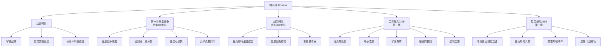

时间线页面是《星灵》阅读应用中的**编年史导航中心**，将小说中跨越千年的叙事事件按时间顺序组织为可浏览的视觉时间轴。该页面以五个历史时代为骨架，通过分类标签、图标系统和入场动画，帮助读者快速建立对故事世界观的全局认知。

Sources: [Timeline.tsx](xingling-web/src/components/pages/Timeline.tsx#L1-L358)

## 页面定位与数据模型

时间线页面在应用路由中挂载于 `/timeline` 路径，从首页的导航卡片直接进入。其核心是一个静态事件数组 `timelineData`，每个事件遵循统一的 `TimelineEvent` 接口定义：

| 字段 | 类型 | 说明 |
|------|------|------|
| `year` | `string` | 时代标识，如"远古时代"、"星灵纪元2275" |
| `title` | `string` | 事件标题 |
| `description` | `string` | 事件详细描述文本 |
| `volume` | `number` | 关联的小说卷号（用于跨页面跳转引用） |
| `icon` | `string` | Lucide 图标键名 |
| `category` | `string` | 事件分类，决定颜色与语义 |

Sources: [Timeline.tsx](xingling-web/src/components/pages/Timeline.tsx#L5-L14)

## 事件分类系统

页面采用**六类事件标签**对叙事内容进行语义标注，每类绑定独立的配色方案与图标，读者可通过顶部的图例面板快速识别事件性质：

| 分类键 | 中文标签 | 图标 | 主色 | 背景色 |
|--------|----------|------|------|--------|
| `war` | 战争 | Flame（火焰） | `text-red-400` | `bg-red-500` |
| `discovery` | 发现 | Sparkles（星光） | `text-nebula-400` | `bg-nebula-500` |
| `personal` | 个人 | Heart（心形） | `text-star-400` | `bg-star-500` |
| `political` | 政治 | Flag（旗帜） | `text-amber-400` | `bg-amber-500` |
| `tragedy` | 悲剧 | Skull（骷髅） | `text-gray-400` | `bg-gray-500` |
| `hope` | 希望 | Zap（闪电） | `text-aurora-400` | `bg-aurora-500` |

Sources: [Timeline.tsx](xingling-web/src/components/pages/Timeline.tsx#L200-L218)

## 时代分层结构

时间线数据按**五个历史时代**进行分组渲染，每个时代作为独立区块展示：



分组逻辑通过 `eras` 数组实现，使用 `filter` 按 `year` 字段从 `timelineData` 中提取对应事件。空时代区块会被自动跳过（`era.events.length > 0` 条件判断）。

Sources: [Timeline.tsx](xingling-web/src/components/pages/Timeline.tsx#L228-L236)

## 渲染架构与视觉设计

### 整体布局

```mermaid
graph LR
    A[Timeline 组件] --> B[Header 区域]
    A --> C[Legend 图例]
    A --> D[Era 区块列表]

    B --> B1[返回箭头 → /]
    B --> B2[标题"时间线"]
    B --> B3[副标题描述]

    C --> C1[6个分类标签]

    D --> D1[时代标题]
    D --> D2[垂直渐变线]
    D --> D3[事件卡片列表]

    D3 --> D3A[圆点标记]
    D3 --> D3B[事件卡片]
    D3B --> D3B1[图标+年份+卷号]
    D3B --> D3B2[事件标题]
    D3B --> D3B3[描述文本]
```

每个时代区块包含一条**垂直渐变线**（`from-nebula-500 via-star-500 to-aurora-500`）作为视觉主轴，事件卡片沿主轴右侧排列，通过左侧圆点与主线相连。

Sources: [Timeline.tsx](xingling-web/src/components/pages/Timeline.tsx#L238-L289)

### 动画系统

事件卡片使用 **Framer Motion** 实现滚动触发的入场动画：

| 属性 | 值 | 效果 |
|------|------|------|
| `initial` | `{ opacity: 0, x: -20 }` | 初始状态：不可见，向左偏移 20px |
| `whileInView` | `{ opacity: 1, x: 0 }` | 进入视口时：淡入并滑回原位 |
| `viewport` | `{ once: true }` | 动画仅触发一次 |
| `transition.delay` | `idx * 0.08` | 卡片逐个延迟 80ms，形成瀑布流效果 |

Sources: [Timeline.tsx](xingling-web/src/components/pages/Timeline.tsx#L265-L270)

## 图标映射机制

页面通过 `iconMap` 字典将字符串键名映射为 Lucide React 组件，实现数据驱动的图标渲染：

```
"flame"   → Flame    "sparkles" → Sparkles  "heart" → Heart
"flag"    → Flag     "skull"    → Skull     "zap"   → Zap
"star"    → Star     "shield"   → Shield
```

渲染时若图标键不存在，则回退到 `Sparkles` 作为默认图标。

Sources: [Timeline.tsx](xingling-web/src/components/pages/Timeline.tsx#L220-L227)

## 数据与主题系统

时间线页面的视觉风格与项目全局主题保持一致：

- **背景色系**：`cosmic-700/30` 半透明卡片背景，`cosmic-600/30` 边框
- **文本色系**：`text-primary`（正文）、`text-secondary`（辅助文字）、`text-accent`（标题强调）
- **渐变线**：nebula → star → aurora 三色渐变，呼应应用品牌色
- **字体**：全局使用 Noto Serif SC 衬线字体，营造文学阅读氛围

Sources: [index.css](xingling-web/src/index.css#L1-L77)

## 扩展指南

### 添加新事件

在 `timelineData` 数组中追加对象即可：

```typescript
{
  year: '星灵纪元2290',
  title: '新事件标题',
  description: '事件描述...',
  volume: 3,
  icon: 'sparkles',
  category: 'discovery',
}
```

### 添加新时代

在 `eras` 数组中增加分组配置：

```typescript
{ label: '新时代名称', events: timelineData.filter((e) => e.year === '对应year值') }
```

Sources: [Timeline.tsx](xingling-web/src/components/pages/Timeline.tsx#L15-L198)

## 相关页面

- 了解小说章节结构：[章节阅读器](14-zhang-jie-yue-du-qi)
- 探索角色关系网络：[人物图鉴](15-ren-wu-tu-jian)
- 浏览地理与组织设定：[世界观浏览](16-shi-jie-guan-liu-lan)
- 学习动画实现原理：[Framer Motion 动画系统](19-framer-motion-dong-hua-xi-tong)