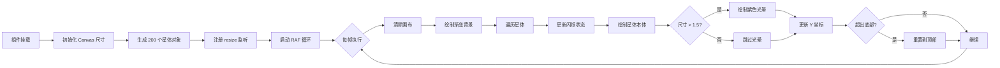

星空背景动画是「星灵」阅读应用的视觉基石，为整个应用营造出沉浸式的宇宙深空氛围。该效果通过原生 Canvas 2D API 实现，以声明式 React 组件的形式集成到应用根层级，对所有页面生效。

Sources: [StarField.tsx](xingling-web/src/components/effects/StarField.tsx#L1-L98)

## 架构概览

星空背景采用"全局层叠"架构——`StarField` 组件作为固定背景层挂载于应用根节点，通过 CSS 定位和 z-index 控制确保其位于所有页面内容之下且不影响用户交互。

```mermaid
graph TD
    A[App.tsx 根组件] --> B[StarField 星空画布]
    A --> C[BrowserRouter 路由容器]
    C --> D[Home 首页]
    C --> E[VolumeSelector 卷选择器]
    C --> F[ChapterReader 章节阅读器]
    C --> G[CharacterBook 人物图鉴]
    C --> H[WorldView 世界观]
    C --> I[Timeline 时间线]
    
    B -.固定定位 .z-10.-> D
    B -.固定定位 .z-10.-> E
    B -.固定定位 .z-10.-> F
    B -.固定定位 .z-10.-> G
    B -.固定定位 .z-10.-> H
    B -.固定定位 .z-10.-> I
    
    style B fill:#1a1f4e,stroke:#8b5cf6,color:#e2e8f0
```

**核心设计决策**：将 `StarField` 置于 `<BrowserRouter>` 内部但在 `<Routes>` 外部，确保所有路由页面共享同一背景实例，避免页面切换时的重绘闪烁。

Sources: [App.tsx](xingling-web/src/App.tsx#L1-L27)

## 渲染管线

星空动画的渲染管线基于 Canvas 2D 的 requestAnimationFrame 循环，每一帧执行完整的重绘流程：



Sources: [StarField.tsx](xingling-web/src/components/effects/StarField.tsx#L14-L75)

## 星体数据模型

每个星体由 `Star` 接口定义，包含六个维度的属性：

| 属性 | 类型 | 取值范围 | 作用 |
|------|------|----------|------|
| `x` | `number` | `[0, canvas.width]` | 水平位置 |
| `y` | `number` | `[0, canvas.height]` | 垂直位置，持续递增实现下落效果 |
| `size` | `number` | `[0.5, 2.5]` | 星体半径，决定是否有光晕效果 |
| `speed` | `number` | `[0.05, 0.35]` | 每帧下移速度，模拟远近视觉差 |
| `opacity` | `number` | `[0, 1]` | 当前透明度，用于闪烁动画 |
| `twinkleSpeed` | `number` | `[0.005, 0.025]` | 透明度变化速率，正负交替实现闪烁 |

Sources: [StarField.tsx](xingling-web/src/components/effects/StarField.tsx#L3-L10)

## 视觉效果分解

### 渐变背景层

画布每帧首先绘制三段线性渐变，构建深空底色：

| 渐变节点 | 色值 | 视觉含义 |
|----------|------|----------|
| `0%` (顶部) | `#0a0e27` | 深邃夜空 |
| `50%` (中部) | `#0f1535` | 过渡暗区 |
| `100%` (底部) | `#1a1f4e` | 微光地平线 |

这三个色值与应用的全局主题色 `cosmic-900`、`cosmic-800`、`cosmic-700` 完全一致，确保 Canvas 背景与 CSS 背景无缝衔接。

Sources: [StarField.tsx](xingling-web/src/components/effects/StarField.tsx#L40-L44), [index.css](xingling-web/src/index.css#L3-L5)

### 闪烁机制

闪烁通过透明度正弦模拟实现——每个星体以独立的 `twinkleSpeed` 速率增减透明度，在 `0.1` 到 `1.0` 之间往复：

```
opacity += twinkleSpeed
if opacity > 1 || opacity < 0.1:
    twinkleSpeed *= -1  // 方向反转
```

这种简单的一维三角波模拟避免了三角函数计算，在 200 个星体规模下保持流畅。

Sources: [StarField.tsx](xingling-web/src/components/effects/StarField.tsx#L48-L51)

### 光晕效果

当星体尺寸超过 1.5 像素时，额外绘制一层紫色光晕：

- **光晕半径**: `size × 3`
- **光晕颜色**: `rgba(139, 92, 246, opacity × 0.1)` —— 对应主题色 `nebula-500`
- **渲染顺序**: 先绘制光晕（大面积低透明度），再绘制星体本体（小面积高透明度）

这种双层绘制模拟了真实恒星的衍射光环效果，且由于只对约 30% 的大星体启用，性能开销可控。

Sources: [StarField.tsx](xingling-web/src/components/effects/StarField.tsx#L56-L60)

### 下落与循环

所有星体以恒定速度向下移动，当超出画布底部时重置到顶部并随机分配新的 X 坐标，形成持续的流星雨效果。速度范围 `[0.05, 0.35]` 产生的视差暗示了星体的远近层次。

Sources: [StarField.tsx](xingling-web/src/components/effects/StarField.tsx#L62-L66)

## 组件集成方式

`StarField` 以固定定位覆盖整个视口，通过两个机制确保不干扰用户交互：

1. **CSS 类**: `fixed inset-0 w-full h-full -z-10` —— 固定定位、全尺寸、z-index 为负
2. **内联样式**: `pointerEvents: 'none'` —— 穿透所有鼠标事件

```
┌─────────────────────────────────────┐
│         用户交互层 (z-0+)           │  ← 页面内容可交互
├─────────────────────────────────────┤
│    StarField Canvas (z--10)        │  ← pointerEvents: none
├─────────────────────────────────────┤
│    body background: #0a0e27         │  ← 兜底色
└─────────────────────────────────────┘
```

Sources: [StarField.tsx](xingling-web/src/components/effects/StarField.tsx#L82-L90)

## 生命周期管理

组件通过 `useEffect` 的空依赖数组实现精确的资源管理：

- **挂载阶段**: 获取 Canvas 上下文、初始化星体数组、注册 resize 监听、启动 RAF 循环
- **卸载阶段**: 通过 `cancelAnimationFrame` 终止动画循环、移除 resize 事件监听

这种模式避免了组件卸载后的幽灵动画（zombie animation）和内存泄漏。

Sources: [StarField.tsx](xingling-web/src/components/effects/StarField.tsx#L12-L78)

## 性能特征

| 指标 | 数值 | 说明 |
|------|------|------|
| 星体数量 | 200 | 固定数量，不随视口缩放变化 |
| 每帧绘制操作 | ~220 次 (200 本体 + ~60 光晕 + 1 背景) | 轻量 2D 操作 |
| 动画帧率 | 60fps (RAF 驱动) | 受浏览器标签页可见性 API 自动降频 |
| 内存占用 | ~8KB (200 个 Star 对象) | 极小 |
| 重绘区域 | 全画布 | 每帧 clearRect + 全量重绘 |

Sources: [StarField.tsx](xingling-web/src/components/effects/StarField.tsx#L25-L28), [StarField.tsx](xingling-web/src/components/effects/StarField.tsx#L46-L70)

## 扩展方向

当前实现已覆盖核心视觉效果，以下是经过验证的扩展路径：

- **鼠标视差交互**: 监听 `mousemove` 事件，根据光标位置微调星体 X 偏移
- **分层星空**: 将星体分为远/中/近三层，不同层使用不同的速度梯度和颜色温度
- **星座连线**: 在特定页面（如世界观）增加近距星体之间的微光连线
- **配置化参数**: 将星体数量、速度范围、光晕颜色抽离为 props，适配不同页面氛围

Sources: [StarField.tsx](xingling-web/src/components/effects/StarField.tsx#L1-L98)

## 与其他视觉系统的关系

星空背景与应用的其他视觉层协同工作：

- **[主题与样式系统](20-zhu-ti-yu-yang-shi-xi-tong)**: Canvas 渐变色值与 CSS 自定义属性（`--color-cosmic-*`）保持一致
- **[Framer Motion 动画系统](19-framer-motion-dong-hua-xi-tong)**: Canvas 星空作为底层静态动效，Framer Motion 负责 UI 组件的入场/转场动画，两者分层独立不冲突
- **[首页与导航](12-shou-ye-yu-dao-hang)**: 首页额外的 `<Sparkles>` 装饰元素以 Framer Motion 驱动，叠加在 Canvas 星空之上形成视觉层次