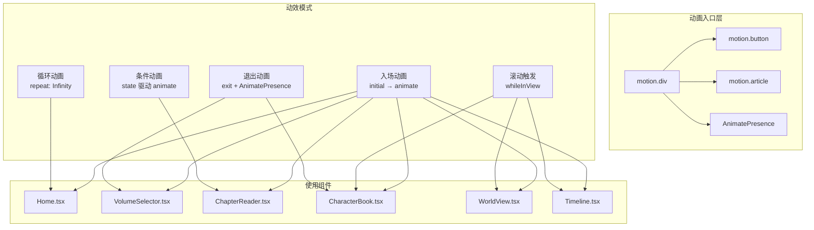

本文档系统梳理星灵 Web 应用中 Framer Motion 动画库的使用模式、组件分布与设计策略。项目采用 **framer-motion ^12.38.0**，在 6 个页面组件中实现了页面入场、滚动触发、条件显隐、循环装饰等动效，形成了一套**去中心化但风格统一**的动画实现体系。

Sources: [package.json](xingling-web/package.json#L14)

## 动画架构总览

项目未使用共享的 variants 对象或自定义动画 hooks，而是由各页面组件直接声明式地定义动画属性。这种策略降低了抽象层复杂度，适合页面数量固定、动效模式相对集中的应用场景。

Sources: [Home.tsx](xingling-web/src/components/pages/Home.tsx#L1-L110) [VolumeSelector.tsx](xingling-web/src/components/pages/VolumeSelector.tsx#L1-L126) [ChapterReader.tsx](xingling-web/src/components/pages/ChapterReader.tsx#L1-L158) [CharacterBook.tsx](xingling-web/src/components/pages/CharacterBook.tsx#L1-L194) [WorldView.tsx](xingling-web/src/components/pages/WorldView.tsx#L1-L200) [Timeline.tsx](xingling-web/src/components/pages/Timeline.tsx#L300-L358)

## 动效模式分类

项目中的动画可以归纳为五种核心模式，每种模式对应特定的用户体验目标：

| 模式 | Framer Motion API | 典型参数 | 使用场景 | 涉及组件 |
|---|---|---|---|---|
| **入场滑入** | `initial` → `animate` | `opacity: 0→1`, `y: -40→0` | 页面加载时元素渐显 | Home, VolumeSelector, ChapterReader |
| **滚动触发** | `whileInView` | `viewport: { once: true }` | 长列表逐项显现 | CharacterBook, WorldView, Timeline |
| **退出过渡** | `exit` + `AnimatePresence` | `opacity: 1→0`, `height: auto→0` | 可折叠面板、模态框关闭 | VolumeSelector, CharacterBook |
| **循环装饰** | `animate` + `repeat: Infinity` | `backgroundPosition`, `scale` | 标题渐变流动、粒子闪烁 | Home |
| **条件驱动** | state 变量绑定 `animate` | 布尔值控制目标状态 | 章节内容延迟显现 | ChapterReader |

Sources: [Home.tsx](xingling-web/src/components/pages/Home.tsx#L9-L104) [VolumeSelector.tsx](xingling-web/src/components/pages/VolumeSelector.tsx#L56-L122) [ChapterReader.tsx](xingling-web/src/components/pages/ChapterReader.tsx#L107-L120) [CharacterBook.tsx](xingling-web/src/components/pages/CharacterBook.tsx#L64-L190)

## 各组件动效详解

### Home — 首页入场与循环装饰

首页承担项目视觉第一印象的角色，采用**多层次延迟入场**策略。标题容器首先从 `y: -40` 滑入，随后标题文字通过 `backgroundPosition` 的三帧关键帧实现渐变色流动效果（8 秒循环），副标题和标语分别延迟 0.8s 和 1.2s 渐显，形成视觉层次递进。导航卡片组延迟 0.5s 整体滑入。底部散布的 5 个 Sparkles 粒子各自以不同时长（3~7s）和延迟进行透明度与缩放循环，营造星空氛围。

Sources: [Home.tsx](xingling-web/src/components/pages/Home.tsx#L9-L104)

### VolumeSelector — 交错入场与可展开面板

卷选择器使用 `idx * 0.05` 的延迟系数实现 16 个卷卡片的**交错入场**效果，产生波浪式渐显的视觉节奏。核心交互是点击卷卡片后展开章节列表，通过 `AnimatePresence` 包裹 `motion.div`，利用 `height: 0 → auto` 实现平滑的高度过渡，退出时反向收折。

Sources: [VolumeSelector.tsx](xingling-web/src/components/pages/VolumeSelector.tsx#L56-L122)

### ChapterReader — 条件驱动的文本显现

章节阅读器采用 state 驱动的条件动画策略。组件挂载后通过 100ms 定时器设置 `textVisible` 状态为 `true`，`motion.article` 的 `animate` 属性根据该状态在 `{ opacity: 0, y: 20 }` 与 `{ opacity: 1, y: 0 }` 之间切换。这种模式确保 DOM 挂载后有一段极短的缓冲期，避免内容突然闪现。

Sources: [ChapterReader.tsx](xingling-web/src/components/pages/ChapterReader.tsx#L17-L20] [ChapterReader.tsx](xingling-web/src/components/pages/ChapterReader.tsx#L107-L120)

### CharacterBook — 滚动触发与模态框动效

人物图鉴在卡片列表中使用 `whileInView` + `viewport: { once: true }` 实现**滚动时逐项显现**，避免一次性渲染大量动画造成的性能压力。模态框采用双层动效：外层遮罩仅做透明度渐变，内层内容面板同时执行缩放（`scale: 0.9 → 1`）和位移（`y: 20 → 0`），形成"弹出"质感。

Sources: [CharacterBook.tsx](xingling-web/src/components/pages/CharacterBook.tsx#L64-L71) [CharacterBook.tsx](xingling-web/src/components/pages/CharacterBook.tsx#L103-L190)

### WorldView — 跨 Tab 统一的滚动动画

世界观浏览页在 5 个 Tab（地点、神器、组织、种族、科技）中统一使用 `whileInView` 模式，所有卡片均以 `y: 20 → 0` 的位移配合 `idx * 0.05` 的交错延迟渐显。不同 Tab 的差异化通过 border hover 颜色（`star-500`、`aurora-500` 等）而非动画参数实现。

Sources: [WorldView.tsx](xingling-web/src/components/pages/WorldView.tsx#L69-L209)

### Timeline — 横向滑入时间线

时间线组件采用 **`x: -20 → 0` 的横向入场**方向，与其余组件的纵向滑入形成区分，暗合时间轴从左至右的阅读直觉。每个事件卡片延迟 `idx * 0.08` 显现，较长的延迟间隔（相比其他组件的 0.03~0.05）适应时间线内容的纵向展开节奏。

Sources: [Timeline.tsx](xingling-web/src/components/pages/Timeline.tsx#L320-L347)

## 动画参数规范

项目中所有动画参数遵循一致的设计语言，以下表格总结了核心数值约定：

| 参数维度 | 常用值 | 设计意图 |
|---|---|---|
| 入场方向 | `y: -40→0`（标题）、`y: 20→0`（卡片）、`x: -20→0`（时间线） | 主次层级区分 |
| 交错延迟系数 | `0.03`~`0.08` × 索引 | 列表越长系数越小，控制整体节奏 |
| 入场持续时间 | `0.5`~`1.2s` | 标题较慢营造仪式感，卡片较快保证流畅 |
| 缓动函数 | `easeOut`（显式声明）或未指定（默认 `easeInOut`） | 入场多用 easeOut 自然减速 |
| 循环动画 | `duration: 3~8s`, `repeat: Infinity` | 装饰元素慢速循环不抢注意力 |
| 滚动触发 | `viewport: { once: true }` | 仅触发一次，避免反复动画干扰阅读 |

Sources: [Home.tsx](xingling-web/src/components/pages/Home.tsx#L9-L104) [VolumeSelector.tsx](xingling-web/src/components/pages/VolumeSelector.tsx#L56-L122) [Timeline.tsx](xingling-web/src/components/pages/Timeline.tsx#L320-L347)

## 与 CSS 过渡的协作

值得注意的是，Framer Motion 在本项目中**仅处理组件级别的显隐与位移动画**，而 hover 状态下的颜色变化、缩放、阴影等微交互统一通过 Tailwind CSS 的 `transition-all` / `transition-colors` / `transition-transform` 实现。这种分工避免了 Framer Motion 过度介入简单交互，保持了动效系统的轻量化。

Sources: [Home.tsx](xingling-web/src/components/pages/Home.tsx#L52-L85) [VolumeSelector.tsx](xingling-web/src/components/pages/VolumeSelector.tsx#L62-L82)

## 扩展建议

当前架构适合现有规模，若后续增加页面或需要统一调优动画曲线，可考虑以下演进方向：

- **提取共享 variants**：将 `fadeSlideUp`、`fadeSlideIn` 等重复模式抽离为共享 variants 对象
- **全局动画配置**：通过 `LayoutGroup` 或自定义 hook 实现跨页面动画协调
- **性能优化**：对长列表考虑 `layoutId` 共享元素过渡，减少 DOM 重建开销

如需了解相关主题，可继续阅读 [星空背景动画](18-xing-kong-bei-jing-dong-hua) 了解 Canvas 粒子系统与 Framer Motion 动画的协作方式，或查阅 [主题与样式系统](20-zhu-ti-yu-yang-shi-xi-tong) 了解动画中使用的色彩体系。