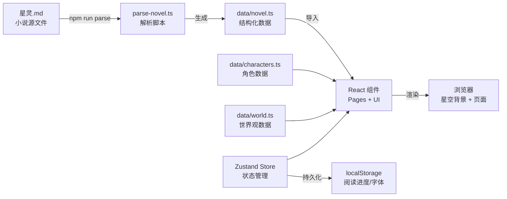

**星灵**（Xingling）是一个以科幻奇幻小说《星灵》为核心内容的沉浸式在线阅读平台。项目将小说文本、角色图鉴、世界观设定与时间线整合于统一的 Web 应用中，配合星空背景动效和主题化视觉设计，为读者提供多层次的阅读体验。

本页面向**初次接触项目的开发者**，涵盖从环境准备到本地运行的完整流程。完成本页面后，你应能够在本地启动开发服务器，理解项目的核心数据流，并为后续深入学习各模块做好准备。

## 项目概览与架构

星灵 Web 应用采用**数据驱动**的架构：源文件 `星灵.md` 通过解析脚本生成 TypeScript 数据模块，再由 React 组件消费并渲染。状态管理由 Zustand 驱动，阅读进度持久化至 localStorage。



Sources: [parse-novel.ts](xingling-web/scripts/parse-novel.ts#L1-L129), [App.tsx](xingling-web/src/App.tsx#L1-L27), [store/index.ts](xingling-web/src/store/index.ts#L1-L68)

## 环境准备

在开始之前，请确保你的开发环境满足以下要求：

| 依赖项 | 最低版本 | 说明 |
|--------|---------|------|
| Node.js | 20.x+ | 运行 Vite 开发服务器和构建工具 |
| 包管理器 | Bun 或 npm | 项目使用 `bun.lock` 锁定依赖，推荐 Bun |
| 操作系统 | Linux / macOS / Windows | Vite 跨平台支持 |

Sources: [package.json](xingling-web/package.json#L1-L39)

## 安装与启动

### 步骤一：进入项目目录并安装依赖

```bash
cd xingling-web
bun install        # 或 npm install
```

该命令将安装 `package.json` 中声明的全部依赖，包括 **React 19**、**Vite 8**、**Zustand 5**、**Framer Motion 12**、**React Router 7** 以及 **Tailwind CSS 4**。

Sources: [package.json](xingling-web/package.json#L13-L28)

### 步骤二：解析小说数据

在启动开发服务器之前，需要先将小说源文件解析为结构化 TypeScript 数据：

```bash
bun run parse      # 或 npm run parse
```

该脚本读取根目录的 `星灵.md`，按卷和章节进行结构化解析，输出至 `src/data/novel.ts`。执行成功后会打印解析统计，例如：

```
Parsed 16 volumes, 254 chapters
Output: /home/tony/xingling/xingling-web/src/data/novel.ts
```

解析器支持 **16 卷** 内容，每卷映射一个视觉主题（如 snow、storm、ocean 等），这些主题用于章节阅读器的背景配色。

Sources: [parse-novel.ts](xingling-web/scripts/parse-novel.ts#L70-L128)

### 步骤三：启动开发服务器

```bash
bun run dev        # 或 npm run dev
```

Vite 开发服务器将在 **`http://localhost:5178`** 启动（端口配置于 `vite.config.ts`），并开启热模块替换（HMR）。修改组件代码后，浏览器将自动刷新。

Sources: [vite.config.ts](xingling-web/vite.config.ts#L8-L11)

## 项目结构速览

```
xingling-web/
├── src/
│   ├── main.tsx              # 应用入口，初始化 Zustand 进度加载
│   ├── App.tsx               # 根组件，定义路由与星空背景
│   ├── components/
│   │   ├── pages/            # 六大页面组件（首页/卷选择/阅读器/人物/世界观/时间线）
│   │   ├── effects/          # StarField 星空背景动效
│   │   └── ui/               # 可复用 UI 组件
│   ├── data/                 # 数据层（novel.ts 为自动生成）
│   ├── store/                # Zustand 状态管理（阅读进度 + 设置）
│   ├── styles/               # 全局样式与主题
│   └── scripts/              # 数据处理脚本
├── scripts/parse-novel.ts    # 小说解析脚本
├── public/                   # 静态资源（favicon, icons）
└── 星灵.md                    # 小说源文件（位于仓库根目录）
```

Sources: [main.tsx](xingling-web/src/main.tsx#L1-L15), [get_dir_structure](xingling-web/src)

## 核心功能速查

| 功能模块 | 路由路径 | 数据来源 | 技术实现 |
|----------|---------|---------|---------|
| 首页导航 | `/` | 静态 | React Router + Framer Motion |
| 卷选择器 | `/volumes` | `volumes[]` | 卡片式布局，主题化配色 |
| 章节阅读器 | `/read/:v/:c` | `volumes[v].chapters[c]` | Markdown 渲染 + 进度追踪 |
| 人物图鉴 | `/characters` | `characters.ts` | 角色卡片网格 |
| 世界观浏览 | `/world` | `world.ts` | 词条分类展示 |
| 时间线 | `/timeline` | `characters.ts` 事件 | 纵向时间轴 |
| 星空背景 | 全局 | StarField 组件 | Canvas 粒子动画 |

Sources: [App.tsx](xingling-web/src/App.tsx#L13-L22), [characters.ts](xingling-web/src/data/characters.ts), [world.ts](xingling-web/src/data/world.ts)

## 常用命令汇总

| 命令 | 说明 |
|------|------|
| `bun run dev` | 启动开发服务器（端口 5178） |
| `bun run parse` | 解析小说数据，生成 `src/data/novel.ts` |
| `bun run build` | 类型检查 + 生产构建（输出至 `dist/`） |
| `bun run lint` | ESLint 代码规范检查 |
| `bun run preview` | 预览生产构建 |

Sources: [package.json](xingling-web/package.json#L6-L11)

## 下一步：深入探索

完成本页面后，建议按以下顺序继续阅读文档，以建立对项目的全局认知：

1. **[项目概述](1-xiang-mu-gai-shu)** — 了解项目的创作背景与设计目标
2. **[技术栈总览](3-ji-zhu-zhan-zong-lan)** — 深入学习每个技术选型的理由与版本
3. **[项目结构说明](4-xiang-mu-jie-gou-shuo-ming)** — 逐目录理解代码组织方式
4. **[应用架构设计](5-ying-yong-jia-gou-she-ji)** — 掌握数据流、组件层次与状态管理策略

当你准备好开始修改代码时，可以直接进入 **[开发工作流](24-kai-fa-gong-zuo-liu)** 了解完整的开发 - 测试 - 构建循环。