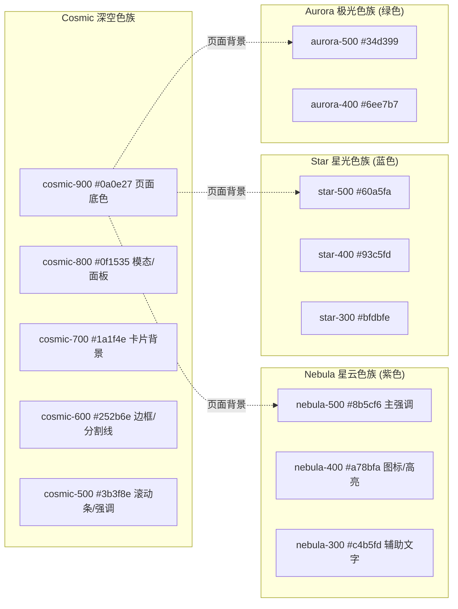
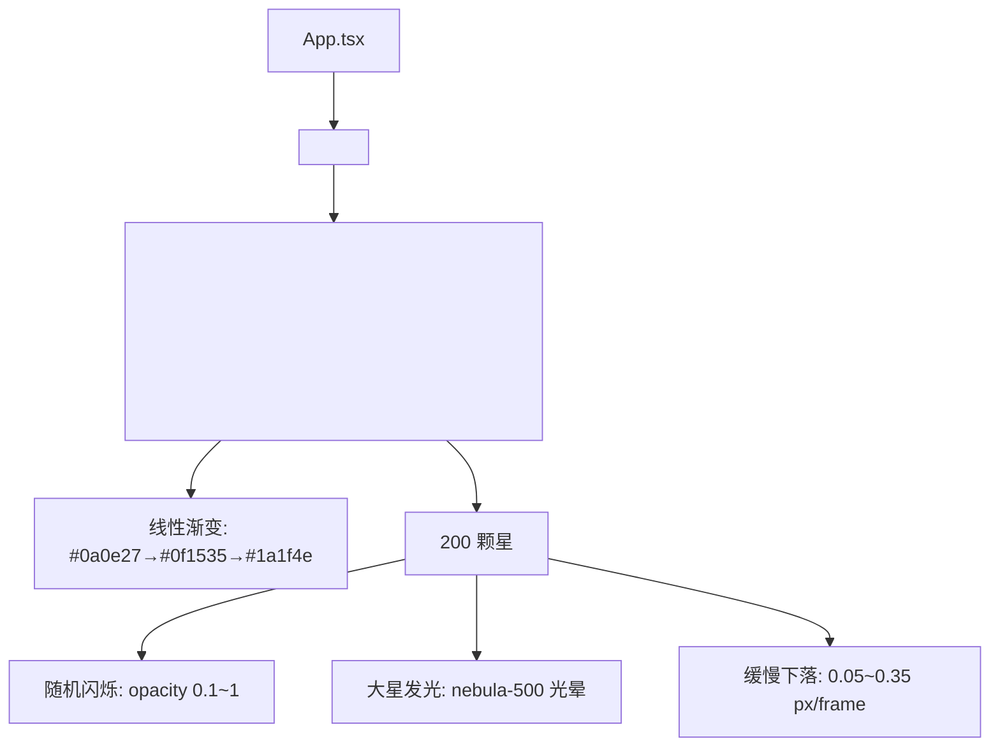
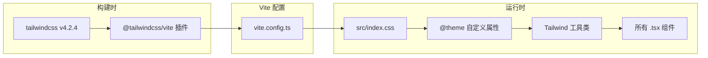

星灵（Star Spirit）的视觉系统以**宇宙深空美学**为核心设计语言，采用 Tailwind CSS v4 作为唯一样式方案。整套系统由三层构成：**全局 CSS 变量定义层**、**Canvas 星空渲染层**、**组件级 Tailwind 工具类层**。没有使用 CSS-in-JS、预处理器或 CSS Modules——所有样式通过一个入口 CSS 文件和内联工具类完成。

Sources: [index.css](xingling-web/src/index.css#L1-L77), [vite.config.ts](xingling-web/vite.config.ts#L1-L14)

## 色彩体系

主题色板围绕「深空 + 星辉」意象设计，分为四个色族，全部通过 Tailwind v4 的 `@theme` 指令声明为 CSS 自定义属性。



| 色族 | 色阶 | 色值 | 主要用途 |
|------|------|------|----------|
| cosmic（深空） | 900 | `#0a0e27` | 页面全局背景、Canvas 渐变起点 |
| cosmic | 800 | `#0f1535` | 设置面板、模态框背景 |
| cosmic | 700 | `#1a1f4e` | 卡片容器背景、按钮基础态 |
| cosmic | 600 | `#252b6e` | 边框线、分割线、滚动条 |
| cosmic | 500 | `#3b3f8e` | 滚动条悬停、次要强调 |
| nebula（星云） | 500 | `#8b5cf6` | 主 CTA 按钮、激活状态 |
| nebula | 400 | `#a78bfa` | 图标颜色、渐变标题 |
| nebula | 300 | `#c4b5fd` | 辅助高亮 |
| star（星光） | 500 | `#60a5fa` | 人物相关 hover 边框 |
| star | 400 | `#93c5fd` | 人物图标颜色 |
| aurora（极光） | 500 | `#34d399` | 世界观相关 hover 边框 |
| aurora | 400 | `#6ee7b7` | 世界观/组织图标颜色 |

此外，文本层使用 Tailwind v4 内置的语义色 `text-text-primary`（白色系）、`text-text-secondary`（灰色系）、`text-text-accent`（强调色），这些不需要手动定义，框架自动适配深色背景。

Sources: [index.css](xingling-web/src/index.css#L3-L13), [Home.tsx](xingling-web/src/components/pages/Home.tsx#L14-L19)

## 全局样式与动画

入口文件 [`index.css`](xingling-web/src/index.css#L15-L77) 定义了四个基础规范：重置规则、字体族、全局关键帧动画、自定义滚动条。

### 字体配置

正文使用 **Noto Serif SC** 思源宋体（字重 400/600/700），通过 Google Fonts 加载，回退链包含多个中文字体。

```css
body {
  font-family: "Noto Serif SC", "Source Han Serif SC", "STSong", "SimSun", serif;
  background: #0a0e27;
  color: #e2e8f0;
}
```

Sources: [index.html](xingling-web/index.html#L9-L10), [index.css](xingling-web/src/index.css#L24-L28)

### CSS 关键帧动画

| 动画名 | 效果 | 持续时间 | 工具类名 |
|--------|------|----------|----------|
| `twinkle` | 透明度 0.2 ↔ 1 闪烁 | 3s 循环 | `.animate-twinkle` |
| `float` | 垂直位移 ±10px 浮动 | 4s 循环 | `.animate-float` |
| `glow-pulse` | 紫色阴影脉冲 (20px→40px) | 2s 循环 | `.animate-glow` |
| `slide-up` | 从下方 30px 滑入 | 0.6s 单次 | `.animate-slide-up` |
| `fade-in` | 透明度淡入 | 0.8s 单次 | `.animate-fade-in` |

这些动画类主要服务于纯 CSS 场景。在实际组件中，页面级入场动效更多由 Framer Motion 的 `motion` 组件接管（详见 [Framer Motion 动画系统](19-framer-motion-dong-hua-xi-tong)）。

Sources: [index.css](xingling-web/src/index.css#L30-L53)

### 自定义滚动条

```css
::-webkit-scrollbar { width: 6px; }
::-webkit-scrollbar-track { background: #0a0e27; }
::-webkit-scrollbar-thumb { background: #3b3f8e; border-radius: 3px; }
::-webkit-scrollbar-thumb:hover { background: #8b5cf6; }
```

滚动条默认态与 cosmic-500 对齐，悬停态切换为 nebula-500 紫色，与整体主题保持一致。

Sources: [index.css](xingling-web/src/index.css#L55-L59)

## Canvas 星空背景层

[`StarField`](xingling-web/src/components/effects/StarField.tsx#L1-L98) 组件在 `App.tsx` 路由树顶层渲染，作为所有页面的固定背景层（`fixed inset-0 -z-10`），通过 `pointer-events: none` 确保不拦截用户交互。



实现要点：
- **200 颗随机星**：每颗星拥有独立的坐标、尺寸（0.5~2.5px）、下落速度和闪烁频率
- **渐变底色**：三阶线性渐变从 cosmic-900 过渡到 cosmic-700，替代纯黑背景营造深度感
- **紫色光晕**：尺寸大于 1.5px 的星会额外绘制半径 3 倍的半透明 nebula-500 光晕层
- **无缝循环**：星落到视口底部后从顶部重新生成，保持画面持续性

Sources: [StarField.tsx](xingling-web/src/components/effects/StarField.tsx#L1-L98), [App.tsx](xingling-web/src/App.tsx#L11)

## 组件级样式模式

项目中所有组件通过 Tailwind 工具类直接编写样式，遵循以下统一模式：

### 卡片容器规范

所有信息卡片（卷列表、角色卡、世界观条目、时间线事件）共享相同的容器样式：

```
bg-cosmic-700/30 border border-cosmic-600/30 rounded-xl
```

交互态在 hover 时提升边框亮度或切换为主题色，配合 `transition-all duration-300` 实现平滑过渡。

Sources: [VolumeSelector.tsx](xingling-web/src/components/pages/VolumeSelector.tsx#L48-L51), [CharacterBook.tsx](xingling-web/src/components/pages/CharacterBook.tsx#L71-L72), [WorldView.tsx](xingling-web/src/components/pages/WorldView.tsx#L75)

### 导航按钮规范

返回按钮统一使用：

```
p-2 rounded-lg bg-cosmic-700/50 hover:bg-cosmic-600/50 transition-colors
```

出现在每个页面的 header 区域，提供一致的导航视觉反馈。

Sources: [VolumeSelector.tsx](xingling-web/src/components/pages/VolumeSelector.tsx#L27), [CharacterBook.tsx](xingling-web/src/components/pages/CharacterBook.tsx#L23), [WorldView.tsx](xingling-web/src/components/pages/WorldView.tsx#L28), [Timeline.tsx](xingling-web/src/components/pages/Timeline.tsx#L260), [ChapterReader.tsx](xingling-web/src/components/pages/ChapterReader.tsx#L68)

### 渐变标题

首页标题使用三色渐变动画：

```
bg-gradient-to-r from-nebula-400 via-star-400 to-aurora-400 bg-clip-text text-transparent
```

配合 Framer Motion 的 `backgroundPosition` 动画实现流动效果，8 秒一个循环周期。

Sources: [Home.tsx](xingling-web/src/components/pages/Home.tsx#L14-L19)

### 各页面主题映射

卷选择器为 16 卷各自定义了独立的渐变色、强调色和 emoji 图标：

| 卷号 | 渐变色 | 强调色 | 图标 |
|------|--------|--------|------|
| 0 | blue→cyan | cyan-400 | ❄️ |
| 1 | purple→pink | pink-400 | 🌪️ |
| 2 | green→emerald | emerald-400 | 💊 |
| 3 | sky→blue | sky-300 | 💙 |
| 4 | amber→orange | orange-400 | 🏠 |
| 5 | green→lime | lime-400 | 🌲 |
| 6 | violet→purple | purple-400 | 🚪 |
| 7 | indigo→violet | violet-400 | 🔮 |
| 8 | teal→cyan | cyan-400 | 🌊 |
| 9 | gray→slate | slate-400 | 👤 |
| 10 | red→orange | red-400 | ⚡ |
| 11 | orange→yellow | yellow-400 | 🔥 |
| 12 | rose→pink | rose-400 | 💔 |
| 13 | yellow→amber | amber-300 | 🤝 |
| 14 | blue→indigo | indigo-400 | 🌙 |
| 15 | slate→gray | gray-400 | ⭐ |

这些数据驱动的主题配置展示了如何用 Tailwind 工具类实现内容感知的差异化视觉。

Sources: [VolumeSelector.tsx](xingling-web/src/components/pages/VolumeSelector.tsx#L9-L25)

### 时间线分类配色

时间线事件按类别映射到不同的颜色方案：

| 类别 | 文字色 | 圆点背景色 | 图标 |
|------|--------|------------|------|
| war（战争） | text-red-400 | bg-red-500 | Flame |
| discovery（发现） | text-nebula-400 | bg-nebula-500 | Sparkles |
| personal（个人） | text-star-400 | bg-star-500 | Heart |
| political（政治） | text-amber-400 | bg-amber-500 | Flag |
| tragedy（悲剧） | text-gray-400 | bg-gray-500 | Skull |
| hope（希望） | text-aurora-400 | bg-aurora-500 | Zap |

Sources: [Timeline.tsx](xingling-web/src/components/pages/Timeline.tsx#L244-L251)

## 响应式设计策略

系统采用 Tailwind 的移动端优先断点体系，主要布局模式如下：

| 页面 | 移动端 | md (768px+) | lg (1024px+) | xl (1280px+) |
|------|--------|-------------|--------------|--------------|
| 首页导航卡片 | `grid-cols-2` | `md:grid-cols-4` | — | — |
| 卷选择器 | `grid-cols-1` | `sm:grid-cols-2` | `lg:grid-cols-3` | `xl:grid-cols-4` |
| 角色图鉴 | `grid-cols-1` | `sm:grid-cols-2` | `lg:grid-cols-3` | — |
| 世界观 | `grid-cols-1` | `md:grid-cols-2` | — | — |

所有页面使用 `max-w-5xl mx-auto` 或 `max-w-4xl mx-auto` 控制内容最大宽度，配合 `px-4` 保持移动端安全间距。

Sources: [Home.tsx](xingling-web/src/components/pages/Home.tsx#L38), [VolumeSelector.tsx](xingling-web/src/components/pages/VolumeSelector.tsx#L35), [CharacterBook.tsx](xingling-web/src/components/pages/CharacterBook.tsx#L63), [WorldView.tsx](xingling-web/src/components/pages/WorldView.tsx#L67)

## 用户设置持久化

阅读器页面提供字体大小调节（14px~28px），通过 Zustand store 管理并持久化到 localStorage：

```
useSettings → fontSize (默认 18) → localStorage 'xingling-fontsize'
```

章节内容通过 inline style 动态应用字号，行高固定为 2 倍。

Sources: [store/index.ts](xingling-web/src/store/index.ts#L49-L68), [ChapterReader.tsx](xingling-web/src/components/pages/ChapterReader.tsx#L92-L93)

## 样式工具链



Tailwind v4 通过 Vite 插件在构建时扫描所有 `.tsx` 文件中的 `className`，按需生成最小化 CSS。与 v3 相比，v4 使用 `@theme` 指令替代 `tailwind.config.js` 配置文件，使色板定义直接嵌入 CSS 文件，减少配置层级。

Sources: [vite.config.ts](xingling-web/vite.config.ts#L1-L14), [package.json](xingling-web/package.json#L20-L21), [index.css](xingling-web/src/index.css#L1-L13)

## 样式决策总结

| 维度 | 选型 | 原因 |
|------|------|------|
| CSS 方案 | Tailwind CSS v4 纯工具类 | 零运行时开销，构建时按需生成 |
| 配置文件 | 无 tailwind.config.js | v4 使用 @theme 内联定义 |
| 动画库 | CSS 关键帧 + Framer Motion | CSS 处理简单循环，Motion 处理页面过渡 |
| 背景渲染 | Canvas 2D API | 200 颗星的逐帧渲染性能优于 DOM 节点 |
| 字体 | Noto Serif SC（思源宋体） | 与小说阅读场景的文学气质匹配 |
| 状态样式 | CSS 伪类 + Tailwind hover: | 无需 JS 干预的交互反馈 |
| 主题变量 | @theme CSS 自定义属性 | 与 Tailwind v4 深度集成 |

## 后续阅读

- 了解动效系统的完整实现 → [Framer Motion 动画系统](19-framer-motion-dong-hua-xi-tong)
- 了解星空背景的渲染细节 → [星空背景动画](18-xing-kong-bei-jing-dong-hua)
- 了解构建时 CSS 处理流程 → [Vite 构建配置](21-vite-gou-jian-pei-zhi)
- 了解各页面的组件结构 → [首页与导航](12-shou-ye-yu-dao-hang)、[卷选择器](13-juan-xuan-ze-qi)、[章节阅读器](14-zhang-jie-yue-du-qi)