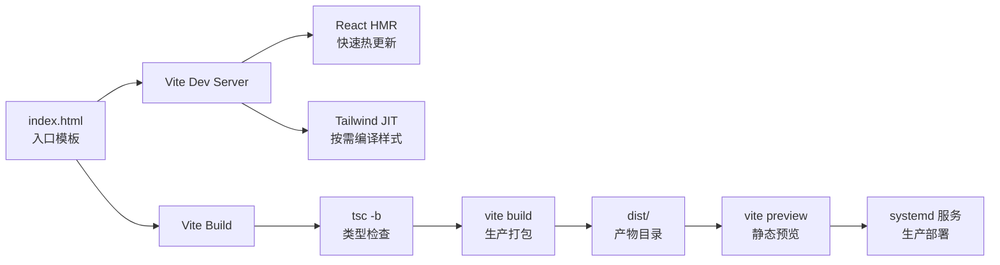
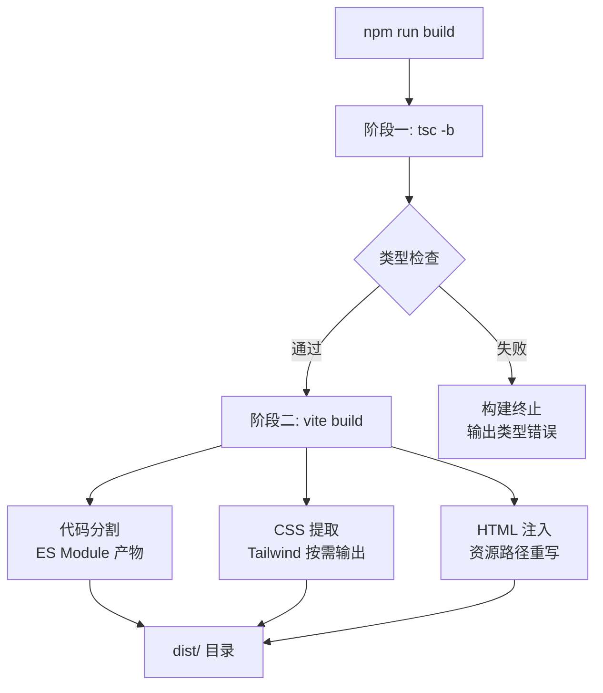
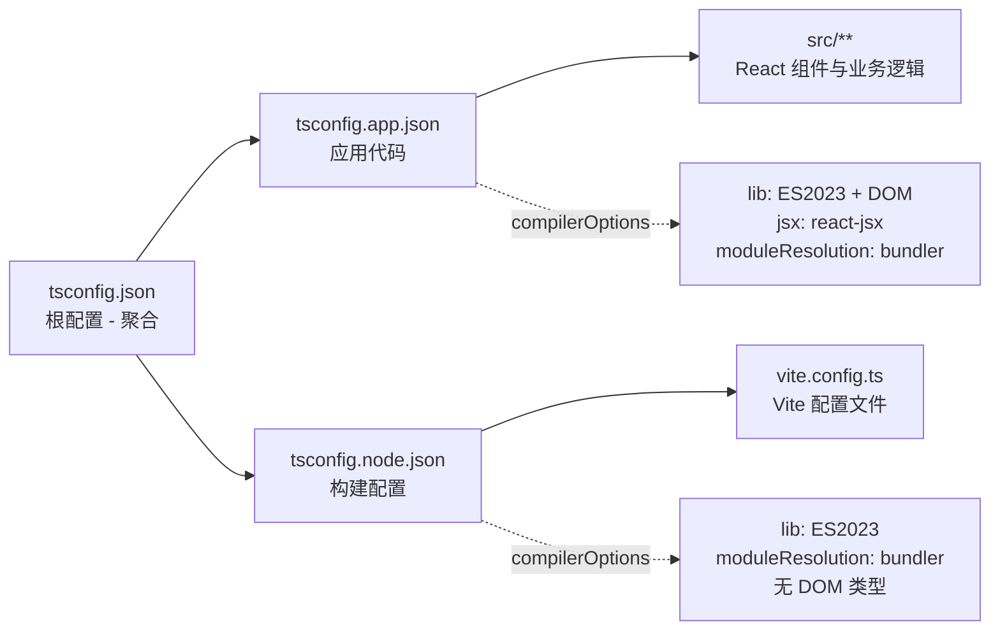

本文档解析星灵 Web 前端的 Vite 构建体系，涵盖插件配置、开发服务器设置、构建流水线及生产部署方案。项目采用 Vite 8 作为核心构建工具，结合 React 插件与 Tailwind CSS 4 集成，形成一条轻量高效的前端构建链路。

## 配置架构总览

星灵项目的构建配置遵循最小化原则——核心 `vite.config.ts` 仅 14 行代码，却通过插件系统完成了 React HMR、Tailwind CSS JIT 编译等关键功能。构建流水线由 TypeScript 类型检查与 Vite 打包两阶段组成，确保代码质量与产物优化的双重保障。



配置的核心结构由两个维度构成：**插件层**处理框架集成与样式编译，**服务器层**控制开发环境与生产预览的网络行为。这种关注点分离使配置保持高度可维护性。

Sources: [vite.config.ts](xingling-web/vite.config.ts#L1-L14)

## 插件系统

Vite 通过插件机制扩展构建能力。项目当前注册了两个核心插件：

| 插件 | 版本 | 职责 | 编译时行为 |
|------|------|------|------------|
| `@vitejs/plugin-react` | ^6.0.1 | React Fast Refresh、JSX 转换 | 开发环境启用 HMR，生产环境预编译 JSX |
| `@tailwindcss/vite` | ^4.2.4 | Tailwind CSS 4 的 Vite 集成 | JIT 模式按需生成 CSS，零冗余输出 |

`@vitejs/plugin-react` 接管了 React 组件的热模块替换（HMR），使得开发过程中组件状态在代码变更后得以保留。该插件还负责将 JSX 语法转换为浏览器可执行的 JavaScript。

`@tailwindcss/vite` 是 Tailwind CSS 4 引入的官方 Vite 插件，替代了旧的 PostCSS 方案。它以 JIT（Just-In-Time）模式运行，仅扫描实际使用的工具类并生成对应 CSS 规则，最终产物中的样式体积被严格控制在最小范围。

Sources: [vite.config.ts](xingling-web/vite.config.ts#L6-L7), [package.json](xingling-web/package.json#L20-L21)

## 开发服务器配置

开发服务器运行在 `0.0.0.0:5178`，并配置了主机白名单机制：

```
server:
  port: 5178          # 非标准端口（避免与常见服务冲突）
  host: '0.0.0.0'     # 监听所有网络接口
  allowedHosts:       # 域名白名单
    - xingling.201014.xyz
```

`host: '0.0.0.0'` 使开发服务器不仅监听 localhost，还允许局域网设备访问，方便多设备联调。`allowedHosts` 配置了 DNS Rebinding 攻击防护，仅允许指定域名通过主机头验证。

启动命令 `npm run dev` 直接调用 `vite`，加载上述配置并启动开发服务器。入口点通过 `index.html` 中的 `<script type="module">` 标签声明，Vite 会解析模块依赖并建立依赖图。

Sources: [vite.config.ts](xingling-web/vite.config.ts#L8-L12), [index.html](xingling-web/index.html#L15), [package.json](xingling-web/package.json#L7)

## 构建流水线

生产构建执行两步串行流程：`tsc -b && vite build`。这种两阶段设计将类型安全与产物优化解耦。



**阶段一：TypeScript 类型检查**。`tsc -b` 使用 TypeScript 的 Project References 功能，并行编译 `tsconfig.app.json`（应用代码）和 `tsconfig.node.json`（配置文件）两个子项目。这确保了类型安全性，但 `tsc` 仅做类型检查不输出文件——实际代码转换由 Vite 的 esbuild 引擎完成。

**阶段二：Vite 打包**。Vite 使用 Rollup 作为生产打包器，将模块图转换为优化的静态资源。构建产物输出到 `dist/` 目录，包含三个层级：

| 产物路径 | 类型 | 说明 |
|----------|------|------|
| `dist/index.html` | HTML 入口 | 自动注入 CSS/JS 资源路径 |
| `dist/assets/index-*.js` | JavaScript 包 | 应用逻辑，含哈希值用于缓存控制 |
| `dist/assets/index-*.css` | 样式表 | Tailwind 按需生成的 CSS |
| `dist/favicon.svg` | 静态资源 | 网站图标（从 public/ 直接复制） |
| `dist/icons.svg` | 静态资源 | SVG 图标集（从 public/ 直接复制） |

`public/` 目录下的文件在构建时被原样复制到 `dist/`，不参与模块打包。适用于无需处理的静态资源，如 SVG 图标和字体文件。

Sources: [package.json](xingling-web/package.json#L9), [tsconfig.json](xingling-web/tsconfig.json#L1-L8), [tsconfig.app.json](xingling-web/tsconfig.app.json#L1-L26), [tsconfig.node.json](xingling-web/tsconfig.node.json#L1-L25)

## TypeScript 配置架构

TypeScript 配置采用 Project References 模式，通过根 `tsconfig.json` 的 `references` 字段声明子项目关系：



两个子项目共享大部分编译选项（ES2023 目标、bundler 模块解析、verbatimModuleSyntax），但关键差异在于：

- **tsconfig.app.json**：包含 `DOM` 类型库和 `vite/client` 类型声明，启用 `jsx: react-jsx` 以支持 JSX 语法，`include` 指向 `src` 目录
- **tsconfig.node.json**：仅包含 Node.js 类型（无 DOM），`include` 指向 `vite.config.ts`，确保配置文件使用正确的类型上下文

这种分离避免了在配置文件中意外使用浏览器 API，同时在应用代码中完整获得 DOM 类型支持。

Sources: [tsconfig.json](xingling-web/tsconfig.json#L1-L8), [tsconfig.app.json](xingling-web/tsconfig.app.json#L1-L26), [tsconfig.node.json](xingling-web/tsconfig.node.json#L1-L25)

## 生产部署

生产环境通过 `vite preview` 启动静态文件服务器，提供构建产物的预览与托管能力。项目配置了两种启动方式：

| 方式 | 脚本/文件 | 适用场景 |
|------|-----------|----------|
| Shell 脚本 | `start-preview.sh` | 手动启动、调试 |
| Systemd 服务 | `xingling.service` | 生产环境、自动重启 |

Shell 脚本显式设置 PATH 环境变量后执行 `npx vite preview --host 0.0.0.0 --port 5178`，确保 Node.js 和 Bun 二进制可找到。

Systemd 服务单元定义了更健壮的生产部署方案：以 `tony` 用户运行，设置 `NODE_ENV=production`，配置 `Restart=on-failure` 和 5 秒重启延迟，确保服务异常时自动恢复。服务通过 `WantedBy=multi-user.target` 注册为开机自启。

两种方案共享相同的端口（5178）和主机绑定（`0.0.0.0`），确保网络行为一致性。

Sources: [start-preview.sh](xingling-web/start-preview.sh#L1-L5), [xingling.service](xingling-web/xingling.service#L1-L17)

## npm Scripts 参考

`package.json` 中定义的脚本构成了完整的开发工作流：

| 脚本命令 | 执行内容 | 阶段 |
|----------|----------|------|
| `dev` | `vite` | 开发服务器启动 |
| `parse` | `tsx scripts/parse-novel.ts` | 小说数据预处理 |
| `build` | `tsc -b && vite build` | 类型检查 + 生产构建 |
| `lint` | `eslint .` | 代码规范检查 |
| `preview` | `vite preview` | 构建产物预览 |

`parse` 脚本使用 `tsx` 直接运行 TypeScript 脚本，无需预编译，适用于数据转换等一次性任务。`build` 脚本在 Vite 打包前强制执行类型检查，形成质量门禁。

Sources: [package.json](xingling-web/package.json#L6-L12)

## 与相关配置的协作关系

Vite 构建配置并非孤立存在，它与项目中的其他配置文件形成协同：

- **[TypeScript 配置](22-typescript-pei-zhi)**：`tsc -b` 作为构建前置步骤，`tsconfig.node.json` 为 `vite.config.ts` 提供类型上下文
- **[ESLint 代码规范](23-eslint-dai-ma-gui-fan)**：`reactRefresh.configs.vite` 插件集成到 ESLint，确保 HMR 相关代码符合规范；ESLint 配置通过 `globalIgnores(['dist'])` 排除构建产物
- **[开发工作流](24-kai-fa-gong-zuo-liu)**：`dev`、`build`、`preview` 脚本共同构成开发 → 构建 → 预览的完整循环

这些配置共同维护着代码质量、构建效率与部署可靠性之间的平衡。