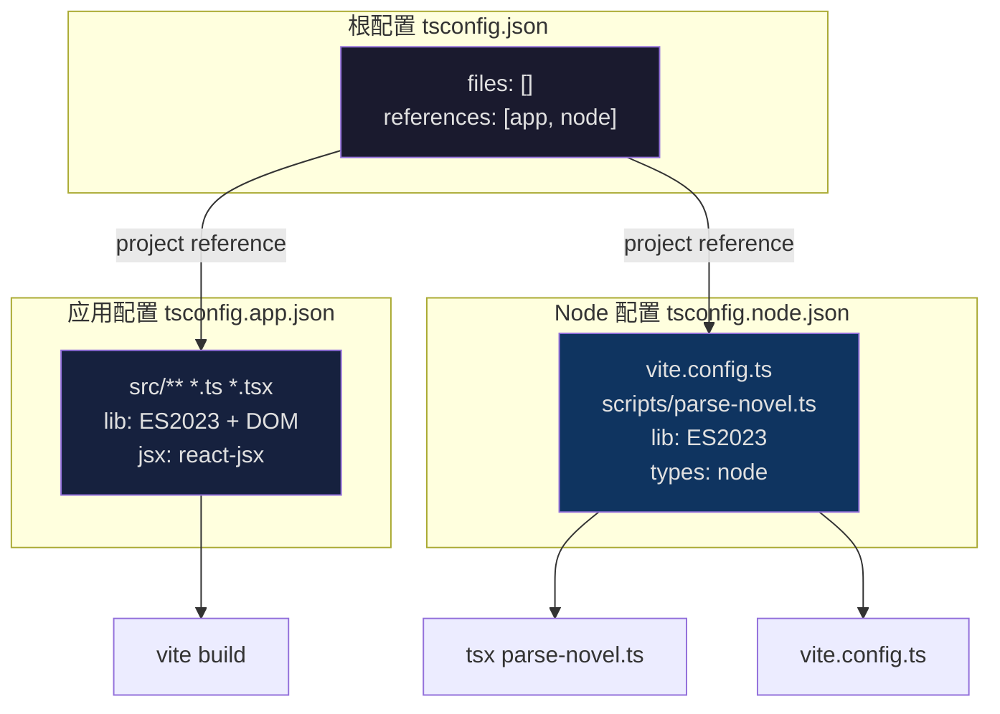
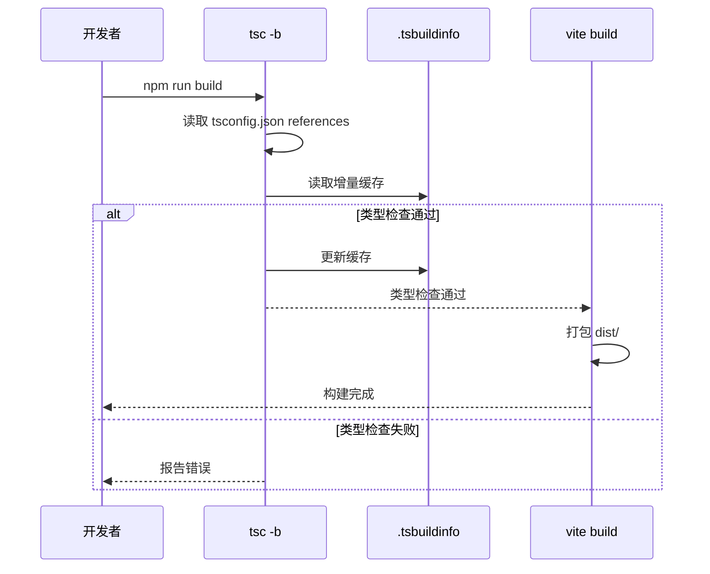

星灵项目的 TypeScript 配置采用 **Vite 官方推荐的 Project References（项目引用）架构**，通过三个独立的 `tsconfig` 文件分别管理应用源码、构建配置和根引用。这种分离策略确保了前端运行时与构建工具链的类型检查互不干扰，同时配合 TypeScript 6.0 的严格 linting 规则，在开发体验与代码质量之间取得平衡。

Sources: [tsconfig.json](xingling-web/tsconfig.json#L1-L8), [tsconfig.app.json](xingling-web/tsconfig.app.json#L1-L26), [tsconfig.node.json](xingling-web/tsconfig.node.json#L1-L25), [package.json](xingling-web/package.json#L36-L36)

## 配置文件架构

项目使用 **Solution-Style tsconfig** 模式，根 `tsconfig.json` 不包含任何编译选项，仅通过 `references` 字段将子配置聚合。IDE 和 `tsc -b` 会根据此文件自动识别整个解决方案的范围。



Sources: [tsconfig.json](xingling-web/tsconfig.json#L1-L8)

### 三文件职责对比

| 配置文件 | 目标文件范围 | TypeScript 类型 | 运行环境 | 核心用途 |
|---------|-------------|----------------|---------|---------|
| `tsconfig.json` | 无（仅引用） | 无 | 无 | IDE 项目根入口，`tsc -b` 的解决方案文件 |
| `tsconfig.app.json` | `src/**` | `vite/client` | 浏览器 (DOM) | 应用源码的类型检查，含 React JSX 支持 |
| `tsconfig.node.json` | `vite.config.ts` | `node` | Node.js | 构建脚本与服务端工具的类型检查 |

这种分离的直接好处是：**`vite.config.ts` 可以使用 `import.meta` 的 Node 类型**（如 `node:fs`），而 `src/` 下的文件则获得完整的 DOM API 类型支持，两者不会互相污染。

Sources: [tsconfig.app.json](xingling-web/tsconfig.app.json#L4-L5), [tsconfig.node.json](xingling-web/tsconfig.node.json#L4-L5)

## 编译器选项详解

### 语言与模块目标

```
target: "es2023"     → 输出语法兼容 ES2023（支持 Array.findLast、Hashbang 等）
lib: ["ES2023", "DOM"]  → 标准库包含 ES2023 + 浏览器 DOM API
module: "esnext"     → 使用最新的 ES 模块语法
moduleResolution: "bundler" → 按打包器语义解析模块（支持 .js 扩展名引用 .ts 文件）
```

**`moduleResolution: "bundler"`** 是 Vite 项目的推荐设置。它模拟 Vite/esbuild 的解析行为，允许导入时省略 `.ts` 扩展名（如 `import { volumes } from '../../data/novel'`），同时保持与 `verbatimModuleSyntax` 的兼容性。

Sources: [tsconfig.app.json](xingling-web/tsconfig.app.json#L4-L11)

### 模块语法策略

`verbatimModuleSyntax: true` 是 TypeScript 5.0 引入的关键选项，它替代了已废弃的 `importsNotUsedAsValues` 和 `preserveValueImports`。此选项强制以下行为：

| 场景 | 要求 | 示例 |
|------|------|------|
| 类型导入 | 必须使用 `import type` 语法 | `import type { Volume } from './data/novel'` |
| 值导入 | 直接使用 `import` | `import { volumes } from './data/novel'` |
| 仅类型文件 | 编译后完全擦除 | 运行时零开销 |

这一设置与 `noEmit: true` 配合使用，因为 Vite 负责实际的编译和打包——TypeScript 在此项目中**仅承担类型检查职责**，不生成 `.js` 产物。

Sources: [tsconfig.app.json](xingling-web/tsconfig.app.json#L13-L16)

### React JSX 支持

```json
"jsx": "react-jsx"
```

此配置启用 **React 17+ 的自动 JSX 运行时**，无需在文件中显式 `import React`。配合 `@types/react@^19.2.14`，所有 `.tsx` 文件中的 JSX 表达式都能获得完整的类型推导。

例如 [App.tsx](xingling-web/src/App.tsx#L1-L27) 中直接使用 `<BrowserRouter>` 而无需引入 `React` 命名空间：

```tsx
// 不需要 import React
import { BrowserRouter, Routes, Route } from 'react-router-dom';

function App() {
  return (
    <BrowserRouter>
      <Routes>...</Routes>
    </BrowserRouter>
  );
}
```

Sources: [tsconfig.app.json](xingling-web/tsconfig.app.json#L17-L17), [App.tsx](xingling-web/src/App.tsx#L1-L10)

## Linting 规则

项目的 TypeScript 配置启用了四项严格规则，它们与 ESLint 的 `typescript-eslint` 插件协同工作，形成双层质量保障：

| 规则 | 作用 | 违反示例 |
|------|------|---------|
| `noUnusedLocals` | 检测未使用的局部变量 | `const unused = getValue();` |
| `noUnusedParameters` | 检测未使用的函数参数 | `function handler(e: Event) { ... }` |
| `erasableSyntaxOnly` | 禁止运行时依赖的类型注解语法 | `enum`、`namespace`、`parameter properties` |
| `noFallthroughCasesInSwitch` | 要求 switch 分支显式 break | `case 1: doA(); case 2: doB();` |

**`erasableSyntaxOnly`** 是 TypeScript 6.0 的新特性，确保所有 TypeScript 特有语法在编译后完全擦除。这意味着项目中不能使用 `enum`（需改用 `const as const` 对象）或 `namespace` 声明。在 [parse-novel.ts](xingling-web/scripts/parse-novel.ts#L34-L38) 中可以看到正确实践——卷主题映射使用 `Record<number, string>` 而非 `enum`：

```typescript
const volumeThemes: Record<number, string> = {
  1: 'snow',
  2: 'storm',
  // ...
};
```

Sources: [tsconfig.app.json](xingling-web/tsconfig.app.json#L19-L23), [parse-novel.ts](xingling-web/scripts/parse-novel.ts#L34-L38)

## 构建集成

### tsc -b 模式

`package.json` 中的构建脚本使用 `tsc -b`（build mode），这是 TypeScript 为 Project References 设计的增量编译模式：

```json
"build": "tsc -b && vite build"
```

执行流程：
1. `tsc -b` 读取根 `tsconfig.json`，按引用顺序执行类型检查
2. 检查结果写入 `.tsbuildinfo` 缓存文件（`node_modules/.tmp/` 目录）
3. 仅当类型检查通过后，`vite build` 才执行实际的打包



Sources: [package.json](xingling-web/package.json#L9-L9), [tsconfig.app.json](xingling-web/tsconfig.app.json#L3-L3), [tsconfig.node.json](xingling-web/tsconfig.node.json#L3-L3)

### TypeScript 版本

项目使用 `typescript@~6.0.2`，这是当前最新的稳定大版本。与 5.x 相比，TypeScript 6.0 带来以下与本配置相关的改进：

- **`erasableSyntaxOnly`** 正式成为稳定选项
- 更好的 `verbatimModuleSyntax` 错误提示
- 改进的 `moduleResolution: "bundler"` 解析性能

Sources: [package.json](xingling-web/package.json#L36-L36)

## 类型定义实践

项目中的 TypeScript 类型定义遵循 **接口优先** 原则，所有数据结构都通过 `interface` 声明。这种策略在三个层面保持一致：

### 数据层类型

[characters.ts](xingling-web/src/data/characters.ts#L1-L11) 和 [novel.ts](xingling-web/src/data/novel.ts#L2-L11) 导出了清晰的数据模型：

```typescript
// 角色数据
interface Character {
  name: string;
  alias?: string;       // 可选字段
  race: string;
  role: string;
  abilities?: string;
  volumes: number[];
}

// 小说结构
interface Chapter {
  title: string;
  content: string;
  lineStart: number;
}
```

### 状态层类型

[store/index.ts](xingling-web/src/store/index.ts#L3-L11) 通过 Zustand 的泛型 `create<State>()` 将接口直接关联到 store：

```typescript
interface ReadingState {
  currentVolume: number;
  currentChapter: number;
  setProgress: (volume: number, chapter: number) => void;
  markComplete: (volume: number, chapter: number) => void;
}

export const useStore = create<ReadingState>((set) => ({ ... }));
```

### 组件 Props 推导

项目采用 **隐式 Props 推导** 策略——不显式声明组件 Props 接口，而是通过 React 19 的类型推导能力从 `useParams`、`useStore` 等 hooks 自动推断类型。例如 [ChapterReader.tsx](xingling-web/src/components/pages/ChapterReader.tsx#L8-L14) 中：

```typescript
export function ChapterReader() {
  const { volumeIndex, chapterIndex } = useParams<{ volumeIndex: string; chapterIndex: string }>();
  // volumeIndex 和 chapterIndex 自动获得 string | undefined 类型
}
```

这种实践减少了冗余的类型声明，同时保持了完整的类型安全。

Sources: [characters.ts](xingling-web/src/data/characters.ts#L1-L11), [store/index.ts](xingling-web/src/store/index.ts#L3-L11), [ChapterReader.tsx](xingling-web/src/components/pages/ChapterReader.tsx#L8-L14)

## 与 ESLint 的协同

TypeScript 类型检查与 ESLint 通过 `typescript-eslint` 插件形成双层验证。[eslint.config.js](xingling-web/eslint.config.js#L12-L14) 的配置显示：

```javascript
extends: [
  js.configs.recommended,
  tseslint.configs.recommended,
  reactHooks.configs.flat.recommended,
  reactRefresh.configs.vite,
],
```

**职责分工**：
- **TypeScript (`tsc`)**：负责类型正确性、未使用变量检测、模块语法验证
- **ESLint + typescript-eslint**：负责代码风格、React Hooks 规则、React Refresh 兼容性

这种双层架构在开发工作流中体现为两个独立命令：

| 命令 | 检查范围 | 工具 |
|------|---------|------|
| `tsc -b` | 类型安全、模块语法 | TypeScript 编译器 |
| `eslint .` | 代码风格、最佳实践 | ESLint + 插件 |

Sources: [eslint.config.js](xingling-web/eslint.config.js#L10-L23), [package.json](xingling-web/package.json#L10-L11)

## 脚本运行时类型

项目的 `scripts/parse-novel.ts` 是一个 Node.js 端脚本，通过 `tsx` 直接运行。它使用 `tsconfig.node.json` 提供的类型支持：

```json
// tsconfig.node.json
"types": ["node"],
"include": ["vite.config.ts"]
```

脚本通过 `import.meta.url` 和 `fileURLToPath` 获取当前文件目录，这是 ESM 环境下的标准做法：

```typescript
import { fileURLToPath } from 'url';
const __dirname = dirname(fileURLToPath(import.meta.url));
```

Sources: [parse-novel.ts](xingling-web/scripts/parse-novel.ts#L1-L6), [tsconfig.node.json](xingling-web/tsconfig.node.json#L7-L7)

## 扩展建议

当项目规模增长时，以下 TypeScript 配置扩展方向值得考虑：

- **路径别名**：在 `tsconfig.app.json` 中添加 `baseUrl` 和 `paths`，配合 `vite.config.ts` 中的 `resolve.alias`，实现 `@/components` 形式的绝对导入
- **严格模式**：启用 `strict: true` 可一次性开启 `strictNullChecks`、`strictFunctionTypes` 等多项子规则
- **声明文件**：为自定义数据格式添加 `*.d.ts` 声明文件，增强第三方资源的类型推导

关于构建配置的更多信息，可参考 [Vite 构建配置](21-vite-gou-jian-pei-zhi)；关于代码规范的完整说明，请参阅 [ESLint 代码规范](23-eslint-dai-ma-gui-fan)。