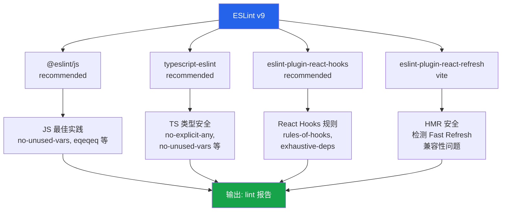
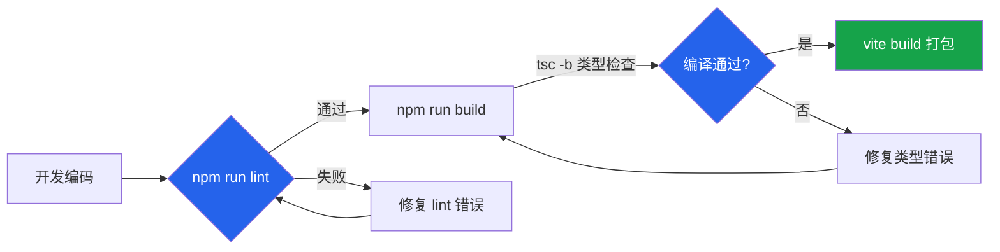
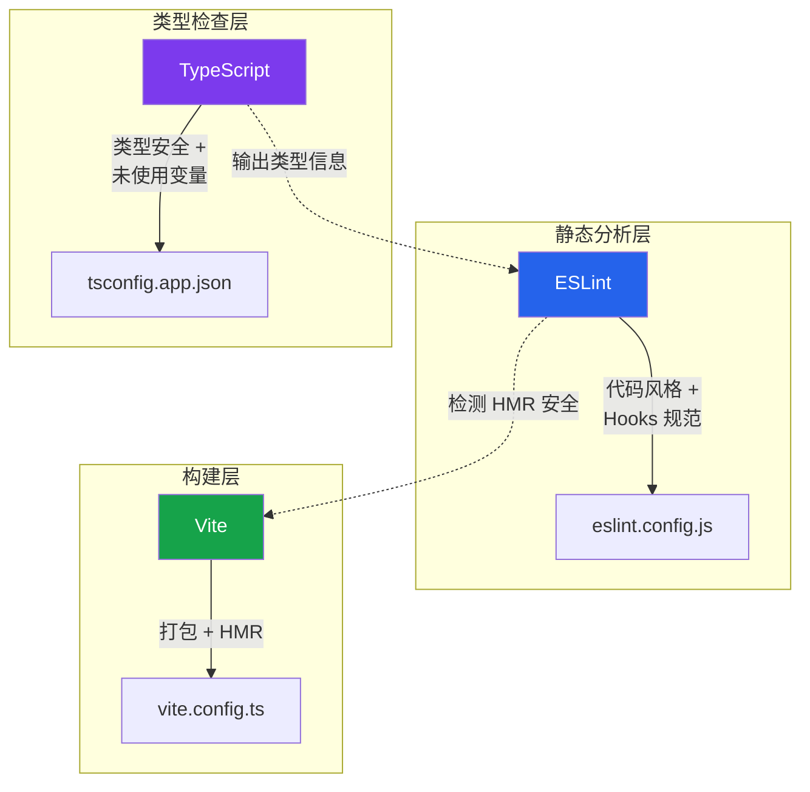

本文档介绍 **xingling-web** 项目的 ESLint 代码质量检查体系。项目采用 **ESLint v9 Flat Config** 格式，配合 TypeScript 编译器内置 linting 规则，形成完整的静态代码分析链路。理解这套规范有助于在开发过程中保持代码一致性与可维护性。

## 配置概览

项目使用 ESLint 9.x 的 **Flat Config** 格式（`eslint.config.js`），取代了传统的 `.eslintrc` 嵌套配置模式。Flat Config 通过数组显式定义配置项的顺序与优先级，使规则继承关系更加透明。



Sources: [eslint.config.js](xingling-web/eslint.config.js#L1-L24)

## 依赖插件与职责分工

| 插件 | 版本范围 | 核心职责 | 典型规则 |
|------|----------|----------|----------|
| `@eslint/js` | ^9.39.4 | JavaScript 基础规则 | `no-undef`, `no-unused-vars` (JS 层面) |
| `typescript-eslint` | ^8.58.2 | TypeScript 类型感知检查 | `@typescript-eslint/no-unused-vars`, `no-explicit-any` |
| `eslint-plugin-react-hooks` | ^7.1.1 | React Hooks 合规性 | `rules-of-hooks`, `exhaustive-deps` |
| `eslint-plugin-react-refresh` | ^0.5.2 | Vite Fast Refresh 兼容性 | 检测 HMR 期间组件导出安全性 |

Sources: [package.json](xingling-web/package.json#L22-L35)

## TypeScript 编译器内置 Linting

除 ESLint 外，项目还通过 **tsconfig** 启用了 TypeScript 编译器级别的代码质量约束。这些规则与 ESLint 规则互补，在类型检查阶段同步执行：

| 编译选项 | 作用 | 影响范围 |
|----------|------|----------|
| `noUnusedLocals` | 标记未使用的局部变量 | 所有 `.ts`/`.tsx` 文件 |
| `noUnusedParameters` | 标记未使用的函数参数 | 所有函数签名 |
| `erasableSyntaxOnly` | 禁止使用 TypeScript 独有的运行时语法 | 确保输出纯 ES 代码 |
| `noFallthroughCasesInSwitch` | 禁止 switch case 穿透 | 所有 switch 语句 |

这两个配置文件分别作用于不同代码域：`tsconfig.app.json` 覆盖 `src/` 目录（应用代码），`tsconfig.node.json` 覆盖 `vite.config.ts`（构建配置）。

Sources: [tsconfig.app.json](xingling-web/tsconfig.app.json#L12-L18), [tsconfig.node.json](xingling-web/tsconfig.node.json#L12-L18)

## 执行工作流

### 运行 Lint 检查

```bash
cd xingling-web
npm run lint
```

该命令等价于执行 `eslint .`，对项目中所有匹配 `**/*.{ts,tsx}` 的文件运行静态分析。`dist/` 目录已通过 `globalIgnores` 排除在检查范围之外。

### 构建流程中的集成

项目的构建脚本 `npm run build` 按顺序执行 `tsc -b && vite build`。其中 `tsc -b`（TypeScript Build Mode）会在编译前进行完整的类型检查，包含所有 tsconfig linting 规则。ESLint 作为独立的代码质量门禁，建议在提交前或 CI 流水线中单独运行。



Sources: [package.json](xingling-web/package.json#L8-L11)

## 配置解析

ESLint 配置文件中各配置项的语义如下：

**`globalIgnores(['dist'])`** — 全局忽略 `dist/` 构建输出目录，避免对编译后产物执行 lint。

**`files: ['**/*.{ts,tsx}']`** — 指定本配置块仅对 TypeScript 和 TSX 文件生效。这意味着项目中的 `.js` 文件（如果存在）不受此配置约束。

**`languageOptions`** 区块设定了两个关键参数：
- `ecmaVersion: 2020` — 以 ECMAScript 2020 语法标准解析代码
- `globals: globals.browser` — 注入浏览器环境全局变量（`window`, `document`, `console` 等），防止将浏览器 API 误报为未定义变量

Sources: [eslint.config.js](xingling-web/eslint.config.js#L8-L17), [globals](xingling-web/eslint.config.js#L15)

## 与相关配置的协同关系

ESLint、TypeScript 和 Vite 在项目中的角色分工如下：



**职责边界说明**：
- **ESLint** 关注代码质量与模式合规性（Hooks 调用顺序、依赖项完整性、HMR 安全）
- **TypeScript** 关注类型正确性与语言层面的代码整洁（未使用变量、switch 穿透）
- **Vite** 负责开发与构建管线，不直接参与代码质量检查

三者协同工作，覆盖了从编码规范到类型安全再到构建产物的全链路质量保障。

Sources: [eslint.config.js](xingling-web/eslint.config.js#L1-L24), [tsconfig.app.json](xingling-web/tsconfig.app.json#L1-L26), [vite.config.ts](xingling-web/vite.config.ts#L1-L14)

## 扩展指南

若需自定义规则，可在 `eslint.config.js` 的配置对象中添加 `rules` 字段：

```javascript
export default defineConfig([
  globalIgnores(['dist']),
  {
    files: ['**/*.{ts,tsx}'],
    extends: [/* 已有配置 */],
    languageOptions: { /* 已有配置 */ },
    rules: {
      // 自定义规则在此添加
      // 例如: '@typescript-eslint/no-explicit-any': 'warn',
    },
  },
])
```

规则严重程度分为三档：`'off'`（禁用）、`'warn'`（警告）、`'error'`（报错并退出）。对于团队项目，建议将关键规则设为 `'error'` 级别，确保 CI 流水线在代码质量不达标时阻断构建。

如需更详细的规则文档，可参阅各插件的官方文档：[typescript-eslint rules](https://typescript-eslint.io/rules/)、[React Hooks 规则](https://react.dev/reference/rules)。

## 下一步

完成 ESLint 规范理解后，建议继续阅读：
- **[TypeScript 配置](22-typescript-pei-zhi)** — 深入了解 tsconfig 的类型系统配置与构建模式
- **[开发工作流](24-kai-fa-gong-zuo-liu)** — 了解完整的开发、测试、构建与部署流程
- **[Vite 构建配置](21-vite-gou-jian-pei-zhi)** — 了解构建管线的插件体系与优化策略