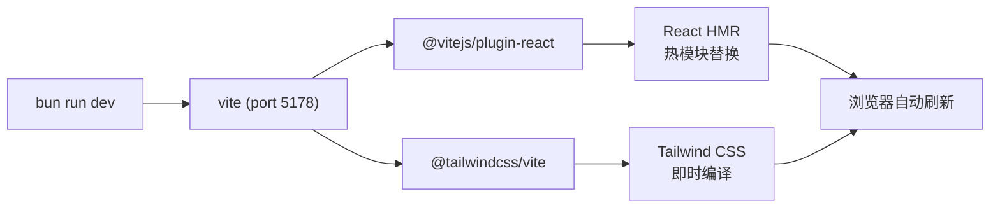
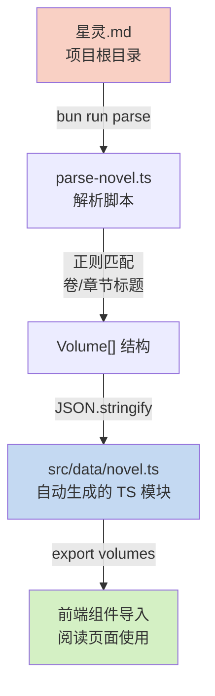

本文档介绍「星灵」Web 应用的完整开发工作流，涵盖从数据准备到本地开发、代码检查、构建部署的全链路操作指南。项目基于 Vite + React + TypeScript 技术栈，采用数据驱动的自动化管线将 Markdown 小说源文件转换为前端可用的 TypeScript 数据模块。

## 开发环境准备

在开始开发之前，确保工作目录位于 `xingling-web/` 子目录中。项目使用 Bun 作为包管理器（由 `bun.lock` 锁定文件标识），Node.js 作为运行时环境。

| 步骤 | 命令 | 说明 |
|------|------|------|
| 安装依赖 | `cd xingling-web && bun install` | 安装所有 production 和 devDependencies |
| 验证环境 | `npx vite --version` | 确认 Vite 8.x 已正确安装 |
| 解析数据 | `bun run parse` | 从根目录 `星灵.md` 生成 `src/data/novel.ts` |

数据解析是开发流程的第一步。脚本 [parse-novel.ts](xingling-web/scripts/parse-novel.ts#L1-L129) 读取项目根目录下的 [星灵.md](星灵.md) 文件，按 Markdown 标题层级（`#` 表示卷，`##` 表示章）解析出完整的小说结构，包含 16 卷、数十个章节的主题映射关系，最终输出 1114 行 TypeScript 模块到 `src/data/novel.ts`。该文件标注了 `// Auto-generated from 星灵.md - DO NOT EDIT` 警告注释，每次修改小说原文后需要重新运行解析脚本。

## 本地开发流程

启动开发服务器的核心命令是 `bun run dev`，它会调用 `vite` 并自动加载 Vite 配置中声明的插件链。



开发服务器配置在 [vite.config.ts](xingling-web/vite.config.ts#L1-L14) 中定义，监听 `0.0.0.0:5178`，并设置了 `allowedHosts` 白名单为 `xingling.201014.xyz`。这意味着通过该域名访问时会被允许，而其他域名将被拒绝——这是 Vite 8.x 的安全特性，防止 DNS 重绑定攻击。

| 操作 | 命令 | 效果 |
|------|------|------|
| 启动开发服务器 | `bun run dev` | 启动 Vite dev server，开启 HMR |
| 代码检查 | `bun run lint` | 运行 ESLint 检查全部源文件 |
| 类型检查 | `npx tsc -b` | 执行 TypeScript 项目引用编译检查 |
| 生产构建 | `bun run build` | 先类型检查，再 Vite 打包到 `dist/` |
| 预览构建产物 | `bun run preview` | 启动本地预览服务器 |

## 数据管线工作流

小说数据的处理是本项目最特殊的开发环节。理解这条管线对于避免常见错误至关重要。



数据管线的关键规则：

1. **单向生成**：只能编辑 `星灵.md`，然后运行 `bun run parse` 重新生成。直接修改 `src/data/novel.ts` 会在下次解析时被覆盖。
2. **标题格式约定**：卷标题必须符合 `# 第X卷 标题名` 格式，章标题必须符合 `## 第X章：标题名` 或 `## 第X章: 标题名` 格式（支持全角/半角冒号）。
3. **主题映射**：[parse-novel.ts](xingling-web/scripts/parse-novel.ts#L20-L37) 中定义了 16 个卷的主题关键词（如 `snow`、`storm`、`medicine`），这些关键词直接影响前端章节阅读器的视觉主题渲染。
4. **行号追踪**：每个章节记录 `lineStart` 字段，标记该章节在原始 Markdown 文件中的起始行号，用于调试和引用定位。

当修改小说内容后，标准操作流程为：

| 步骤 | 操作 | 验证方式 |
|------|------|----------|
| 1 | 编辑 `星灵.md`，修改章节内容或结构 | 使用 Git diff 确认变更范围 |
| 2 | 运行 `bun run parse` | 终端输出类似 `Parsed 16 volumes, XX chapters` |
| 3 | 检查 `src/data/novel.ts` 变更 | `git diff src/data/novel.ts` 确认预期变更 |
| 4 | 启动 `bun run dev` 验证渲染效果 | 浏览器中导航到对应章节检查 |

## 代码规范与质量检查

项目使用 ESLint 9.x 配合 `typescript-eslint` 进行代码规范检查。配置入口为 [eslint.config.js](xingling-web/eslint.config.js)，包含以下规则插件：

- `eslint-plugin-react-hooks`：检查 React Hooks 的使用规则（如依赖数组完整性）
- `eslint-plugin-react-refresh`：确保组件支持 Fast Refresh 热替换
- `typescript-eslint`：提供 TypeScript 类型感知的 lint 规则

运行 `bun run lint` 会扫描整个项目的 `.ts`、`.tsx`、`.js` 文件。建议在提交代码前始终执行 lint 检查，并将其集成到 Git pre-commit 钩子中（如使用 Husky 或 lint-staged）。

TypeScript 类型检查通过 `npx tsc -b` 执行，采用项目引用（Project References）模式。[tsconfig.json](xingling-web/tsconfig.json#L1-L8) 作为入口，引用 `tsconfig.app.json`（应用代码）和 `tsconfig.node.json`（Node 脚本如 parse-novel.ts）。构建命令 `bun run build` 会先执行 `tsc -b` 进行类型检查，再通过 `vite build` 进行生产打包——这意味着任何类型错误都会阻止构建流程。

## 构建与部署

生产构建产物输出到 `dist/` 目录，包含优化后的静态资源：

| 文件/目录 | 内容 | 大小特征 |
|-----------|------|----------|
| `dist/index.html` | 入口 HTML，内联关键资源引用 | 约 832 字节 |
| `dist/assets/` | 哈希化的 JS/CSS 文件 | 包含代码分割产物 |
| `dist/favicon.svg` | 网站图标 | 静态资源 |
| `dist/icons.svg` | 图标集（Lucide icons 内联） | 静态资源 |

部署方案提供了两种模式：

**脚本预览模式**：[start-preview.sh](xingling-web/start-preview.sh#L1-L5) 是一个 Bash 脚本，设置完整的 PATH 环境变量后执行 `npx vite preview --host 0.0.0.0 --port 5178`。适用于临时预览或手动启动场景。

**Systemd 服务模式**：[xingling.service](xingling-web/xingling.service#L1-L17) 是一个完整的 systemd 服务单元文件，配置为以 `tony` 用户运行，工作目录为 `/home/tony/xingling/xingling-web`，启动命令直接调用 Vite 的 preview 二进制文件。服务配置了 `Restart=on-failure` 和 `RestartSec=5` 的自动重启策略，环境变量设置 `NODE_ENV=production`。

安装 systemd 服务的标准流程：

```bash
# 复制服务文件到系统目录
sudo cp xingling-web/xingling.service /etc/systemd/system/
# 重载 systemd 配置
sudo systemctl daemon-reload
# 启动服务
sudo systemctl start xingling
# 设置开机自启
sudo systemctl enable xingling
# 查看运行状态
sudo systemctl status xingling
```

## 常见开发问题排查

| 问题现象 | 可能原因 | 解决方案 |
|----------|----------|----------|
| `bun run dev` 启动后浏览器空白 | `src/data/novel.ts` 不存在或格式错误 | 先运行 `bun run parse` 生成数据文件 |
| 章节主题颜色不匹配 | 卷号与 `volumeThemes` 映射不一致 | 检查 [parse-novel.ts#L20-L37](xingling-web/scripts/parse-novel.ts#L20-L37) 中的主题映射 |
| `bun run build` 类型错误 | TypeScript 项目引用配置问题 | 运行 `npx tsc -b --force` 查看详细错误 |
| 访问域名被拒绝 | `allowedHosts` 白名单未包含当前域名 | 在 [vite.config.ts](xingling-web/vite.config.ts#L10) 中添加新域名 |
| `bun run parse` 解析章节丢失 | Markdown 标题格式不符合正则模式 | 检查标题是否严格匹配 `# 第X卷` 和 `## 第X章：` 格式 |

## 推荐阅读路径

完成本页面学习后，建议按照以下顺序深入理解项目的不同层面：

- 构建配置细节 → [Vite 构建配置](21-vite-gou-jian-pei-zhi)
- 类型系统约束 → [TypeScript 配置](22-typescript-pei-zhi)
- 代码质量标准 → [ESLint 代码规范](23-eslint-dai-ma-gui-fan)
- 数据处理原理 → [Markdown 解析脚本](11-markdown-jie-xi-jiao-ben)
- 数据在应用中的使用 → [小说数据模型](9-xiao-shuo-shu-ju-mo-xing)