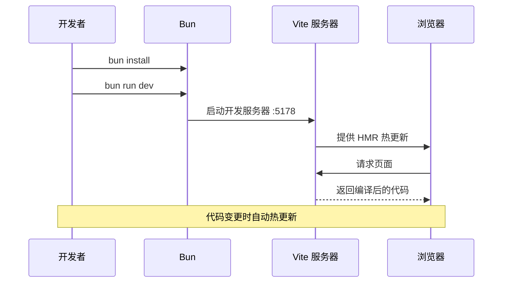
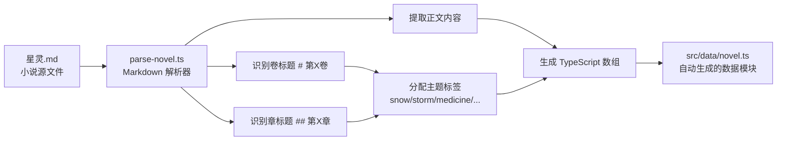

本文档介绍「星灵」Web 应用所采用的全部技术栈，包括核心框架、构建工具、样式系统、状态管理和数据处理管线。目标是帮助初学者快速建立对项目整体技术选型的认知，为后续深入阅读各专项文档奠定基础。

建议的阅读路径：先浏览本页建立全局认知，再依次阅读 [项目结构说明](4-xiang-mu-jie-gou-shuo-ming)、[应用架构设计](5-ying-yong-jia-gou-she-ji)，然后根据需要深入到具体专题。

## 技术栈全景图

```mermaid
graph TB
    subgraph "开发工具链"
        A[Bun 包管理器] --> B[Vite 8 构建工具]
        B --> C[TypeScript 6.0]
        B --> D[ESLint 9 + 插件]
    end

    subgraph "前端核心"
        E[React 19] --> F[React Router DOM v7]
        E --> G[Zustand v5 状态管理]
        E --> H[Framer Motion v12 动画]
        E --> I[Lucide React 图标]
    end

    subgraph "样式系统"
        J[TailwindCSS v4] --> K[@theme 自定义色彩]
        K --> L[星空主题色板]
    end

    subgraph "数据管线"
        M[星灵.md 源文件] --> N[parse-novel.ts 解析脚本]
        N --> O[小说数据 src/data/novel.ts]
        G --> P[localStorage 持久化]
    end

    B --> E
    E --> J
```

上图展示了技术栈的分层结构：底层为开发工具链，中间层为前端核心库，上层为样式系统和数据管线。

Sources: [xingling-web/package.json](xingling-web/package.json#L1-L39)

## 核心技术选型

| 技术 | 版本 | 职责 | 配置文件 |
|------|------|------|----------|
| React | ^19.2.5 | UI 组件框架，JSX 渲染 | [tsconfig.app.json](xingling-web/tsconfig.app.json#L14) 启用 `react-jsx` |
| TypeScript | ~6.0.2 | 静态类型检查，开发体验 | [tsconfig.json](xingling-web/tsconfig.json#L1-L8) 项目引用 |
| Vite | ^8.0.9 | 开发服务器 + 生产构建 | [vite.config.ts](xingling-web/vite.config.ts#L1-L13) |
| React Router DOM | ^7.14.2 | 客户端路由管理 | [App.tsx](xingling-web/src/App.tsx#L1-L27) 定义 6 条路由 |
| Zustand | ^5.12 | 全局状态管理，localStorage 持久化 | [store/index.ts](xingling-web/src/store/index.ts#L1-L68) |
| TailwindCSS | ^4.2.4 | 实用优先的 CSS 框架 | [index.css](xingling-web/src/index.css#L1-L77) |
| Framer Motion | ^12.38.0 | 声明式动画系统 | 组件层使用 |
| Lucide React | ^1.8.0 | SVG 图标库 | 组件层使用 |
| ESLint | ^9.39.4 | 代码规范检查 | [eslint.config.js](xingling-web/eslint.config.js#L1-L24) |
| Bun | — | 包管理（bun.lock） | 项目根目录 |

## 构建与开发流程

Vite 配置定义了开发服务器运行在 `0.0.0.0:5178`，并注册了两个插件：`@vitejs/plugin-react` 提供 React 快速刷新（HMR），`@tailwindcss/vite` 将 TailwindCSS 集成到构建管线中。



主要 npm scripts 如下：

| 命令 | 作用 |
|------|------|
| `bun run dev` | 启动 Vite 开发服务器 |
| `bun run parse` | 执行 `parse-novel.ts`，将小说 Markdown 解析为 TypeScript 数据 |
| `bun run build` | 先运行 TypeScript 类型检查，再执行 Vite 生产构建 |
| `bun run lint` | 运行 ESLint 代码规范检查 |
| `bun run preview` | 预览生产构建结果 |

Sources: [vite.config.ts](xingling-web/vite.config.ts#L1-L13), [package.json](xingling-web/package.json#L7-L12)

## TypeScript 配置策略

项目采用 TypeScript 6.0，使用 **项目引用（Project References）** 模式将配置拆分为 `tsconfig.app.json`（应用代码）和 `tsconfig.node.json`（Node 端脚本）。

核心编译选项：

| 选项 | 值 | 说明 |
|------|-----|------|
| `target` | ES2023 | 编译目标为现代 JavaScript |
| `module` | esnext | 使用 ESM 模块系统 |
| `moduleResolution` | bundler | 适配 Vite 的模块解析策略 |
| `jsx` | react-jsx | React 17+ 自动 JSX 转换 |
| `verbatimModuleSyntax` | true | 强制显式导入/导出类型 |
| `noUnusedLocals` | true | 报告未使用的局部变量 |
| `noUnusedParameters` | true | 报告未使用的函数参数 |
| `noFallthroughCasesInSwitch` | true | 禁止 switch 语句穿透 |

Sources: [tsconfig.app.json](xingling-web/tsconfig.app.json#L1-L26)

## 样式系统

项目使用 TailwindCSS v4，通过 `@theme` 指令定义了**专属星空色彩系统**。这一设计将小说"星灵"的主题视觉直接映射到 CSS 变量中：

| 色板名称 | 色阶 | 色彩值 | 视觉含义 |
|----------|------|--------|----------|
| cosmic | 500–900 | `#3b3f8e` → `#0a0e27` | 宇宙深空背景，由浅至深 |
| nebula | 300–500 | `#c4b5fd` → `#8b5cf6` | 星云紫色，高亮和交互 |
| star | 300–500 | `#bfdbfe` → `#60a5fa` | 星光蓝色，信息和链接 |
| aurora | 400–500 | `#6ee7b7` → `#34d399` | 极光绿色，成功和强调 |

此外，CSS 中定义了 5 组关键帧动画：`twinkle`（星星闪烁）、`float`（悬浮效果）、`glow-pulse`（发光脉冲）、`slide-up`（上滑入场）、`fade-in`（渐显）。这些动画配合 Framer Motion 实现丰富的视觉层次。

字体采用中文衬线字体族：`"Noto Serif SC", "Source Han Serif SC", "STSong", "SimSun"`，与小说文学风格相呼应。

Sources: [index.css](xingling-web/src/index.css#L1-L77)

## 状态管理与数据持久化

项目使用 Zustand 创建了两个独立 store：

- **`useStore`（阅读状态）**：维护当前卷/章节索引、阅读进度和已完成章节列表，通过 `localStorage` 键 `xingling-progress` 和 `xingling-completed` 实现持久化。
- **`useSettings`（设置状态）**：管理字体大小（默认 18px），通过 `xingling-fontsize` 键持久化。

应用启动时，`main.tsx` 调用 `useStore.getState().loadProgress()` 从 localStorage 恢复阅读进度。

Sources: [store/index.ts](xingling-web/src/store/index.ts#L1-L68), [main.tsx](xingling-web/src/main.tsx#L1-L15)

## 数据管线：从 Markdown 到 TypeScript

项目包含一个自定义解析脚本 `parse-novel.ts`，负责将根目录的 [`星灵.md`](星灵.md) 转换为结构化的 TypeScript 模块 `src/data/novel.ts`。



解析器将 16 卷内容按卷主题（`volumeThemes` 映射表）分配视觉主题标签，例如第一卷"自行始终"对应 `snow` 主题，第二卷"风暴突袭"对应 `storm` 主题。生成的数据包含 16 卷、每卷的章节列表以及每章的标题、内容和行号位置信息。

Sources: [parse-novel.ts](xingling-web/scripts/parse-novel.ts#L1-L129), [novel.ts](xingling-web/src/data/novel.ts#L1-L30)

## ESLint 代码规范

ESLint 采用 Flat Config（`eslint.config.js`），集成了以下规则集：

| 规则集 | 作用 |
|--------|------|
| `@eslint/js` recommended | JavaScript 基础规则 |
| `typescript-eslint` recommended | TypeScript 类型安全规则 |
| `eslint-plugin-react-hooks` recommended | React Hooks 使用规范 |
| `eslint-plugin-react-refresh` vite | Vite HMR 兼容性规则 |

配置忽略 `dist/` 目录，对所有 `.ts` 和 `.tsx` 文件生效，ECMAScript 版本设置为 2020，全局环境为浏览器。

Sources: [eslint.config.js](xingling-web/eslint.config.js#L1-L24)

## 路由结构

应用通过 React Router DOM 定义了 6 条路由，覆盖了小说阅读的全部核心页面：

| 路径 | 页面组件 | 功能 |
|------|----------|------|
| `/` | Home | 首页入口 |
| `/volumes` | VolumeSelector | 卷选择器 |
| `/read/:volumeIndex/:chapterIndex` | ChapterReader | 章节阅读器 |
| `/characters` | CharacterBook | 人物图鉴 |
| `/world` | WorldView | 世界观浏览 |
| `/timeline` | Timeline | 时间线 |

星空背景组件 `StarField` 作为全局背景在所有路由上方渲染。

Sources: [App.tsx](xingling-web/src/App.tsx#L1-L27)

## 下一步

完成本页阅读后，建议按以下顺序深入学习：

1. **[项目结构说明](4-xiang-mu-jie-gou-shuo-ming)** — 了解源码目录组织和各目录职责
2. **[应用架构设计](5-ying-yong-jia-gou-she-ji)** — 理解组件层级和数据流
3. **[Zustand 状态管理](7-zustand-zhuang-tai-guan-li)** — 深入了解状态管理实现
4. **[阅读进度持久化](8-yue-du-jin-du-chi-jiu-hua)** — 了解 localStorage 持久化策略
5. **[Vite 构建配置](21-vite-gou-jian-pei-zhi)** — 了解构建优化和生产部署