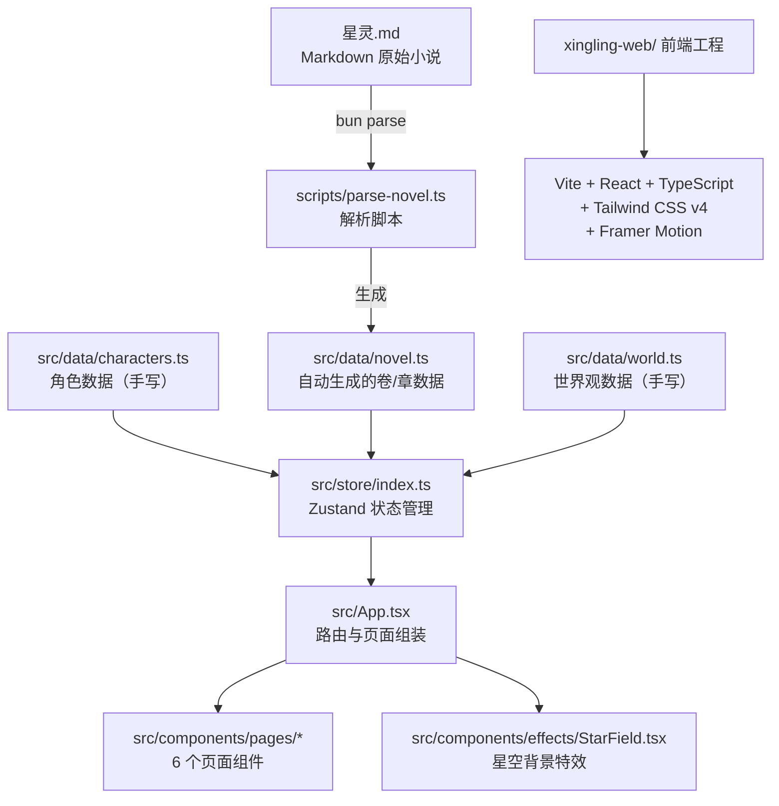

本文档系统性地介绍「星灵」阅读器的代码组织结构，帮助初学者快速理解各目录的职责与协作关系。项目采用 **monorepo 风格** 布局：根目录存放原始素材与工程配置，`xingling-web/` 子目录包含完整的前端应用源码。

## 整体架构概览

星灵阅读器的代码仓库按功能域划分为三个层次——**数据源层**、**构建管线层**和**Web 应用层**。原始 Markdown 小说作为唯一数据源，通过脚本解析为 TypeScript 数据模块，再供 React 前端消费。



数据流向为 **单向管线**：`星灵.md → parse-novel.ts → novel.ts → Zustand store → 页面组件`。角色与世界观数据则以手写 TypeScript 模块直接供前端使用。

Sources: [星灵.md](星灵.md#L1-L50), [scripts/parse-novel.ts](xingling-web/scripts/parse-novel.ts#L1-L129), [src/data/novel.ts](xingling-web/src/data/novel.ts#L1-L10)

## 根目录结构

仓库根目录承载 **原始数据** 和 **开发工作流配置**，不包含运行时代码。

| 目录/文件 | 职责 | 说明 |
|---|---|---|
| `星灵.md` | 小说原始素材 | 全书 Markdown 源文件，约 6500 行，使用 `#` 标记卷标题、`##` 标记章标题 |
| `xingling-web/` | Web 应用源码 | React 前端工程的全部代码，详见下方子目录说明 |
| `.spec-workflow/` | 规范工作流 | 产品设计与开发流程模板（design、product、requirements 等模板） |
| `.code-review-graph/` | 代码审查图谱 | GitNexus 技能生成的代码关系数据库 |
| `.claude/skills/` | AI 技能配置 | Claude Agent 扩展技能定义 |
| `AGENTS.md` / `CLAUDE.md` | Agent 指令 | 对 AI 编码助手的行为约束与项目上下文说明 |
| `Plans/` | 开发计划 | 功能迭代计划文档 |

Sources: [AGENTS.md](AGENTS.md), [.spec-workflow/templates/](.spec-workflow/templates/)

## xingling-web 前端工程

`xingling-web/` 是基于 Vite + React + TypeScript 的单页应用（SPA），采用约定式目录组织。

### 目录树

```
xingling-web/
├── package.json          # 依赖与脚本声明
├── vite.config.ts        # Vite 构建配置（port: 5178, React + Tailwind 插件）
├── tsconfig.json         # TypeScript 项目引用入口
├── tsconfig.app.json     # 应用代码 TS 配置
├── tsconfig.node.json    # Node 端脚本 TS 配置
├── eslint.config.js      # ESLint 代码规范
├── index.html            # HTML 入口模板
├── scripts/
│   └── parse-novel.ts    # Markdown → TypeScript 解析脚本
├── public/               # 静态资源（favicon.svg, icons.svg）
├── src/
│   ├── main.tsx          # 应用挂载点，初始化阅读进度
│   ├── App.tsx           # 路由定义，6 条页面路由
│   ├── index.css         # Tailwind CSS + 全局样式 + 动画关键帧
│   ├── components/
│   │   ├── pages/        # 6 个页面组件
│   │   │   ├── Home.tsx
│   │   │   ├── VolumeSelector.tsx
│   │   │   ├── ChapterReader.tsx
│   │   │   ├── CharacterBook.tsx
│   │   │   ├── WorldView.tsx
│   │   │   └── Timeline.tsx
│   │   ├── effects/
│   │   │   └── StarField.tsx   # 星空背景粒子动画
│   │   └── ui/                 # 可复用 UI 组件（待扩展）
│   ├── data/             # 数据层
│   │   ├── novel.ts      # 自动生成的卷/章/内容数据
│   │   ├── characters.ts # 角色档案数据
│   │   └── world.ts      # 世界观（地点/神器/组织/科技）数据
│   ├── store/
│   │   └── index.ts      # Zustand 状态管理（阅读进度 + 字体设置）
│   ├── styles/           # 样式模块目录
│   └── assets/           # 图片资源
└── dist/                 # 构建产物（自动生成）
```

### 各目录职责说明

**入口层** — `src/main.tsx` 与 `src/App.tsx`

`main.tsx` 是 React 应用的挂载入口，在渲染前调用 `useStore.getState().loadProgress()` 从 `localStorage` 恢复上次阅读进度。`App.tsx` 使用 React Router v7 定义 6 条路由，并将 `StarField` 星空背景作为全局组件包裹所有页面。

Sources: [src/main.tsx](xingling-web/src/main.tsx#L1-L15), [src/App.tsx](xingling-web/src/App.tsx#L1-L27)

**页面组件层** — `src/components/pages/`

| 组件文件 | 路由路径 | 功能 |
|---|---|---|
| `Home.tsx` | `/` | 首页，展示导航入口 |
| `VolumeSelector.tsx` | `/volumes` | 卷选择器，展示全部卷列表与主题 |
| `ChapterReader.tsx` | `/read/:volumeIndex/:chapterIndex` | 章节阅读器，支持正文阅读 |
| `CharacterBook.tsx` | `/characters` | 人物图鉴，浏览角色档案 |
| `WorldView.tsx` | `/world` | 世界观浏览，展示地点、神器、组织 |
| `Timeline.tsx` | `/timeline` | 时间线，展示事件时间轴 |

Sources: [src/App.tsx](xingling-web/src/App.tsx#L14-L20)

**数据层** — `src/data/`

三个 TypeScript 模块构成应用的静态数据源。`novel.ts` 由解析脚本自动生成（文件头部标注 `DO NOT EDIT`），定义 `Volume[]` 结构，每卷包含 `title`、`chapters` 和 `theme`（用于匹配不同视觉主题）。`characters.ts` 和 `world.ts` 为手写维护，分别定义角色档案与世界观实体。

Sources: [src/data/novel.ts](xingling-web/src/data/novel.ts#L1-L10), [src/data/characters.ts](xingling-web/src/data/characters.ts#L1-L10), [src/data/world.ts](xingling-web/src/data/world.ts#L1-L15)

**状态管理层** — `src/store/index.ts`

使用 Zustand 定义两个独立的 store：`useStore` 管理阅读进度（`currentVolume`、`currentChapter`、`completedChapters`），`useSettings` 管理字体大小设置。两者均通过 `localStorage` 实现持久化。

Sources: [src/store/index.ts](xingling-web/src/store/index.ts#L1-L68)

**样式层** — `src/index.css`

使用 Tailwind CSS v4 的 `@theme` 指令定义自定义色板（cosmic、nebula、star、aurora 四组配色），包含 5 组 CSS 动画关键帧（`twinkle`、`float`、`glow-pulse`、`slide-up`、`fade-in`），并定制了滚动条样式。全局背景色 `#0a0e27` 为深空蓝，字体使用思源宋体族。

Sources: [src/index.css](xingling-web/src/index.css#L1-L77)

**特效层** — `src/components/effects/StarField.tsx`

星空背景粒子动画组件，通过 Framer Motion 实现星点闪烁效果，作为全局背景层渲染在路由内容下方。

Sources: [src/components/effects/StarField.tsx](xingling-web/src/components/effects/StarField.tsx#L1-L1)

### 构建与开发脚本

```json
{
  "dev": "vite",                  // 启动开发服务器（端口 5178）
  "parse": "tsx scripts/parse-novel.ts",  // 解析 Markdown 生成 novel.ts
  "build": "tsc -b && vite build",        // 类型检查 + 生产构建
  "lint": "eslint .",             // 代码规范检查
  "preview": "vite preview"       // 预览构建产物
}
```

**开发流程建议**：修改小说内容后，先运行 `bun parse`（或 `npm run parse`）重新生成 `novel.ts`，再启动 `bun dev` 查看效果。

Sources: [package.json](xingling-web/package.json#L5-L11), [vite.config.ts](xingling-web/vite.config.ts#L1-L13)

## 技术栈总览

| 类别 | 技术 | 版本 | 用途 |
|---|---|---|---|
| 运行时 | React | 19.2 | UI 组件框架 |
| 路由 | React Router | 7.14 | 页面导航与动态路由 |
| 状态 | Zustand | 5.0 | 轻量级全局状态管理 |
| 动画 | Framer Motion | 12.38 | 页面过渡与动效 |
| 图标 | Lucide React | 1.8 | 矢量图标库 |
| 样式 | Tailwind CSS | 4.2 | 原子化 CSS 框架 |
| 构建 | Vite | 8.0 | 前端构建工具 |
| 语言 | TypeScript | 6.0 | 类型安全 |
| 解析 | tsx | 4.21 | Node.js 脚本运行时 |

Sources: [package.json](xingling-web/package.json#L12-L39)

## 下一步阅读

按照以下路径继续深入学习项目架构：

1. **[快速开始](2-kuai-su-kai-shi)** — 了解如何启动开发环境与运行项目
2. **[技术栈总览](3-ji-zhu-zhan-zong-lan)** — 各技术的详细作用与选型理由
3. **[应用架构设计](5-ying-yong-jia-gou-she-ji)** — 深入理解组件间协作模式
4. **[路由与页面导航](6-lu-you-yu-ye-mian-dao-hang)** — 了解 6 个页面的路由结构与导航逻辑
5. **[Markdown 解析脚本](11-markdown-jie-xi-jiao-ben)** — 理解 `parse-novel.ts` 的解析管线实现