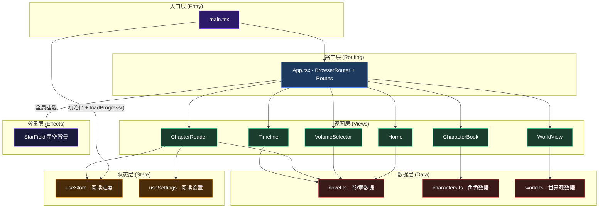
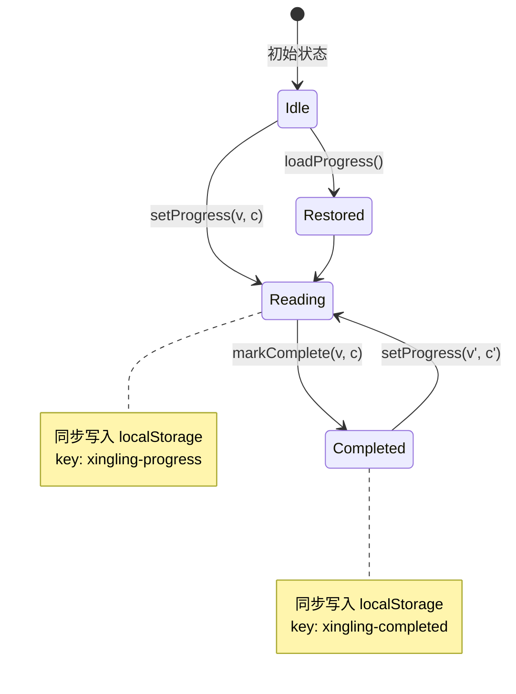
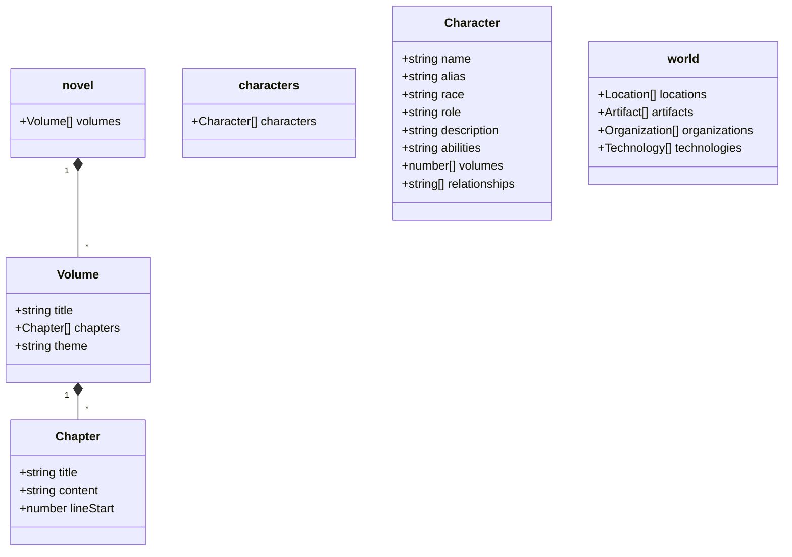
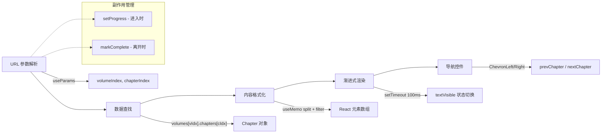

本文档阐述「星灵」小说阅读器的前端应用架构。项目采用 **React + TypeScript + Vite** 技术栈，以组件驱动的声明式范式构建沉浸式阅读体验。整体架构遵循 **数据层 → 状态层 → 路由层 → 视图层** 的单向数据流模型，通过 Zustand 实现轻量级全局状态管理，通过 React Router 组织页面导航，通过 Tailwind CSS + Framer Motion 实现视觉与动效系统。

## 整体架构分层

应用从入口到渲染可分为五个逻辑层级，各层之间职责明确、依赖单向：

Sources: [main.tsx](xingling-web/src/main.tsx#L1-L15), [App.tsx](xingling-web/src/App.tsx#L1-L27)

## 入口层：应用启动引导

`main.tsx` 是应用的唯一入口点，承担三项核心职责：**创建 React 根节点**、**恢复持久化状态**、**挂载根组件**。在 `<StrictMode>` 下渲染 `App` 组件之前，先调用 `useStore.getState().loadProgress()` 从 `localStorage` 恢复用户的阅读进度和已完成章节列表，确保用户刷新页面后能无缝接续阅读体验。

这种设计将状态恢复提前到组件树构建之前，避免了首屏渲染时的状态闪烁问题。字体大小等阅读设置也采用相同的初始化模式，在 `useSettings` store 定义后立即从 `localStorage` 读取持久化值。

Sources: [main.tsx](xingling-web/src/main.tsx#L7-L8), [index.ts](xingling-web/src/store/index.ts#L55-L68)

## 路由层：页面导航骨架

`App.tsx` 定义了应用的完整路由拓扑。所有路由采用 **客户端路由（Client-Side Routing）**，通过 `react-router-dom` 的 `BrowserRouter` 实现无刷新页面切换。路由表包含六条路径，覆盖应用的全部功能入口：

| 路径 | 组件 | 功能描述 | 数据来源 |
|------|------|----------|----------|
| `/` | `Home` | 首页导航，展示四大功能入口 | `novel.ts`（卷统计） |
| `/volumes` | `VolumeSelector` | 卷选择器，展示全部卷列表 | `novel.ts`（卷/章数据） |
| `/read/:volumeIndex/:chapterIndex` | `ChapterReader` | 章节阅读器，支持前进/后退/字体调整 | `novel.ts` + `useStore` + `useSettings` |
| `/characters` | `CharacterBook` | 人物图鉴，展示角色信息 | `characters.ts` |
| `/world` | `WorldView` | 世界观浏览，展示地点/神器/组织 | `world.ts` |
| `/timeline` | `Timeline` | 时间线，展示故事编年 | `novel.ts` |

星空背景组件 `StarField` 作为全局效果层，在 `BrowserRouter` 内部但 `Routes` 外部挂载，确保所有页面共享统一的视觉氛围而不参与路由匹配。

Sources: [App.tsx](xingling-web/src/App.tsx#L10-L20)

## 状态层：Zustand Store 架构

状态管理采用 **Zustand** 库，定义了 `ReadingState` 和 `SettingsState` 两个独立 store。这种拆分遵循**关注点分离**原则，避免不相关状态的相互触发。

### ReadingState — 阅读进度管理

`ReadingState` 管理四个核心状态字段：
- **`currentVolume` / `currentChapter`**：当前阅读的卷/章索引
- **`readingProgress`**：持久化的阅读进度快照
- **`completedChapters`**：已完成章节的字符串数组（格式为 `"volume-chapter"`）

`setProgress` 在用户进入章节时调用，同时更新内存状态和 `localStorage`；`markComplete` 在用户离开章节时通过 `useEffect` 清理函数触发，确保即使异常退出也能记录阅读完成状态。所有持久化操作包裹在 `try/catch` 中以处理私有浏览模式下的 `localStorage` 不可用情况。

### SettingsState — 阅读偏好管理

`SettingsState` 仅管理 `fontSize` 单一状态，默认值 18px。设置变更后同步持久化到 `localStorage`，初始化时恢复。

Sources: [index.ts](xingling-web/src/store/index.ts#L1-L68)

## 数据层：静态数据模型

数据层由三个 TypeScript 模块构成，以**纯静态导出**的方式提供应用所需的全部数据。这种设计避免了运行时网络请求，使应用可以作为纯静态站点部署。

| 模块 | 导出的数据结构 | 数据量级 | 生成方式 |
|------|---------------|----------|----------|
| `novel.ts` | `Volume[]`（含 `Chapter[]`） | 16 卷，每卷约 14-16 章 | 由 `parse-novel.ts` 从 `星灵.md` 自动生成 |
| `characters.ts` | `Character[]` | 40+ 角色 | 手动维护 |
| `world.ts` | `Location[]`、`Artifact[]`、`Organization[]`、`Technology[]` | 50+ 条目 | 手动维护 |

`novel.ts` 文件头部标注 `// Auto-generated from 星灵.md - DO NOT EDIT`，表明其由构建脚本自动生成，避免手动修改与源文档不一致。`Chapter` 接口中的 `lineStart` 字段记录了每章在原始 Markdown 文件中的起始行号，便于调试和溯源。

Sources: [novel.ts](xingling-web/src/data/novel.ts#L1-L15), [characters.ts](xingling-web/src/data/characters.ts#L1-L14), [world.ts](xingling-web/src/world.ts#L1-L10)

## 视图层：页面组件架构

### 组件组织模式

所有页面组件位于 `src/components/pages/` 目录下，遵循**单一职责原则**——每个组件对应一个路由视图。组件内部采用 **React Hooks** 模式管理本地状态和副作用：

- `Home`：静态导航页，使用 Framer Motion 实现入场动画
- `ChapterReader`：核心阅读组件，处理章节渲染、前后导航、字体设置
- `VolumeSelector`：卷/章列表展示，支持阅读进度标记
- `CharacterBook` / `WorldView` / `Timeline`：数据浏览组件，渲染静态数据

### ChapterReader 渲染管线

`ChapterReader` 是架构中最复杂的页面组件，其数据流可概括为以下阶段：

内容格式化使用 `useMemo` 将 Markdown 文本按行分割、过滤空行和标题行、包装为 `
` 元素数组。这种轻量级处理方式避免了引入完整的 Markdown 解析库，在保持性能的同时满足当前需求。

Sources: [ChapterReader.tsx](xingling-web/src/components/pages/ChapterReader.tsx#L1-L60), [Home.tsx](xingling-web/src/components/pages/Home.tsx#L1-L40)

## 效果层：全局视觉系统

`StarField` 组件作为全局效果层，独立于路由系统之外渲染。它使用 Canvas API 在后台绘制动态星空粒子效果，通过 `position: fixed` 和 `z-index: -1` 确保始终位于所有页面内容之下。这种设计模式将**装饰性视觉效果**与**功能性 UI** 解耦，使页面组件无需关心背景渲染逻辑。

Sources: [App.tsx](xingling-web/src/App.tsx#L11), [StarField.tsx](xingling-web/src/components/effects/StarField.tsx#L1-L1)

## 架构决策总结

| 决策项 | 选择 | 理由 |
|--------|------|------|
| 状态管理 | Zustand | 轻量级、API 简洁、无需 Provider 包裹 |
| 路由方案 | React Router v6 | 声明式路由配置、支持动态参数 |
| 样式方案 | Tailwind CSS | 实用优先、与 Vite 原生集成 |
| 动画方案 | Framer Motion | 声明式动画 API、与 React 生命周期集成 |
| 数据存储 | localStorage | 零依赖、同步读写、适合小规模数据 |
| 数据获取 | 静态导出 | 无后端依赖、可静态部署、加载零延迟 |

## 下一步

深入理解各子系统的实现细节：

- **[路由与页面导航](6-lu-you-yu-ye-mian-dao-hang)** — 路由配置详情、导航模式、历史管理
- **[Zustand 状态管理](7-zustand-zhuang-tai-guan-li)** — Store 设计模式、中间件、状态持久化策略
- **[阅读进度持久化](8-yue-du-jin-du-chi-jiu-hua)** — localStorage 数据结构、版本迁移、异常处理