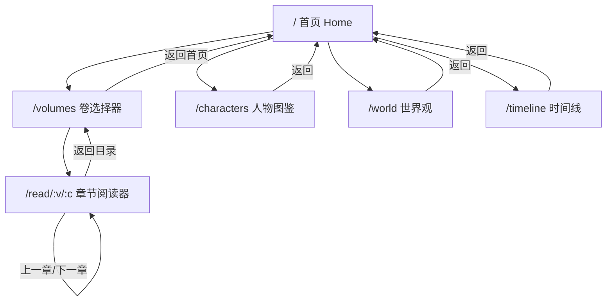
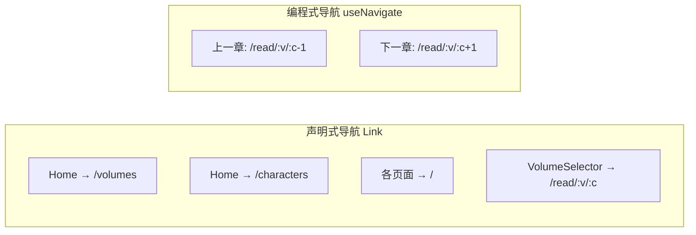
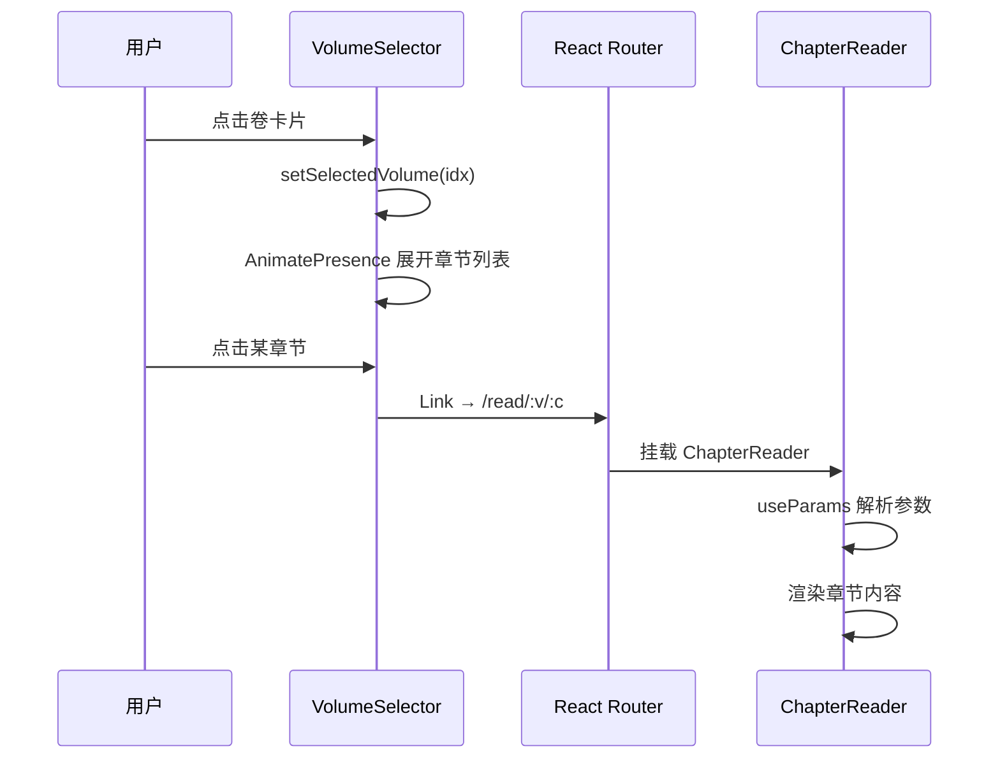

星灵项目采用 **React Router DOM v7** 构建客户端路由系统，所有路由集中定义于 `App.tsx`，通过 `<BrowserRouter>` 包裹整个应用。页面导航采用声明式 `<Link>` 组件与编程式 `useNavigate` 混合模式，确保用户在不同内容模块间的流畅跳转。

Sources: [App.tsx](xingling-web/src/App.tsx#L1-L27), [package.json](xingling-web/package.json#L14-L14)

## 路由架构总览

项目的路由结构呈现**三级信息层次**：首页作为入口枢纽，卷选择器作为阅读路径的调度中心，章节阅读器作为深度阅读终端。三条辅助路线（人物图鉴、世界观、时间线）从首页直达，各自独立。

所有辅助页面通过 `<Link to="/">` 返回首页，形成星形导航拓扑，确保用户在任何深度都能一键回到起点。

Sources: [App.tsx](xingling-web/src/App.tsx#L11-L17), [Home.tsx](xingling-web/src/components/pages/Home.tsx#L50-L84)

## 路由表定义

应用共定义 6 条路由，其中唯一带动态参数的路由是章节阅读器，采用两段式 URL 结构定位具体章节。

| 路径 | 组件 | 参数 | 功能定位 |
|------|------|------|----------|
| `/` | `Home` | 无 | 应用入口，四向导航枢纽 |
| `/volumes` | `VolumeSelector` | 无 | 卷列表浏览与章节选择 |
| `/read/:volumeIndex/:chapterIndex` | `ChapterReader` | `volumeIndex`, `chapterIndex` | 章节内容阅读 |
| `/characters` | `CharacterBook` | 无 | 角色图鉴浏览 |
| `/world` | `WorldView` | 无 | 世界观设定浏览 |
| `/timeline` | `Timeline` | 无 | 故事时间线浏览 |

`/read/:volumeIndex/:chapterIndex` 路由的两个参数均为字符串形式的数字索引，在组件内通过 `parseInt` 转换为数组下标，用于从 `volumes` 数据源中精确定位目标章节。

Sources: [App.tsx](xingling-web/src/App.tsx#L13-L13), [ChapterReader.tsx](xingling-web/src/components/pages/ChapterReader.tsx#L9-L12)

## 导航模式分析

项目根据场景需要，采用了两种互补的导航模式。

**声明式导航**（`<Link>` 组件）用于所有预知目标路径的场景。首页的四个导航卡片、各辅助页面的返回按钮、卷选择器中的章节链接均使用 `<Link>`，利用 React Router 的内部预取机制优化跳转体验。

**编程式导航**（`useNavigate` hook）专用于章节阅读器的上一章/下一章按钮。这两个按钮的目标路径依赖当前卷号与章节号的动态计算，必须在运行时构建 URL。`navigate()` 调用发生在 `onClick` 事件处理器中，与 React 的组件生命周期自然融合。

Sources: [Home.tsx](xingling-web/src/components/pages/Home.tsx#L50-L84), [ChapterReader.tsx](xingling-web/src/components/pages/ChapterReader.tsx#L126-L126), [ChapterReader.tsx](xingling-web/src/components/pages/ChapterReader.tsx#L145-L145), [VolumeSelector.tsx](xingling-web/src/components/pages/VolumeSelector.tsx#L106-L117)

## 卷选择器的双层交互模式

`VolumeSelector` 实现了一种**先选卷、后选章**的双层交互范式。用户首先点击卷卡片进入选中状态，下方通过 `AnimatePresence` 动态展开对应卷的章节列表。每个章节条目以 `<Link>` 包裹，目标路径为 `/read/${selectedVolume}/${chIdx}`。

点击章节链接的同时，通过 `onClick` 回调调用 `useStore.getState().setProgress()` 记录阅读进度，实现了导航与状态更新的同步执行。

Sources: [VolumeSelector.tsx](xingling-web/src/components/pages/VolumeSelector.tsx#L39-L41), [VolumeSelector.tsx](xingling-web/src/components/pages/VolumeSelector.tsx#L85-L117), [VolumeSelector.tsx](xingling-web/src/components/pages/VolumeSelector.tsx#L108-L108)

## 章节阅读器的路由生命周期

`ChapterReader` 组件的导航行为与组件生命周期紧密耦合。组件挂载时通过 `useParams` 提取路由参数，在 `useEffect` 中调用 `useStore.getState().setProgress()` 更新全局阅读进度。组件卸载时（用户离开当前章节），通过 `useEffect` 的清理函数调用 `markComplete()` 标记该章节为已读。

章节内导航（上一章/下一章）通过编程式 `navigate()` 实现。当用户点击上一章或下一章按钮时，组件先卸载再重新挂载，触发完整的生命周期循环：提取新参数 → 更新进度 → 渲染新内容 → 标记旧章节完成。

Sources: [ChapterReader.tsx](xingling-web/src/components/pages/ChapterReader.tsx#L21-L25), [ChapterReader.tsx](xingling-web/src/components/pages/ChapterReader.tsx#L28-L32), [ChapterReader.tsx](xingling-web/src/components/pages/ChapterReader.tsx#L48-L54)

## 路由错误处理

当用户访问不存在的章节路径时（如 `/read/99/99`），`ChapterReader` 通过空值守卫返回兜底 UI。组件在解析 `volumes[vIdx]` 和 `volume.chapters[cIdx]` 后检查有效性，若任一值为 `undefined`，则渲染"章节未找到"提示，避免运行时崩溃。

Sources: [ChapterReader.tsx](xingling-web/src/components/pages/ChapterReader.tsx#L56-L62)

## 导航与星空背景的层次关系

`<StarField />` 组件被放置在 `<BrowserRouter>` 内部、`<Routes>` 外部，这意味着星空背景在所有路由页面间持久存在，不随路由切换而重新渲染。这种布局策略确保视觉连续性，同时让 `<Routes>` 内的页面组件按需挂载和卸载。

Sources: [App.tsx](xingling-web/src/App.tsx#L10-L18)

## 延伸阅读

- 了解状态如何配合路由工作：[Zustand 状态管理](7-zustand-zhuang-tai-guan-li)
- 了解阅读进度如何持久化：[阅读进度持久化](8-yue-du-jin-du-chi-jiu-hua)
- 了解首页导航卡片的具体实现：[首页与导航](12-shou-ye-yu-dao-hang)
- 了解卷选择器的交互细节：[卷选择器](13-juan-xuan-ze-qi)
- 了解章节阅读器的完整功能：[章节阅读器](14-zhang-jie-yue-du-qi)