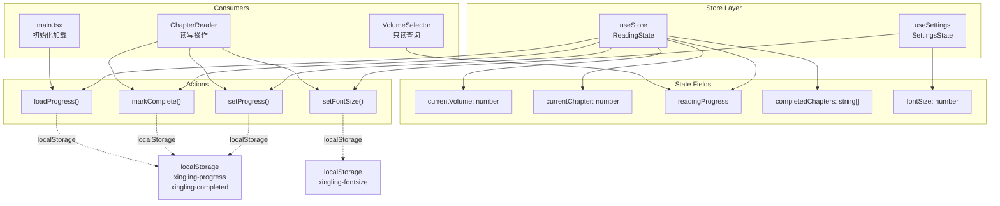
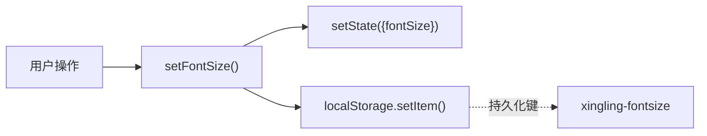
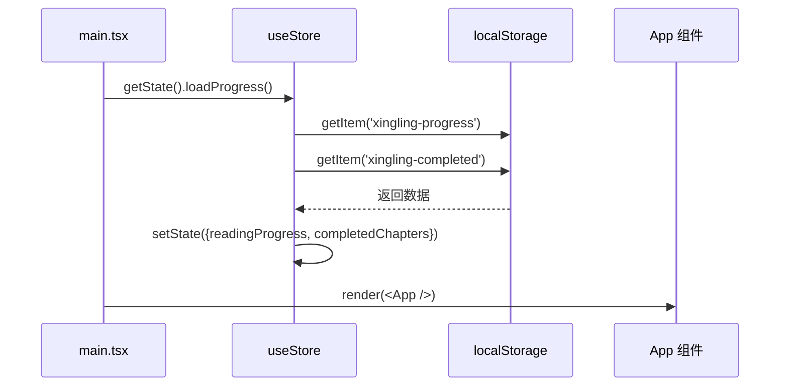
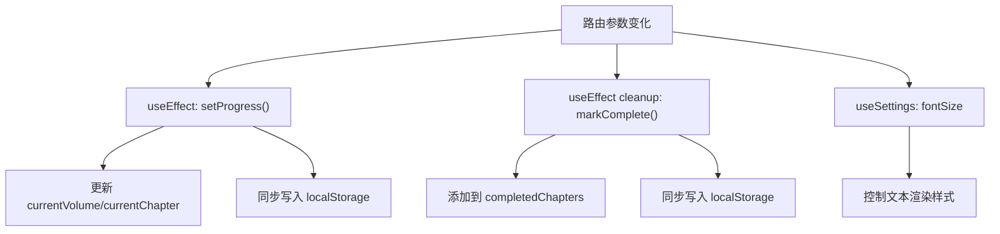

本文档解析星灵阅读应用中 Zustand 状态管理的架构设计与实现模式。项目采用 Zustand v5 作为唯一状态管理方案，通过**双 Store 分离**策略将阅读状态与 UI 设置解耦，所有数据持久化直接内嵌于 action 函数中。

## 架构概览

项目将全部状态定义于单一文件 [`index.ts`](xingling-web/src/store/index.ts#L1-L68)，通过 `create` 工厂函数创建两个独立的 Store 实例。这种设计在中等规模前端应用中有效降低了模块间耦合度。

Sources: [`index.ts`](xingling-web/src/store/index.ts#L1-L68)

## Store 设计详解

### useStore — 阅读状态管理

`useStore` 管理阅读进度与章节完成状态，是应用中最核心的 Store。其接口定义包含四个状态字段和三个 action 方法。

| 字段/方法 | 类型 | 职责 | 持久化键 |
|-----------|------|------|----------|
| `currentVolume` | `number` | 当前卷索引 | — |
| `currentChapter` | `number` | 当前章索引 | — |
| `readingProgress` | `{volume, chapter} \| null` | 阅读进度快照 | `xingling-progress` |
| `completedChapters` | `string[]` | 已读章节标识列表 | `xingling-completed` |
| `setProgress(v, c)` | `void` | 设置当前位置 | ✅ 同步写入 |
| `markComplete(v, c)` | `void` | 标记章节完成 | ✅ 同步写入 |
| `loadProgress()` | `void` | 从 localStorage 恢复 | ✅ 读取 |

**已完成章节的标识策略**：采用 `${volume}-${chapter}` 格式拼接字符串作为唯一键，存储于 `completedChapters` 数组中。`markComplete` 方法包含去重逻辑——若章节已存在则直接返回当前状态，避免不必要的重渲染 [`index.ts`](xingling-web/src/store/index.ts#L26-L36)。

Sources: [`index.ts`](xingling-web/src/store/index.ts#L3-L46)

### useSettings — 阅读设置管理

`useSettings` 独立管理字体大小等 UI 偏好设置，与阅读状态完全解耦。这种分离确保修改字体大小时不会触发阅读页面的重渲染。

该 Store 采用**模块级初始化模式**——在文件加载时立即从 localStorage 读取保存的字体大小，并通过 `setState` 直接更新默认值。这意味着组件首次渲染时即可获得正确的字体大小，无需额外的加载状态 [`index.ts`](xingling-web/src/store/index.ts#L61-L67)。

Sources: [`index.ts`](xingling-web/src/store/index.ts#L48-L67)

## 状态流转与组件集成

### 应用初始化流程

状态恢复在应用启动时完成，遵循**先恢复后渲染**的策略：

`loadProgress` 在 [`main.tsx`](xingling-web/src/main.tsx#L8) 中以同步方式调用，确保 React 组件树挂载前状态已恢复。该方法包含完整的 `try-catch` 保护，即使 localStorage 读取失败也不会阻止应用启动。

Sources: [`main.tsx`](xingling-web/src/main.tsx#L5-L9), [`index.ts`](xingling-web/src/store/index.ts#L38-L45)

### 章节阅读器中的状态操作

`ChapterReader` 组件展示了 Hook 与 imperative API 的混合使用模式：

**双模式调用策略**：
- **Hook 解构**：`const { markComplete } = useStore()` — 用于需要订阅状态变化的场景
- **Imperative 调用**：`useStore.getState().setProgress(vIdx, cIdx)` — 用于不需要组件重渲染的副作用操作

在 `ChapterReader` 中，`setProgress` 采用 imperative 调用是因为组件已通过路由参数获知当前章节位置，无需从 Store 中读取，只需单向写入进度记录。这种模式减少了不必要的订阅开销 [`ChapterReader.tsx`](xingling-web/src/components/pages/ChapterReader.tsx#L21-L26)。

Sources: [`ChapterReader.tsx`](xingling-web/src/components/pages/ChapterReader.tsx#L5-L33)

### 卷选择器中的只读消费

`VolumeSelector` 组件仅订阅 `readingProgress` 用于展示用户上次阅读位置，属于典型的只读消费场景。通过 Hook 解构获取单个字段时，Zustand 会在该字段值变化时精确触发组件重渲染，避免无关更新 [`VolumeSelector.tsx`](xingling-web/src/components/pages/VolumeSelector.tsx#L29-L40)。

Sources: [`VolumeSelector.tsx`](xingling-web/src/components/pages/VolumeSelector.tsx#L29-L40)

## 设计模式分析

### 持久化策略：内联 vs Middleware

当前实现采用**内联持久化**模式——每个 action 函数内部直接调用 `localStorage.setItem`。与 Zustand 官方的 `persist` 中间件相比，这种模式有以下特征：

| 维度 | 当前实现（内联） | Zustand persist 中间件 |
|------|-----------------|----------------------|
| 控制粒度 | 每个 action 独立控制 | 全局自动序列化 |
| 选择性持久化 | ✅ 精确控制哪些操作触发保存 | 需要配置 partialize |
| 错误隔离 | ✅ try-catch 逐个包裹 | 需要统一处理 |
| 代码复用 | ❌ 重复的 localStorage 调用 | ✅ 中间件统一处理 |
| 调试能力 | 手动埋点 | 自带 devtools 集成 |
| 迁移成本 | 低（无外部依赖） | 需引入 zustand/middleware |

**适用性评估**：对于当前仅三个持久化键的轻量级场景，内联模式提供了足够的灵活性和最小的认知负荷。当持久化需求增长至 5 个以上存储项时，建议迁移至 `persist` 中间件以获得更好的可维护性。

Sources: [`index.ts`](xingling-web/src/store/index.ts#L19-L44)

### 状态选择器模式

当前代码库未使用 Zustand 的 selector 特性（如 `useStore(state => state.currentVolume)`）。所有组件直接解构 Hook 返回值，这在 Store 字段较少时是可接受的实践。但随着 Store 扩展，建议采用选择器模式以优化渲染性能——Zustand 的选择器会在返回值严格相等时跳过重渲染。

## 扩展建议

当应用功能增长时，可考虑以下架构演进路径：

1. **Store 拆分**：将角色图鉴、世界观浏览等独立功能的状态拆分为独立 Store
2. **引入 persist 中间件**：统一管理 localStorage 持久化，支持版本迁移
3. **添加选择器**：为高频更新的字段创建 memoized selectors
4. **Devtools 集成**：启用 Zustand Devtools 以支持 Redux Devtools 调试

## 后续阅读

- [阅读进度持久化](8-yue-du-jin-du-chi-jiu-hua) — 深入分析进度数据的存储格式与恢复策略
- [章节阅读器](14-zhang-jie-yue-du-qi) — 查看状态管理在阅读页面中的完整集成
- [卷选择器](13-juan-xuan-ze-qi) — 了解进度数据如何在导航界面中展示