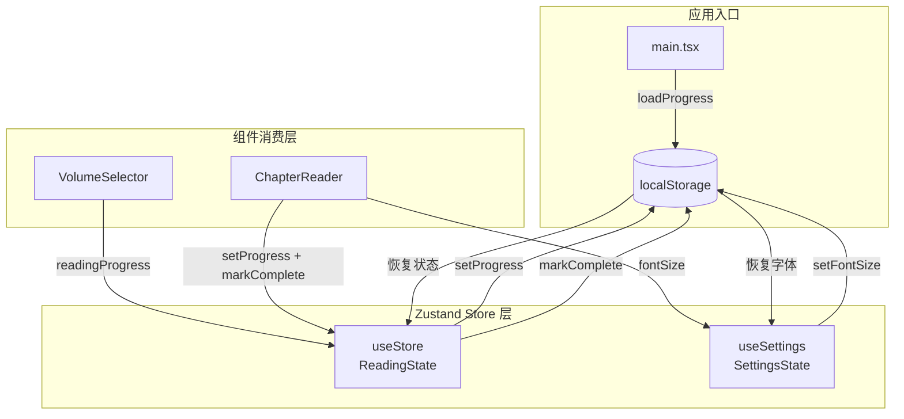
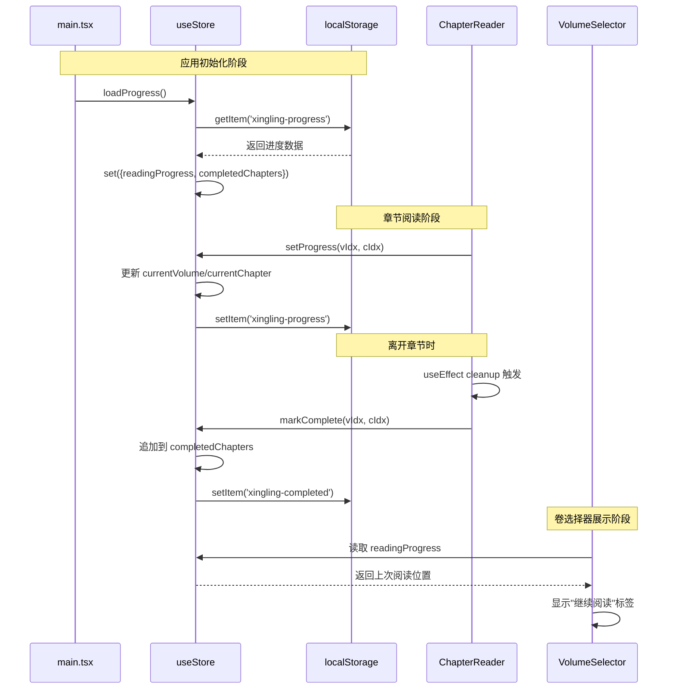

阅读进度持久化模块是星灵阅读器的核心基础设施之一，负责在浏览器环境中保存和恢复用户的阅读状态。该模块基于 **Zustand 状态管理** 与 **localStorage** 构建，实现了阅读位置记录、已完成章节追踪以及字体偏好设置三大持久化能力，确保用户在不同会话间获得无缝的阅读体验。

Sources: [store/index.ts](xingling-web/src/store/index.ts#L1-L68)

## 架构设计

持久化系统采用 **双 Store + localStorage** 的分层架构。`useStore` 管理阅读相关状态，`useSettings` 管理界面偏好设置，两者各自独立序列化到 localStorage 中，避免数据耦合。

整个数据流遵循 **写入时序列化 → 读取时反序列化** 的模式，所有 localStorage 操作均包裹在 try-catch 中以应对存储配额限制或隐私模式异常。

Sources: [store/index.ts](xingling-web/src/store/index.ts#L12-L46) [main.tsx](xingling-web/src/main.tsx#L8)

## 数据存储键值映射

系统使用三个独立的 localStorage 键，每个键对应特定的数据结构：

| 键名 | 数据类型 | 写入时机 | 读取时机 | 用途 |
|------|---------|---------|---------|------|
| `xingling-progress` | `{volume: number; chapter: number}` | 用户进入章节时（`setProgress`） | 应用初始化时（`loadProgress`） | 记录最后阅读的章节位置 |
| `xingling-completed` | `string[]`（格式：`"volume-chapter"`） | 用户离开章节时（`markComplete`） | 应用初始化时（`loadProgress`） | 追踪已读完的章节列表 |
| `xingling-fontsize` | `string`（数字字符串） | 用户调整字体时（`setFontSize`） | 应用初始化时（独立加载逻辑） | 保存阅读器字体大小偏好 |

Sources: [store/index.ts](xingling-web/src/store/index.ts#L22-L25) [store/index.ts](xingling-web/src/store/index.ts#L30-L34) [store/index.ts](xingling-web/src/store/index.ts#L55-L59)

## 生命周期流程

阅读进度的持久化与 React 组件生命周期紧密绑定。以下序列图展示了一次完整阅读会话中的状态流转：

Sources: [main.tsx](xingling-web/src/main.tsx#L8) [ChapterReader.tsx](xingling-web/src/components/pages/ChapterReader.tsx#L20-L24) [ChapterReader.tsx](xingling-web/src/components/pages/ChapterReader.tsx#L27-L33) [VolumeSelector.tsx](xingling-web/src/components/pages/VolumeSelector.tsx#L40-L45)

## 状态写入策略

`setProgress` 与 `markComplete` 采用不同的写入策略，反映了两种状态语义的差异：

**即时写入（setProgress）**：用户每次进入新章节时，立即更新当前阅读位置并序列化到 localStorage。这是一种 **乐观写入** 策略，确保即使应用意外崩溃，用户下次打开时仍能定位到最近的阅读位置。该操作在 `ChapterReader` 的 `useEffect` 依赖 `[vIdx, cIdx]` 时触发。

**延迟确认（markComplete）**：章节完成标记采用 **清理函数模式**（cleanup function），在 `ChapterReader` 组件卸载时执行。这意味着只有当用户离开当前章节（导航到上一章、下一章或返回卷列表）时，该章节才会被标记为已完成。这种设计避免了在章节内刷新页面时被误标记为已完成。

Sources: [ChapterReader.tsx](xingling-web/src/components/pages/ChapterReader.tsx#L20-L24) [ChapterReader.tsx](xingling-web/src/components/pages/ChapterReader.tsx#L27-L33) [store/index.ts](xingling-web/src/store/index.ts#L26-L35)

## 容错与边界处理

所有 localStorage 操作采用一致的容错模式：

| 风险场景 | 防护措施 | 影响范围 |
|---------|---------|---------|
| 隐私浏览模式（localStorage 不可用） | try-catch 包裹写入操作，静默失败 | 当前会话内功能正常，数据不跨会话持久化 |
| 存储配额已满 | try-catch 捕获 `QuotaExceededError` | 写入失败但不阻塞应用运行 |
| 数据损坏（JSON.parse 失败） | try-catch 包裹解析操作 | 失败时跳过该字段，使用默认初始状态 |
| 字体值解析异常 | `parseInt(saved, 10)` 带基数参数 | 解析为 NaN 时 Zustand 使用默认值 18 |

Sources: [store/index.ts](xingling-web/src/store/index.ts#L22-L25) [store/index.ts](xingling-web/src/store/index.ts#L31-L33) [store/index.ts](xingling-web/src/store/index.ts#L39-L44) [store/index.ts](xingling-web/src/store/index.ts#L55-L67)

## UI 集成模式

持久化数据在 UI 层的消费遵循两种模式：

**阅读进度指示器**：`VolumeSelector` 页面通过 `readingProgress` 在标题区域显示"上次阅读至第 X 卷第 Y 章"的提示文本，同时在对应卷卡片上渲染"继续阅读"标签，引导用户快速恢复阅读。

**字体偏好应用**：`ChapterReader` 通过 `useSettings` 订阅 `fontSize`，动态设置文章容器的 `style.fontSize`，字体范围为 14px–28px，默认值为 18px。设置面板通过 `Settings` 图标按钮弹出，使用 range input 进行调节。

Sources: [VolumeSelector.tsx](xingling-web/src/components/pages/VolumeSelector.tsx#L39-L45) [VolumeSelector.tsx](xingling-web/src/components/pages/VolumeSelector.tsx#L52-L57) [ChapterReader.tsx](xingling-web/src/components/pages/ChapterReader.tsx#L14) [ChapterReader.tsx](xingling-web/src/components/pages/ChapterReader.tsx#L100-L108)

## 设计约束与扩展方向

当前实现存在以下架构约束：

- **单设备限制**：所有数据存储在浏览器本地，不支持跨设备同步
- **无版本迁移**：localStorage 数据结构变更时无自动迁移机制
- **全量加载**：`completedChapters` 数组在应用启动时全量读取，当章节数量增长时可能影响初始化性能

如需扩展，可考虑引入 IndexedDB 替代 localStorage 以支持更大容量存储，或通过 `SyncManager API` 实现离线到在线的数据同步。这些扩展需要与 [Zustand 状态管理](7-zustand-zhuang-tai-guan-li) 的中间件机制结合使用。