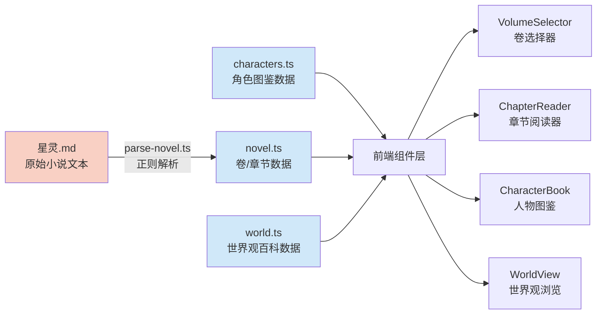
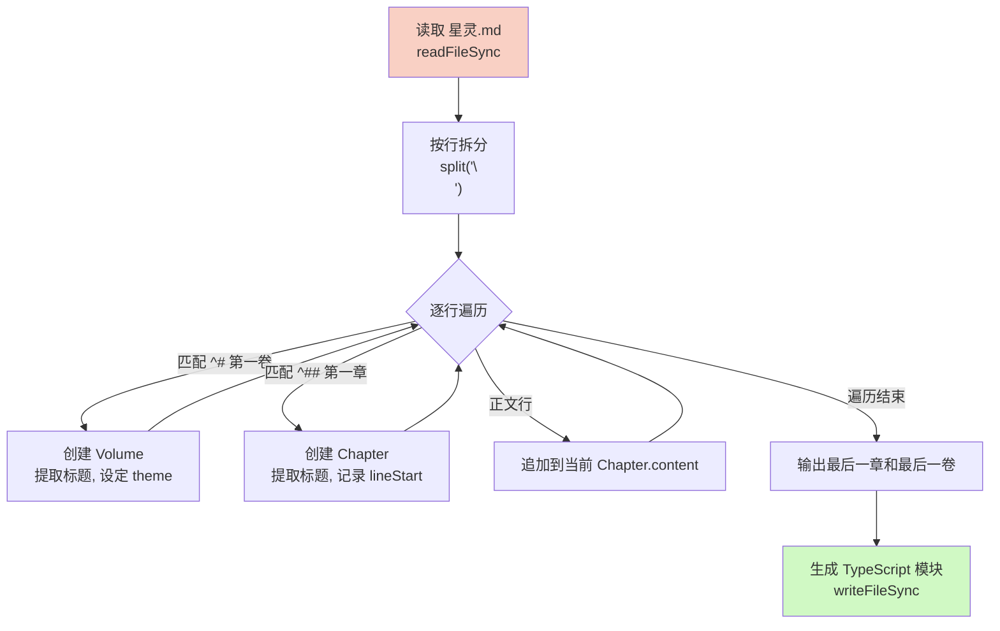
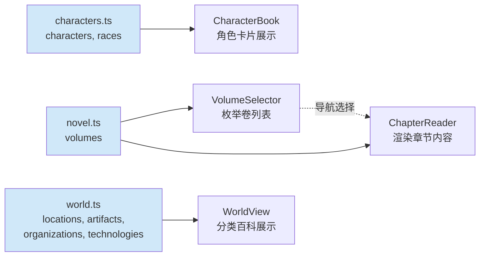

**小说数据模型** 是星灵阅读器的数据层核心，负责将原始小说文本（Markdown 格式）解析为结构化的 TypeScript 数据，供前端组件消费。该模型由三层数据构成：小说正文（卷/章节）、角色图鉴、世界观百科，分别对应 `src/data/` 目录下的三个独立文件。

数据层整体设计遵循 **静态数据 + 自动生成** 范式：源文件 `星灵.md` 作为单一事实来源，通过 `parse-novel.ts` 脚本自动编译为 TypeScript 模块，确保数据与渲染之间的类型安全和一致性。

Sources: [parse-novel.ts](xingling-web/scripts/parse-novel.ts#L1-L129), [novel.ts](xingling-web/src/data/novel.ts#L1-L20), [characters.ts](xingling-web/src/data/characters.ts#L1-L20), [world.ts](xingling-web/src/data/world.ts#L1-L20)

## 数据层架构总览

整个数据流是 **单向的、静态的**：Markdown 源文件经过一次性解析生成 TypeScript 模块，构建时直接打包到前端 bundle 中，不涉及运行时 API 请求或数据库查询。

Sources: [parse-novel.ts](xingling-web/scripts/parse-novel.ts#L1-L129), [VolumeSelector.tsx](xingling-web/src/components/pages/VolumeSelector.tsx#L1-L1), [ChapterReader.tsx](xingling-web/src/components/pages/ChapterReader.tsx#L1-L1), [CharacterBook.tsx](xingling-web/src/components/pages/CharacterBook.tsx#L1-L1), [WorldView.tsx](xingling-web/src/components/pages/WorldView.tsx#L1-L1)

## 小说正文数据模型

小说正文采用 **三层嵌套结构**：卷（Volume）→ 章节（Chapter）→ 内容（content），每个层级都有明确的 TypeScript 接口定义。

| 接口 | 字段 | 类型 | 说明 |
|------|------|------|------|
| `Chapter` | `title` | `string` | 章节标题，格式为"第X章：：标题" |
| `Chapter` | `content` | `string` | 章节正文内容，保留 Markdown 换行 |
| `Chapter` | `lineStart` | `number` | 该章节在源文件中的起始行号（从 0 开始） |
| `Volume` | `title` | `string` | 卷标题，格式为"第X卷 副标题" |
| `Volume` | `chapters` | `Chapter[]` | 该卷包含的章节数组 |
| `Volume` | `theme` | `string` | 视觉主题标识，用于阅读器背景渲染 |

**主题映射表**：每卷关联一个唯一的视觉主题 key，用于驱动 [星空背景动画](18-xing-kong-bei-jing-dong-hua) 的差异化渲染：

| 卷号 | 标题 | 主题 key | 视觉含义 |
|------|------|----------|----------|
| 1 | 自行始终 | `snow` | 冰雪 / 诺克城雪景 |
| 2 | 风暴突袭 | `storm` | 风暴 / 战争氛围 |
| 3 | 靶向药物 | `medicine` | 医疗 / 实验室 |
| 4 | 爱与冰雪 | `ice` | 冰雪 / 爱情 |
| 5 | 家在何方 | `home` | 家庭 / 温暖 |
| 6 | 森林奇缘 | `forest` | 森林 / 自然 |
| 7-8 | 命运之门 | `fate` / `fate2` | 命运 / 神秘 |
| 9 | 暗流涌动 | `ocean` | 深海 / 暗流 |
| 10 | 往日之影 | `shadow` | 阴影 / 过去 |
| 11-13 | 来势汹汹/分崩离析 | `surge` / `break1` / `break2` | 冲击 / 崩裂 |
| 14 | 久别重逢 | `reunion` | 重逢 / 温暖 |
| 15-16 | 长夜孤星 | `night1` / `night2` | 黑夜 / 终局 |

导出的聚合常量 `totalChapters` 和 `totalVolumes` 通过 `reduce` 计算得出，为导航组件提供元数据支撑。

Sources: [novel.ts](xingling-web/src/data/novel.ts#L1-L20), [parse-novel.ts](xingling-web/scripts/parse-novel.ts#L16-L33)

## Markdown 解析机制

`parse-novel.ts` 是一个纯同步解析脚本，采用 **逐行扫描 + 正则匹配** 策略，将 `星灵.md` 的标题层级映射为结构化数据。

解析器识别两类 Markdown 标题模式：

- **卷标题**：`^#\s+第([\d一二三四五六七八九十百千]+)卷\s+(.+)` —— 匹配 `# 第一卷 自行始终`
- **章标题**：`^##\s+第([一二三四五六七八九十百千\d]+)[章:：]\s*(.+)` —— 匹配 `## 第一章：为何而来`

解析器支持阿拉伯数字与中文数字混合格式，确保标题识别的鲁棒性。生成的 `novel.ts` 文件头部带有 `// Auto-generated from 星灵.md - DO NOT EDIT` 注释，防止手动修改被覆盖。

Sources: [parse-novel.ts](xingling-web/scripts/parse-novel.ts#L35-L78), [parse-novel.ts](xingling-web/scripts/parse-novel.ts#L95-L115)

### 数据规模

| 指标 | 数值 |
|------|------|
| 总卷数 | 16 卷 |
| 总章节数 | 约 200+ 章（由各卷累加得出） |
| 源文件行数 | 约 6500+ 行 |
| 生成文件行数 | 约 1115 行（压缩后） |

Sources: [novel.ts](xingling-web/src/data/novel.ts#L1-L1115)

## 角色数据模型

角色数据定义在 `characters.ts` 中，采用扁平数组结构，每个角色对象包含身份、能力、叙事跨度等维度信息。

| 字段 | 类型 | 必需 | 说明 |
|------|------|------|------|
| `name` | `string` | ✅ | 角色中文名 |
| `alias` | `string` | ❌ | 英文名/别称 |
| `race` | `string` | ✅ | 所属种族 |
| `role` | `string` | ✅ | 叙事定位与身份 |
| `description` | `string` | ✅ | 详细角色描述 |
| `abilities` | `string` | ❌ | 权能/技能列表 |
| `volumes` | `number[]` | ✅ | 角色出现的卷号列表 |
| `relationships` | `string[]` | ❌ | 与其他角色的关系描述 |

角色数组按照 **叙事分组** 组织：

1. **主角团** —— 安培尔、艾莉丝、凯奥斯、托尼（贯穿全卷的核心角色）
2. **安兹华德公司成员** —— 苏尔特尔、K、瑟琳娜、苏菲娅等
3. **第一卷角色** —— 费德里科、阿尔基姆、珍妮弗等
4. **麦克斯特政府** —— 莱茵、艾力奥尔德、潘德拉贡等
5. **其他势力** —— 火凤凰、审判庭、卡达列夫等

此外，`races` 数组定义了世界观中的五种主要种族：安吉拉、卡普拉、泰坦、精灵、人类，每种族附带简要说明和代表人物。

Sources: [characters.ts](xingling-web/src/data/characters.ts#L1-L12), [characters.ts](xingling-web/src/data/characters.ts#L450-L457)

## 世界观数据模型

世界观数据定义在 `world.ts` 中，采用 **分类数组** 结构，将世界观元素分为四个维度：

| 数据类别 | 接口 | 核心字段 | 说明 |
|----------|------|----------|------|
| 地点 | `Location` | `name`, `description`, `volume?`, `type?` | 星球、城市、地标、设施等 |
| 物品 | `Artifact` | `name`, `description`, `type?` | 神器、星之键、武器、药物等 |
| 组织 | `Organization` | `name`, `description`, `type` | 政府、企业、反抗组织等 |
| 技术 | `Technology` | `name`, `description` | 权能、力场、航行技术等 |

地点数据进一步按 **地理区域** 分组：

- **主要星球/星系** —— 拉提麦尔星系、塔迪尔星球、纽斯比特、卡提雅
- **卡达列夫（第一卷）** —— 诺克城、大矿洞、莫斯科港等
- **麦克斯特（第二卷）** —— 切尔萨特、奥特沃夫、普雷斯顿等
- **特殊空间** —— 超算空间、虚数空间

物品数据涵盖星之键系列（晨曦、天火等）、灵武·雷影、ALE抑制剂、意识传呼器等关键叙事道具。

Sources: [world.ts](xingling-web/src/data/world.ts#L1-L108)

## 数据消费链路

数据层通过 ES 模块导出，被页面组件直接 import 消费：

数据消费模式为 **直接引用**：组件在模块顶层 import 数据数组，通过 `map`、`filter` 等操作进行渲染。由于数据量固定且全部在构建时打包，不存在分页或懒加载策略。

Sources: [VolumeSelector.tsx](xingling-web/src/components/pages/VolumeSelector.tsx#L1-L1), [ChapterReader.tsx](xingling-web/src/components/pages/ChapterReader.tsx#L1-L1), [CharacterBook.tsx](xingling-web/src/components/pages/CharacterBook.tsx#L1-L1), [WorldView.tsx](xingling-web/src/components/pages/WorldView.tsx#L1-L1)

## 数据与工作流的交互

数据层的维护流程与 [开发工作流](24-kai-fa-gong-zuo-liu) 紧密集成：

1. **作者更新小说**：编辑 `星灵.md` 文件，按 `# 第X卷` 和 `## 第X章` 格式撰写
2. **运行解析脚本**：执行 `npm run parse`（即 `tsx scripts/parse-novel.ts`）
3. **自动覆盖**：`novel.ts` 被重新生成，保留原有的 TypeScript 类型声明
4. **角色/世界观数据**：目前 `characters.ts` 和 `world.ts` 为手动维护，未纳入自动解析流程

**注意事项**：`novel.ts` 文件标记为 `DO NOT EDIT`，任何对章节内容的修改都应回到 `星灵.md` 源文件进行。若新增卷数，需在 `parse-novel.ts` 的 `volumeThemes` 映射表中补充对应的 theme key。

Sources: [parse-novel.ts](xingling-web/scripts/parse-novel.ts#L16-L33), [parse-novel.ts](xingling-web/scripts/parse-novel.ts#L95-L115), [package.json](xingling-web/package.json#L1-L1)

## 设计决策分析

| 决策点 | 选择 | 权衡 |
|--------|------|------|
| 数据存储方式 | 静态 TS 模块 | ✅ 零运行时开销、类型安全 ❌ 数据变更需重新构建 |
| 解析策略 | 正则逐行扫描 | ✅ 简单可靠、无外部依赖 ❌ 对 Markdown 格式变更敏感 |
| 主题映射 | 硬编码映射表 | ✅ 与 [主题与样式系统](20-zhu-ti-yu-yang-shi-xi-tong) 解耦 ❌ 新增卷需手动维护 |
| 角色/世界观 | 手动维护 | ✅ 结构灵活，不受源文本约束 ❌ 可能与小说内容不同步 |

Sources: [parse-novel.ts](xingling-web/scripts/parse-novel.ts#L1-L129), [characters.ts](xingling-web/src/data/characters.ts#L1-L457), [world.ts](xingling-web/src/data/world.ts#L1-L108)

## 延伸阅读

- 了解数据如何驱动页面渲染：[卷选择器](13-juan-xuan-ze-qi)、[章节阅读器](14-zhang-jie-yue-du-qi)
- 探索角色和世界观的可视化展示：[人物图鉴](15-ren-wu-tu-jian)、[世界观浏览](16-shi-jie-guan-liu-lan)
- 理解主题系统如何利用 `theme` 字段：[星空背景动画](18-xing-kong-bei-jing-dong-hua)、[主题与样式系统](20-zhu-ti-yu-yang-shi-xi-tong)
- 查看源文件解析脚本的运行方式：[开发工作流](24-kai-fa-gong-zuo-liu)