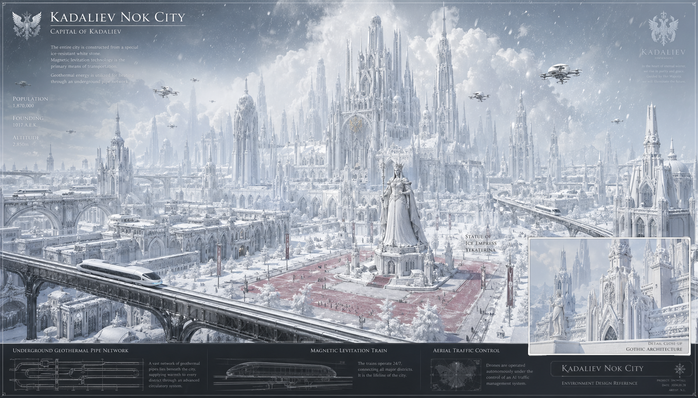

<div align="center">


# ✦ 星灵 · Xingling

**一部中文科幻奇幻史诗 · 沉浸式阅读站 · 互动叙事游戏**

*星灵纪元，权能觉醒 —— 在拉提麦尔星系，寻找传说中的星之键*

[](https://xingling.201014.xyz)
[](https://github.com/Tonystarkw12/xingling/releases/latest)
[](https://deepwiki.com/Tonystarkw12/xingling)
[](#-版权声明)

**[🌐 在线阅读](https://xingling.201014.xyz)** · **[🎮 试玩游戏](#-客户端下载)** · **[⬇️ 下载客户端](#-客户端下载)** · **[📖 项目文档 (DeepWiki)](https://deepwiki.com/Tonystarkw12/xingling)**

</div>

---

## 🌌 项目简介

《星灵》是一个**内容 + 产品双轨**的创作工程：

- **📖 文学内核** — 16 卷、约 200 章的中文科幻/奇幻长篇，围绕星灵种族、星之键与圣皇战争展开，另有 10+ 部独立短篇与系统化评分体系
- **🌐 沉浸式阅读站** — React 构建的多终端阅读体验：卷章导航、角色图鉴、世界观百科、剧情时间线、星空动效
- **🎮 互动叙事游戏** — Phaser 驱动的视觉小说 + 卡牌战斗：14 幕分镜剧情、全程语音、立绘演出、装备与卡组养成

从 Markdown 原稿到结构化数据，再到网页与游戏双端呈现 —— 一条完整的**内容工程化管线**。

## ✨ 产品亮点

### 🌐 xingling-web · 阅读站（已上线）

| | |
|---|---|
| 📚 **沉浸阅读** | 卷/章二级导航，阅读进度记忆，优雅排版 |
| 🧑‍🚀 **角色图鉴** | 人物卡、关系与设定一键查阅 |
| 🪐 **世界观百科** | 权能体系、星系架构、专有名词全景 |
| 📜 **剧情时间线** | 星灵纪元事件轴可视化 |
| ✨ **视觉体验** | Framer Motion 动效 + 实时星空渲染 |

### 🎮 xingling-game · 互动游戏

| | |
|---|---|
| 🎬 **分镜叙事** | Episode 1 全 14 幕手绘分镜演出 |
| 🎙️ **全程语音** | 每幕角色配音 + BGM + 战斗音效 |
| ⚔️ **卡牌战斗** | 技能卡组构筑、敌人图鉴、Boss 战 |
| 🛡️ **养成系统** | 装备、卡牌升级、角色面板、存档系统 |
| 🖥️ **跨平台** | Windows / macOS / Android 客户端 |

## 🖼️ 预览

<table>
<tr>
<td width="50%" align="center"><br/><sub>🎮 游戏分镜 · Episode 1 序幕</sub></td>
<td width="50%" align="center"><br/><sub>🌃 场景美术 · 诺克城</sub></td>
</tr>
</table>

> 🌐 完整阅读体验请访问 **[xingling.201014.xyz](https://xingling.201014.xyz)**

## ⬇️ 客户端下载

从 [GitHub Releases](https://github.com/Tonystarkw12/xingling/releases/latest) 获取最新版本：

| 平台 | 文件 | 说明 |
|---|---|---|
| 🪟 Windows | `*_x64-setup.exe` | NSIS 安装程序 |
| 🍎 macOS | `.dmg` | 直接挂载安装 |
| 🤖 Android | `app-debug.apk` | 测试包，需允许未知来源 |

> 🇨🇳 中国大陆网络可经 [GitHub 下载镜像](https://ghproxy.201014.xyz/https://github.com/Tonystarkw12/xingling/releases/latest) 加速。

## 🚀 快速开始

```bash
git clone https://github.com/Tonystarkw12/xingling.git
cd xingling
```

**阅读站**（React 19 · Vite · Tailwind 4）

```bash
cd xingling-web
bun install
bun run parse   # 解析小说 Markdown → 结构化数据
bun run dev
```

**游戏**（Phaser 3.90 · TypeScript）

```bash
cd xingling-game
bun install
bun run dev
```

## 🏗️ 技术架构

```
星灵.md (6500+ 行原著)
   │  parse-novel.ts
   ▼
结构化数据 (novel.ts / characters.ts / world.ts)
   │
   ├─▶ 🌐 xingling-web   React 19 · Zustand · Framer Motion · Tailwind 4
   └─▶ 🎮 xingling-game  Phaser 3.90 · TypeScript · Vite · localStorage 存档
```

| 层 | 技术 |
|---|---|
| 内容 | Markdown 长篇 + 构建期解析管线 |
| 阅读站 | React 19 · TypeScript · Vite 8 · Tailwind 4 · Zustand · React Router 7 |
| 游戏 | Phaser 3.90 · TypeScript 5.8 · Vite 6 · 卡牌战斗引擎 · 语音/分镜资产管线 |
| 部署 | systemd + Vite preview · GitHub Releases 多平台分发 |

## 📖 项目文档

- **[DeepWiki](https://deepwiki.com/Tonystarkw12/xingling)** — 由 AI 生成的完整代码库文档与架构解读
- 仓库内 `CLAUDE.md`（根目录 / `xingling-web/` / `xingling-game/`）— 工程上下文与开发约定

## 🗺️ 路线图

- [x] 第一卷《自行始终》连载 + 阅读站上线
- [x] 游戏 Episode 1（14 幕 · 语音 · 卡牌战斗）
- [ ] 立绘升级（BSE / ALE / 星化状态形态）
- [ ] 战斗语音、特效与动效强化
- [ ] 卡组平衡性迭代 + 敌人技能完善
- [ ] 后续卷章与 Episode 2

## 🌠 世界观速览

> 星灵纪元，圣皇战争的阴影未散。在拉提麦尔星系，星灵少年们觉醒各自的**权能**——电磁、空间、绝对零度——追寻传说中的**星之键**，直面 **ALE 崩坏病**蔓延的宇宙。紫晶为能源，灵武为兵器，命运的答案藏在艾尔登超星系团深处。

## 🤝 友情链接

本项目已添加 [LINUX DO 社区](https://linux.do/) 友链，以表达对社区的认可与支持。感谢 [shu26.cfd](https://shu26.cfd/) 对本项目的支持。

## ⭐ Star History

[](https://star-history.com/#Tonystarkw12/xingling&Date)

---

<div align="center">

**如果这个项目对你有帮助，欢迎点一个 ⭐ Star 支持作者持续创作**

</div>

## ©️ 版权声明

小说文本、世界观设定及项目素材版权归作者所有。未经许可，不得转载、改编或用于商业用途。

© 2026 Xingling · [Tonystarkw12](https://github.com/Tonystarkw12)
